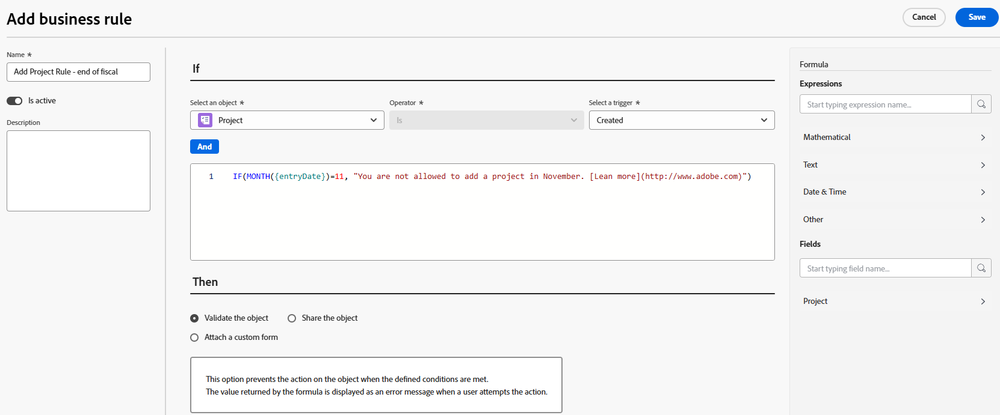

# Creare e modificare le regole di business

Una regola business consente di applicare la convalida agli oggetti di Workfront e di impedire agli utenti di creare, modificare o eliminare un oggetto quando vengono soddisfatte determinate condizioni. La convalida delle regole aziendali consente di migliorare la qualità dei dati e l&#39;efficienza operativa impedendo azioni che potrebbero compromettere l&#39;integrità dei dati.

Le organizzazioni che dispongono del pacchetto Workflow Ultimate possono inoltre configurare regole business per automatizzare le azioni per l&#39;oggetto creato, modificato o modificato quando vengono soddisfatte determinate condizioni. Le azioni disponibili includono la condivisione dell’oggetto o l’associazione di un modulo personalizzato all’oggetto.


Una singola regola business può essere assegnata a un solo oggetto. Ad esempio, se si crea una regola business per non modificare i progetti in determinate condizioni, non è possibile applicare la stessa regola alle attività. È necessario creare una regola business separata con le stesse condizioni per le attività.

I livelli di accesso e la condivisione degli oggetti hanno una priorità più alta rispetto alle regole di business quando un utente interagisce con un oggetto. Ad esempio, se un utente dispone di un livello di accesso o di un’autorizzazione che non consente la modifica di un progetto, questi hanno la precedenza su una regola business che consente la modifica di un progetto in determinate condizioni.

Quando a un oggetto vengono applicate più regole business, tutte le regole vengono seguite ma non vengono applicate in un determinato ordine. Ad esempio, sono disponibili due regole business. Uno limita la creazione di spese nel mese di febbraio. La seconda impedisce la modifica di un progetto quando lo stato del progetto è Completo. Se un utente tenta di aggiungere una spesa a un progetto completato nel mese di giugno, la spesa non può essere aggiunta perché ha attivato la seconda regola.

Le regole business si applicano alla creazione, modifica ed eliminazione di oggetti tramite l’API e nell’interfaccia di Workfront.

>[!NOTE]
>
>Poiché le regole business bloccano alcune azioni, è sempre necessario configurare le regole business prima in un ambiente sandbox o di anteprima e testarle completamente prima di abilitarle in produzione.

## Requisiti di accesso

+++ Espandi per visualizzare i requisiti di accesso per la funzionalità descritta in questo articolo.

<table style="table-layout:auto"> 
 <col> 
 <col> 
 <tbody> 
  <tr>
   <td>Pacchetto Adobe Workfront
   </td>
   <td> <p>Convalida regola business:<ul><li><p>Ultimate</p></li><li>
    <p>Flusso di lavoro Ultimate</p></li></ul></p><p>Automazione delle regole di business:<ul><li>
    <p>Flusso di lavoro Ultimate</p></li><ul></p>
   </td>
  </tr> 
  <tr> 
   <td>Licenza di Adobe Workfront</td> 
   <td>Standard</td> 
  </tr> 
  <tr> 
   <td>Configurazioni del livello di accesso</td> 
   <td>Amministratore di sistema</td> 
  </tr>  
 </tbody> 
</table>

Per informazioni, consulta [Requisiti di accesso nella documentazione di Workfront](/help/quicksilver/administration-and-setup/add-users/access-levels-and-object-permissions/access-level-requirements-in-documentation.md).

+++

## Scenari per le regole business

* [Scenari per la convalida della regola business](#scenarios-for-business-rule-validation)
* [Scenari di automazione delle regole di business](#scenarios-for-business-rule-automation)

### Scenari per la convalida della regola business

Il formato della convalida di una regola business è &quot;Se la condizione definita viene soddisfatta, l&#39;utente non è in grado di eseguire l&#39;azione sull&#39;oggetto e viene visualizzato il messaggio&quot;.

La sintassi per le proprietà e le altre funzioni di una regola business è identica a quella di un campo calcolato di un modulo personalizzato. Per ulteriori informazioni sulla sintassi, vedere [Aggiungere campi calcolati con la finestra di progettazione del modulo](/help/quicksilver/administration-and-setup/customize-workfront/create-manage-custom-forms/form-designer/design-a-form/add-a-calculated-field.md).

Per informazioni sulle istruzioni IF, vedere [&#x200B; Panoramica delle istruzioni &quot;IF&quot;](/help/quicksilver/reports-and-dashboards/reports/calc-cstm-data-reports/if-statements-overview.md) e [Operatori condizione nei campi personalizzati calcolati](/help/quicksilver/reports-and-dashboards/reports/calc-cstm-data-reports/condition-operators-calculated-custom-expressions.md).

Per informazioni sui caratteri jolly basati sugli utenti, vedere [Utilizzare caratteri jolly basati sugli utenti per generalizzare i report](/help/quicksilver/reports-and-dashboards/reports/reporting-elements/use-user-based-wildcards-generalize-reports.md).

Per informazioni sui caratteri jolly basati sulla data, vedere [Utilizzare caratteri jolly basati sulla data per generalizzare i report](/help/quicksilver/reports-and-dashboards/reports/reporting-elements/use-date-based-wildcards-generalize-reports.md).

Un carattere jolly API è disponibile anche nelle regole business. Utilizza `$$ISAPI` per attivare la regola solo nell&#39;API. Utilizzare `!$$ISAPI` per applicare la regola solo nell&#39;interfaccia utente e consentire agli utenti di ignorarla tramite l&#39;API.

* Ad esempio, questa regola impedisce agli utenti di modificare i progetti completati tramite l’API. Se il carattere jolly non veniva utilizzato, la regola bloccava l’azione sia nell’interfaccia utente che nell’API.

  ```
  IF({status} = "CPL" && $$ISAPI, "You cannot edit completed projects through the API.")
  ```

I caratteri jolly `$$BEFORE_STATE` e `$$AFTER_STATE` vengono utilizzati nelle espressioni per accedere ai valori dei campi dell&#39;oggetto prima e dopo eventuali modifiche.

* Questi caratteri jolly sono entrambi disponibili per il trigger di modifica. Lo stato predefinito del trigger di modifica (se nell&#39;espressione non è incluso alcuno stato) è `$$AFTER_STATE`.
* Il trigger di creazione dell&#39;oggetto consente solo `$$AFTER_STATE`, perché lo stato prima non esiste.
* Il trigger di eliminazione dell&#39;oggetto consente solo `$$BEFORE_STATE`, perché lo stato after non esiste.

Alcuni semplici scenari di regole di business sono:

* Gli utenti non possono aggiungere nuove spese durante l&#39;ultima settimana di febbraio. Questa formula potrebbe essere così formulata:

  ```
  IF(MONTH($$TODAY) = 2 && DAYOFMONTH($$TODAY) >= 22, "You cannot add new expenses during the last week of February.")
  ```

* Gli utenti non possono modificare il nome di un progetto nello stato Completato. Questa formula potrebbe essere così formulata:

  ```
  IF({status} = "CPL" && {name} != $$BEFORE_STATE.{name}, "You cannot edit the project name.")
  ```

Il sistema consente una regola business per oggetto per trigger. Ad esempio, per i problemi è consentita una regola di attivazione di modifica. È tuttavia possibile includere più regole in una formula con istruzioni IF nidificate.

Uno scenario con istruzioni IF nidificate è:

Gli utenti non possono modificare i progetti completati e non possono modificare i progetti con una Data di completamento pianificata a marzo. Questa formula potrebbe essere così formulata:

```
IF(
    $$AFTER_STATE.{status}="CPL",
    "You cannot edit a completed project",
    IF(
        MONTH({plannedCompletionDate})=3,
        "You cannot edit a project with a planned completion date in March")
)
```

### Abilitare la localizzazione in una regola business

Se l&#39;organizzazione utilizza la localizzazione personalizzata, è necessario abilitare la traduzione di un messaggio di regola business nella regola business. Se la traduzione non è abilitata, il messaggio viene visualizzato al lettore in inglese, anche se il testo del messaggio si trova nell’elenco Localizzazione e il browser dell’utente è impostato sulla lingua appropriata.

Durante la configurazione della regola, inserisci la parola TRANSLATE prima del messaggio e racchiudi il messaggio tra parentesi.

>[!BEGINSHADEBOX]

Esempio:

In questo esempio si presuppone che il messaggio &quot;Non è possibile modificare i progetti completati&quot; sia incluso nell’area di localizzazione di Configura e che il browser dell’utente sia impostato sulla lingua localizzata.

* `IF({status} = "CPL", "You cannot edit completed projects.") `
Il messaggio viene visualizzato in inglese.
* `IF({status} = "CPL", TRANSLATE("You cannot edit completed projects."))`
Il messaggio viene visualizzato nella lingua localizzata.

>[!ENDSHADEBOX]

Per informazioni sulla localizzazione personalizzata, vedere [Configurare la localizzazione personalizzata](/help/quicksilver/administration-and-setup/set-up-workfront/configure-system-defaults/configure-custom-localization.md).

## Scenari di automazione delle regole di business

>[!NOTE]
>
>Per utilizzare l&#39;automazione delle regole business, l&#39;organizzazione deve disporre di un pacchetto Ultimate del flusso di lavoro.

Il formato dell&#39;automazione di una regola business è &quot;Se la condizione definita viene soddisfatta, viene attivata l&#39;automazione selezionata&quot;.

Le formule di automazione delle regole di business non richiedono un messaggio di errore

Per garantire l&#39;esecuzione di un&#39;automazione ogni volta che si verifica l&#39;oggetto e l&#39;azione selezionati, ad esempio quando viene creato un progetto, utilizzare la formula seguente:

```
IF(true, true)
```

Per condividere un progetto solo se è stato approvato, utilizza una formula simile alla seguente:

```
IF({status} = "APR", true)
```

È possibile utilizzare caratteri jolly nelle azioni delle regole business, come descritto nella sezione [Scenari per la convalida delle regole business](#scenarios-for-business-rule-validation).


## Aggiungere una nuova regola business

{{step-1-to-setup}}

1. Fai clic su **Regole aziendali** nel pannello a sinistra.
1. Fare clic su **Nuova regola business**.

1. Digita **Nome** per la regola business nella finestra di dialogo del generatore di regole.
1. Nel campo **È attivo**, selezionare se la regola deve essere attiva al momento del salvataggio.

   Se si seleziona **No**, la regola verrà salvata come inattiva e sarà possibile attivarla in un secondo momento.

1. (Facoltativo) Immetti una **Descrizione** della regola business e cosa accade quando viene applicata.


1. Selezionare il tipo di oggetto a cui assegnare la regola business.

   

   È possibile applicare le regole business ai seguenti oggetti:

   * Progetto
   * Attività
   * Problema/Richiesta
   * Portfolio
   * Documento
   * Programma
   * Spesa
   * Azienda
   * Iterazione
   * Record della fatturazione
   * Gruppo
   * Risorsa non di manodopera
   * Rischio
   * Scheda tariffa
   * Assegnazione
   * Utente
   * Ruolo
   * Ora
   * Modello
   * Indisponibilità
   * Gruppo di risorse
   * Mansione
   * Categoria risorse non di manodopera
   * Gruppo di risorse
   * Indisponibilità
   * Ora
   * Piano per gestione del personale
   * Modello
   * Risorse del piano per gestione del personale
   <!--
   * <span class="preview">Team</span>
   -->

1. Selezionare un **Trigger** per la regola business. Le opzioni sono:

   * **Creato** La regola viene applicata quando un utente tenta di creare un oggetto.
   * **Modificato** La regola viene applicata quando un utente tenta di modificare un oggetto.
   * **Eliminato** La regola viene applicata quando un utente tenta di eliminare un oggetto.

1. Crea la formula nell’editor di formule, al centro della finestra di dialogo della regola business.

   Il formato di una regola business è &quot;Se la condizione definita viene soddisfatta, l&#39;utente non è in grado di eseguire l&#39;azione sull&#39;oggetto e viene visualizzato il messaggio&quot;.

   Nell&#39;area della formula, le parti della regola business creata sono la condizione e il messaggio visualizzato in Workfront quando la condizione viene soddisfatta.

   * L&#39;&quot;oggetto&quot; è il tipo di oggetto selezionato durante la creazione della regola business. Viene visualizzato nell’intestazione della finestra di dialogo.
   * L’&quot;azione&quot; è il trigger selezionato per la regola: crea, modifica o elimina l’oggetto.
   * Poiché l&#39;oggetto e l&#39;azione sono già definiti, non vengono inclusi nella formula.
   * Il messaggio di errore personalizzato viene incluso solo se la regola è per la convalida e viene visualizzato all&#39;utente quando attiva la regola business. Dovrebbe fornire istruzioni chiare su cosa è andato storto e su come correggere il problema.

     Puoi includere un URL statico nel messaggio di errore, per collegare alla documentazione o ad altre pagine utili per guidare l’utente nella modifica della sua azione entro il vincolo della regola.

     In questo esempio, &quot;Ulteriori informazioni&quot; si collegherà all’URL. `"You are not allowed to add a new project in November.[Learn more](http://url)"` L&#39;URL deve essere tra parentesi, ma il testo del collegamento tra parentesi non è obbligatorio. Puoi visualizzare l’URL completo, che sarà un collegamento cliccabile.

   

   Questo esempio è una regola business per i progetti. Se il mese corrente è novembre, agli utenti non è consentito creare nuovi progetti, e questo viene spiegato nel messaggio.

   Per ulteriori esempi di regole business, vedere [Scenari per regole business](#scenarios-for-business-rules) in questo articolo.

1. (Facoltativo) Utilizza la formula **Espressioni** e **Campi** nel pannello a destra per facilitare la creazione della regola.

   Cerca un&#39;espressione o un campo per restringere l&#39;elenco degli elementi disponibili.

   L&#39;elenco dei campi disponibili è limitato ai campi correlati al tipo di oggetto per la regola business.

1. (Condizionale) Se stai convalidando l&#39;azione, se la tua organizzazione si trova nel pacchetto Workfront Ultimate, seleziona **Convalida l&#39;oggetto** nell&#39;area Then.

   Per gli altri pacchetti, questa opzione è preselezionata.

1. (Condizionale) Per automatizzare un’altra azione, seleziona l’azione.

   Per informazioni dettagliate su queste azioni, vedere la sezione [Opzioni di automazione delle regole business](#business-rule-automation-options) in questo articolo.

   >[!NOTE]
   >
   >Per utilizzare le azioni oltre alla convalida, la tua organizzazione deve far parte del pacchetto Ultimate del flusso di lavoro. Se queste altre opzioni non sono disponibili, significa che l&#39;organizzazione non è inclusa nel pacchetto Workflow Ultimate.

1. Fai clic su **Salva** al termine della creazione della regola business.

>[!NOTE]
>
>Dopo aver aggiunto una regola business, è necessario verificarla aggiungendo, modificando o eliminando l&#39;oggetto associato per assicurarsi che la regola venga applicata correttamente.

### Opzioni di automazione delle regole di business

>[!NOTE]
>
>Per utilizzare le azioni oltre alla convalida, la tua organizzazione deve far parte del pacchetto Ultimate del flusso di lavoro. Se queste altre opzioni non sono disponibili, significa che l&#39;organizzazione non è inclusa nel pacchetto Workflow Ultimate.

È possibile impostare queste azioni in modo che vengano automatizzate quando viene attivata la regola business. Le azioni disponibili dipendono dal tipo di oggetto selezionato.

| Automazione | Ulteriore configurazione |
|---|---|
| Allega un modulo personalizzato | Seleziona il modulo personalizzato da aggiungere |
| Condividi l’oggetto | Selezionare le persone, i ruoli, i gruppi, le aziende o i livelli di accesso con cui si desidera condividere l&#39;oggetto. |

## Attivare una regola aziendale

Quando una regola business è inattiva, il campo È attivo nell&#39;elenco delle regole business visualizza False. Impossibile aggiornare lo stato della regola nella vista a elenco.

Per attivare una regola business:

1. Selezionare la regola business nell&#39;elenco di regole e fare clic sull&#39;icona Modifica.
1. Selezionare **Sì** per **È attivo** nella finestra di dialogo della regola business.
1. Fai clic su **Salva**.
