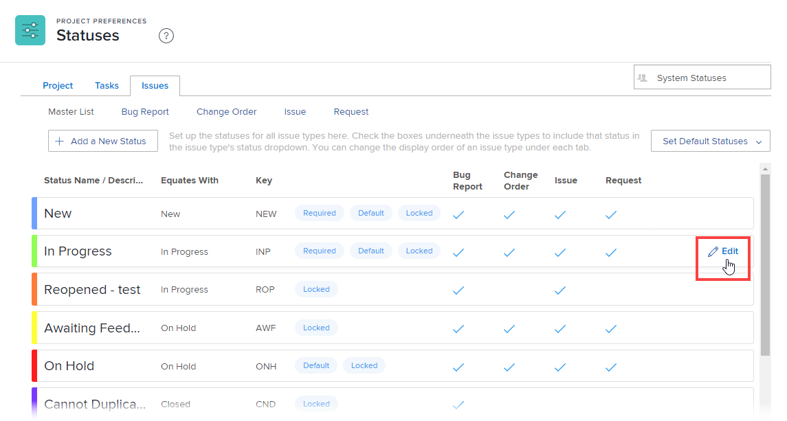

# Personalizzare i tipi di problemi predefiniti

I tipi di problema sono utili nelle seguenti circostanze:

* Durante la personalizzazione degli stati del problema, come descritto in [Creare o modificare uno stato](../../../administration-and-setup/customize-workfront/creating-custom-status-and-priority-labels/create-or-edit-a-status.md).
* Durante la creazione di una coda di richieste, come descritto in [Creare una coda di richieste](../../../manage-work/requests/create-and-manage-request-queues/create-request-queue.md).

Puoi personalizzare le etichette per ogni tipo di problema predefinito in modo che corrispondano meglio alla terminologia utilizzata nell’organizzazione.

## Requisiti di accesso

+++ Espandi per visualizzare i requisiti di accesso per la funzionalità in questo articolo.

Per eseguire i passaggi descritti in questo articolo, è necessario disporre dei seguenti diritti di accesso:

<table style="table-layout:auto"> 
 <col> 
 <col> 
 <tbody> 
  <tr> 
   <td role="rowheader">[!DNL Adobe Workfront] piano</td> 
   <td>Qualsiasi</td> 
  </tr> 
  <tr> 
   <td role="rowheader">[!DNL Adobe Workfront] licenza</td> 
   <td>
Nuovo: [!UICONTROL Standard]

   Oppure
   
Corrente: [!UICONTROL Plan]

   </td> 
  </tr>
  <tr>
   <td role="rowheader">Configurazioni del livello di accesso</td> 
   <td>[!UICONTROL Amministratore di sistema]</td>
  </tr> 
 </tbody> 
</table>

Per ulteriori dettagli sulle informazioni contenute in questa tabella, vedere [Requisiti di accesso nella documentazione di Workfront](/help/quicksilver/administration-and-setup/add-users/access-levels-and-object-permissions/access-level-requirements-in-documentation.md).

+++

## Tipi di problemi predefiniti

Se disponi dell&#39;accesso [!DNL Adobe Workfront] [!UICONTROL amministratore], puoi configurare e rinominare quattro tipi di problemi predefiniti:

* **[!UICONTROL Rapporto bug]** utilizzato per tenere traccia dei bug segnalati nel sistema.
* **[!UICONTROL Ordine di modifica]** utilizzato per tenere traccia dei problemi che devono essere aggiornati o rivisti.
* **[!UICONTROL Problema]** Oggetto in [!DNL Workfront] che comunica il lavoro non pianificato, un problema che si verifica o un problema che deve essere risolto per continuare un&#39;attività.
* **[!UICONTROL Richiesta]** Un tipo di problema che si applica a una coda di richieste in cui gli utenti effettuano richieste in Workfront.

## Personalizzare un tipo di problema

Considera quanto segue sulla personalizzazione dei tipi di problema:

* È possibile modificare l’etichetta di un tipo di problema, ma non la sua funzione.
* Non è possibile creare altri tipi di problemi.
* Non puoi modificare i valori del filtro per il nome di un tipo di problema. Pertanto, se crei un filtro per un report sui problemi, il valore del filtro (chiave) non riflette il nome personalizzato del tipo di problema.
* A ogni tipo di problema sono associati tre stati predefiniti: [!UICONTROL Nuovo], [!UICONTROL In corso] e [!UICONTROL Chiuso]. Non è possibile eliminare o rimuovere questi stati da un tipo di problema, ma è possibile rinominarli.
* Puoi riordinare le opzioni visualizzate nel menu a discesa per ciascun tipo di problema.

Per personalizzare un tipo di problema:

{{step-1-to-setup}}

1. Fai clic su **[!UICONTROL Preferenze progetto]** > **[!UICONTROL Stati]**.

1. Fai clic sulla scheda **[!UICONTROL Issues]**.
1. Effettua una delle seguenti operazioni:

   * Passa il puntatore del mouse sul tipo di problema che desideri personalizzare, fai clic sull&#39;icona [!UICONTROL Modifica]  che appare all&#39;estrema destra, quindi digita un nuovo nome per il tipo di problema.

     

   * Fai clic su un [!UICONTROL tipo di problema] per elencare i relativi stati associati, quindi trascina gli handle visualizzati al passaggio del mouse su di essi e rilasciali nell&#39;ordine in cui desideri che vengano visualizzati nel menu a discesa dei problemi degli utenti **[!UICONTROL Stato]**.
