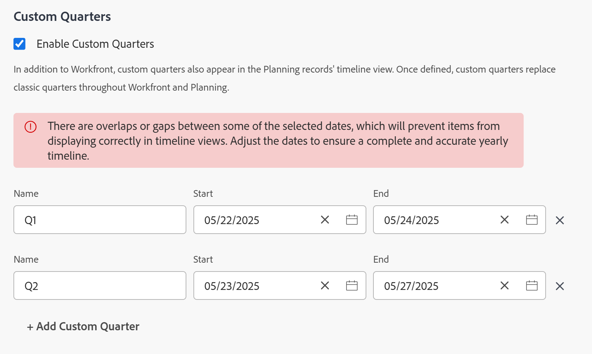

# Abilita trimestri personalizzati

<!--Audited: 11/2024-->

A scopo di reporting, è possibile creare trimestri personalizzati se i trimestri dell&#39;organizzazione si basano su criteri specifici diversi dalle date del calendario, ad esempio giorni lavorativi o di acquisto.

A seconda dei prodotti acquistati dalla società, è possibile configurare il seguente numero di trimestri nell&#39;area di configurazione di Workfront:

* I clienti che hanno acquistato solo [!DNL Workfront] possono configurare fino a otto trimestri personalizzati per il sistema [!DNL Adobe Workfront].
* I clienti che hanno acquistato [!DNL Workfront] e [!DNL Workfront Planning] possono configurare fino a 100 trimestri per il sistema [!DNL Workfront], disponibili anche in [!DNL Planning].

## Requisiti di accesso

+++ Espandi per visualizzare i requisiti di accesso per la funzionalità in questo articolo.

<table style="table-layout:auto"> 
 <col> 
 <col> 
 <tbody> 
  <tr> 
   <td>[!DNL Adobe Workfront] pacchetto</td> 
   <td>
Qualsiasi
</td> 
  </tr> 
  <tr> 
   <td>[!DNL Adobe Workfront] licenza</td> 
   <td>
[!UICONTROL Standard]

       
[!UICONTROL Plan]
</td>
  </tr> 
  <tr> 
   <td>Configurazioni del livello di accesso</td> 
   <td>[!UICONTROL Amministratore di sistema]</td> 
  </tr> 
 </tbody> 
</table>

Per informazioni, consulta [Requisiti di accesso nella documentazione di Workfront](/help/quicksilver/administration-and-setup/add-users/access-levels-and-object-permissions/access-level-requirements-in-documentation.md).

+++

## Imposta trimestri personalizzati per il sistema [!DNL Workfront]

{{step-1-to-setup}}

1. Fai clic su **[!UICONTROL Preferenze progetto]** > **[!UICONTROL Progetti].**

1. Nella sezione **[!UICONTROL Timeline]**, seleziona **[!UICONTROL Abilita trimestri personalizzati]**.

1. Digita un nome per il trimestre personalizzato, ad esempio &quot;Fiscal Q1 2021&quot;.
1. Seleziona le date di inizio e fine per il trimestre personalizzato.

   

1. (Facoltativo) Fai clic su **[!UICONTROL Aggiungi trimestre personalizzato]** per aggiungere altri trimestri personalizzati al sistema.

   >[!IMPORTANT]
   >
   > Se la tua azienda ha acquistato [!DNL Workfront Planning], non puoi salvare i trimestri personalizzati se ci sono spazi o sovrapposizioni tra i trimestri.
   >
   >Gli spazi vuoti e le sovrapposizioni tra i trimestri sono consentiti solo per i clienti [!DNL Workfront].

1. (Facoltativo e condizionale) Se la società ha acquistato solo [!DNL Workfront], senza [!DNL Workfront Planning], crea un elemento di reporting che si riferisce ai trimestri fiscali.

   **Esempio:** Crea un filtro per un elenco di [!UICONTROL progetti] e includi la data di completamento pianificata di un progetto che fa riferimento ai trimestri personalizzati.

   

   I riferimenti a &quot;Questo trimestre&quot;, &quot;Prossimo trimestre&quot; e &quot;Ultimo trimestre&quot; sono sostituiti da nuovi riferimenti ai trimestri personalizzati.

   Per informazioni sugli elementi di reporting, vedere [Elementi di reporting: filtri, visualizzazioni e raggruppamenti](../../../reports-and-dashboards/reports/reporting-elements/reporting-elements-filters-views-groupings.md).

   Per informazioni sulla creazione di filtri, vedere [Creare o modificare filtri in [!DNL Adobe Workfront]](../../../reports-and-dashboards/reports/reporting-elements/create-filters.md).
1. (Facoltativo e condizionale) Se si dispone dell&#39;accesso a [!DNL Workfront Planning], passare a una pagina del tipo di record e aprire una visualizzazione timeline. Nella visualizzazione vengono visualizzati i nuovi trimestri personalizzati.
Per informazioni, vedere [Gestire la visualizzazione della sequenza temporale](/help/quicksilver/planning/views/manage-the-timeline-view.md).
