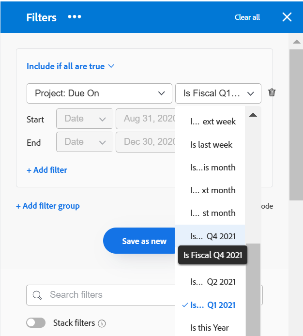

# Abilitare trimestri personalizzati

<!--Audited: 03/2026-->

<!--remove Production and Preview references at release-->

Le informazioni evidenziate in questa pagina si riferiscono a funzionalità non ancora generalmente disponibili. È disponibile solo nell’ambiente di anteprima per tutti i clienti. Dopo i rilasci mensili in Produzione, le stesse funzioni sono disponibili nell’ambiente di Produzione per i clienti che hanno abilitato i rilasci rapidi. 

Per informazioni sulle versioni rapide, vedere [Abilitare o disabilitare le versioni rapide per l&#39;organizzazione](/help/quicksilver/administration-and-setup/set-up-workfront/configure-system-defaults/enable-fast-release-process.md). 

A scopo di reporting, è possibile creare trimestri personalizzati se i trimestri dell&#39;organizzazione si basano su criteri specifici diversi dalle date del calendario, ad esempio giorni lavorativi o di acquisto.

A seconda dei prodotti acquistati dalla società, è possibile configurare il seguente numero di trimestri nell&#39;area di configurazione di Workfront:

* I clienti che hanno acquistato solo [!DNL Workfront] possono configurare fino a otto trimestri personalizzati per il sistema [!DNL Adobe Workfront].
* I clienti che hanno acquistato [!DNL Workfront] e [!DNL Workfront Planning] possono configurare fino a 100 trimestri per il sistema [!DNL Workfront], disponibili anche in [!DNL Planning].

* I clienti che hanno acquistato [!DNL Workfront] e [!DNL Workfront Planning] possono configurare settimane personalizzate per ogni trimestre personalizzato. Le settimane personalizzate sono visibili nelle visualizzazioni della timeline [!DNL Planning].

## Requisiti di accesso

+++ Espandi per visualizzare i requisiti di accesso per la funzionalità descritta in questo articolo.

<table style="table-layout:auto"> 
 <col> 
 <col> 
 <tbody> 
  <tr> 
   <td>[!DNL Adobe Workfront] pacchetto</td> 
   <td>
Qualsiasi
</td> 
  </tr> 
  <tr> 
   <td>[!DNL Adobe Workfront] licenza</td> 
   <td>
Licenza [!UICONTROL Workflow Standard] o [!UICONTROL Workfront Plan]

       

</td>
  </tr> 
  <tr> 
   <td>Configurazioni del livello di accesso</td> 
   <td>[!UICONTROL Amministratore di sistema]</td> 
  </tr> 
 </tbody> 
</table>

Per informazioni, consulta [Requisiti di accesso nella documentazione di Workfront](/help/quicksilver/administration-and-setup/add-users/access-levels-and-object-permissions/access-level-requirements-in-documentation.md).

+++

<!--
When we release fiscal weeks, replace the table above with this:

<table style="table-layout:auto"> 
 <col> 
 <col> 
 <tbody> 
  <tr> 
   <td>[!DNL Adobe Workfront] package</td> 
   <td>
   <ul>
   <li>
To configure custom quarters:

   
Any Workfront or Workflow package
</li>
   <li>
   

   
To configure custom weeks:

   
Any Planning package, including Planning as a standalone product

   

   </li>
   </ul>
   </td> 
  </tr> 
  <tr> 
   <td>[!DNL Adobe Workfront] license</td> 
   <td>
   
   <ul>
   <li>
To configure custom quarters:

   
[!UICONTROL Workflow Standard] or [!UICONTROL Workfront Plan] license
</li>
   <li>
   

   
To configure custom weeks:

   
A [!UICONTROL Planning Standard] license, in addition to a Workfront or a Workflow license

   

   </li>
   </ul>
    </td>
  </tr> 
  <tr> 
   <td>Access level configurations</td> 
   <td>[!UICONTROL System Administrator]</td> 
  </tr> 
 </tbody> 
</table>

-->

## Imposta trimestri personalizzati per il sistema [!DNL Workfront]

L’impostazione dei trimestri personalizzati varia a seconda dell’ambiente utilizzato.

### Impostare trimestri personalizzati per il sistema [!DNL Workfront] nell&#39;ambiente di produzione

{{step-1-to-setup}}

1. Fai clic su **[!UICONTROL Trimestri personalizzati]**.

1. Selezionare **[!UICONTROL Abilita trimestri personalizzati]**.

1. Digita un nome per il trimestre personalizzato, ad esempio &quot;Fiscal Q1 2021&quot;.
1. Seleziona le date di inizio e fine per il trimestre personalizzato.

   

1. (Facoltativo) Fai clic su **[!UICONTROL Aggiungi trimestre personalizzato]** per aggiungere altri trimestri personalizzati al sistema.

   >[!IMPORTANT]
   >
   > Se la tua azienda ha acquistato [!DNL Workfront Planning], non puoi salvare i trimestri personalizzati se ci sono spazi o sovrapposizioni tra i trimestri.
   >
   >Gli spazi vuoti e le sovrapposizioni tra i trimestri sono consentiti solo per i clienti [!DNL Workfront].

1. (Facoltativo e condizionale) Se la società ha acquistato solo [!DNL Workfront], senza [!DNL Workfront Planning], crea un elemento di reporting che si riferisce ai trimestri fiscali.

   **Esempio:** Crea un filtro per un elenco di [!UICONTROL progetti] e includi la data di completamento pianificata di un progetto che fa riferimento ai trimestri personalizzati.

   

   I riferimenti a &quot;Questo trimestre&quot;, &quot;Prossimo trimestre&quot; e &quot;Ultimo trimestre&quot; sono sostituiti da nuovi riferimenti ai trimestri personalizzati.

   Per informazioni sugli elementi di reporting, vedere [Elementi di reporting: filtri, visualizzazioni e raggruppamenti](../../../reports-and-dashboards/reports/reporting-elements/reporting-elements-filters-views-groupings.md).

   Per informazioni sulla creazione di filtri, vedere [Creare o modificare filtri in [!DNL Adobe Workfront]](../../../reports-and-dashboards/reports/reporting-elements/create-filters.md).
1. (Facoltativo e condizionale) Se la società ha acquistato Workfront Planning e si dispone dell&#39;accesso a [!DNL Workfront Planning], passare a una pagina del tipo di record e aprire una visualizzazione della sequenza temporale. Nella visualizzazione vengono visualizzati i nuovi trimestri personalizzati.
Per informazioni, consulta [Gestire la vista timeline](/help/quicksilver/planning/views/manage-the-timeline-view.md).

### Impostare trimestri personalizzati per il sistema [!DNL Workfront] nell&#39;ambiente di anteprima

>[!NOTE]
>
>Se l&#39;organizzazione ha acquistato un pacchetto Planning in aggiunta a un pacchetto Flusso di lavoro o se ha acquistato Workfront Planning come pacchetto standalone, è possibile configurare le settimane personalizzate, oltre ai trimestri personalizzati.
> 
>Le settimane personalizzate non sono disponibili per i rapporti e gli elenchi di Workfront.

{{step-1-to-setup}}

1. Fai clic su **[!UICONTROL Trimestri personalizzati]**.

1. Selezionare **[!UICONTROL Abilita trimestri personalizzati]**.

1. Digita un nome per il trimestre personalizzato. Ad esempio, &quot;Fiscal Q1 2021&quot;.
1. Seleziona le date di inizio e fine per il trimestre personalizzato.

1. (Facoltativo) Seleziona l&#39;opzione **Avvia una nuova sequenza settimanale personalizzata**.

   Se selezionata, questa opzione imposta l&#39;inizio del trimestre personalizzato come inizio della prima settimana personalizzata del trimestre nella visualizzazione della sequenza temporale di Planning.
1. (Facoltativo) Nell&#39;area **Formato etichetta settimana personalizzato**, scegliere il **Formato** per le etichette settimana personalizzate. Scegli una tra le opzioni seguenti:

   * **W1, W2, W3 ...** . Questo è il formato predefinito.
   * **FW1, FW2, FW3 ...**
   * **Settimana1, Settimana 2, Settimana 3, ...**
   * **Personalizzato**

1. (Condizionale) Se hai selezionato **Personalizzato** per il campo **Formato**, digita una **Etichetta personalizzata** per identificare le settimane personalizzate.

   Le settimane personalizzate vengono visualizzate nelle visualizzazioni timeline di Planning.

   >[!TIP]
   >
   >Quando aggiungi un’etichetta personalizzata, puoi digitare fino a 100 caratteri.
   >
   >È possibile indicare il nome della prima settimana e le settimane successive utilizzeranno la stessa etichetta seguita da un numero sequenziale.
   >
   >Ad esempio, una **etichetta personalizzata** di &quot;Settimana fiscale&quot; aggiungerà le etichette &quot;Settimana fiscale 1, Settimana fiscale 2, Settimana fiscale 3 ...&quot; al resto delle settimane nella sequenza.

1. (Facoltativo) Fai clic su **[!UICONTROL Aggiungi trimestre personalizzato]** per aggiungere altri trimestri personalizzati al sistema.

   >[!IMPORTANT]
   >
   > Se la tua azienda ha acquistato [!DNL Workfront Planning], non puoi salvare i trimestri personalizzati se ci sono spazi o sovrapposizioni tra i trimestri.
   >
   >Gli spazi vuoti e le sovrapposizioni tra i trimestri sono consentiti solo per i clienti [!DNL Workfront].

1. (Facoltativo e condizionale) Per visualizzare i trimestri personalizzati in Workfront, crea un elemento di reporting che faccia riferimento ai trimestri personalizzati.

   **Esempio:** Crea un filtro per un elenco di [!UICONTROL progetti] e includi la data di completamento pianificata di un progetto che fa riferimento ai trimestri personalizzati.

   

   I riferimenti a &quot;Questo trimestre&quot;, &quot;Prossimo trimestre&quot; e &quot;Ultimo trimestre&quot; sono sostituiti da nuovi riferimenti ai trimestri personalizzati.

   Per informazioni sugli elementi di reporting, vedere [Elementi di reporting: filtri, visualizzazioni e raggruppamenti](../../../reports-and-dashboards/reports/reporting-elements/reporting-elements-filters-views-groupings.md).

   Per informazioni sulla creazione di filtri, vedere [Creare o modificare filtri in [!DNL Adobe Workfront]](../../../reports-and-dashboards/reports/reporting-elements/create-filters.md).
1. (Facoltativo e condizionale) Per visualizzare i trimestri e le settimane personalizzati in Workfront Planning, passare a una pagina del tipo di record e aprire una visualizzazione della sequenza temporale. Nella visualizzazione vengono visualizzati i nuovi trimestri e settimane personalizzati.

Per informazioni, consulta [Gestire la vista timeline](/help/quicksilver/planning/views/manage-the-timeline-view.md).

