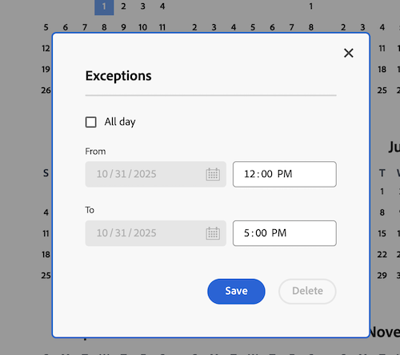

# Creare una nuova pianificazione

<!--Audited: 01/2024-->

<!--DON'T DELETE, DRAFT OR HIDE THIS ARTICLE. IT IS LINKED TO THE PRODUCT, THROUGH THE CONTEXT SENSITIVE HELP LINKS. 
Linked to Editing Users, Editing Projects, Creating and managing groups
-->

In qualità di amministratore [!DNL Adobe Workfront], puoi definire la tua settimana lavorativa con le pianificazioni. È possibile associare una pianificazione a un utente o a un progetto. Questo consente a [!DNL Workfront] di calcolare le timeline e la disponibilità dell&#39;utente.

Se gli utenti lavorano in fusi orari diversi, la creazione di una pianificazione in ciascuno dei fusi orari e l&#39;associazione a tali utenti garantisce che il lavoro venga registrato in [!DNL Workfront] in tempo reale e che la disponibilità sia sempre accurata in base al momento in cui lavorano.

Per informazioni sull&#39;associazione delle pianificazioni a utenti e progetti, vedere [Modifica profilo utente](../../../administration-and-setup/add-users/create-and-manage-users/edit-a-users-profile.md) e [Modifica progetti](../../../manage-work/projects/manage-projects/edit-projects.md).

Gli amministratori di gruppi possono anche creare pianificazioni associate ai gruppi che gestiscono. Per ulteriori informazioni, vedere [Creare e modificare le pianificazioni di un gruppo](../../../administration-and-setup/manage-groups/work-with-group-objects/create-and-modify-a-groups-schedules.md).

Per informazioni sull&#39;utilizzo delle pianificazioni per consentire agli utenti di collaborare in [!DNL Workfront] tra fusi orari, vedere [Utilizzo tra fusi orari diversi](../../../workfront-basics/tips-tricks-and-troubleshooting/working-across-timezones.md).

Per informazioni sull&#39;utilizzo delle pianificazioni nella pianificazione delle risorse, vedere [Panoramica pianificazioni](/help/quicksilver/administration-and-setup/set-up-workfront/configure-timesheets-schedules/schedules-overview.md) e [Panoramica pianificazione risorse](/help/quicksilver/resource-mgmt/resource-planning/get-started-resource-planner.md).

## Requisiti di accesso

+++ Espandi per visualizzare i requisiti di accesso per la funzionalità in questo articolo.

<table style="table-layout:auto"> 
 <col> 
 <col> 
 <tbody> 
  <tr> 
   <td>[!DNL Adobe Workfront] pacchetto</td> 
   <td>
Qualsiasi
</td> 
  </tr> 
  <tr> 
   <td>[!DNL Adobe Workfront] licenza</td> 
   <td>
[!UICONTROL Standard]

       
[!UICONTROL Plan]
</td>
  </tr> 
  <tr> 
   <td>Configurazioni del livello di accesso</td> 
   <td>[!UICONTROL Amministratore di sistema]</td> 
  </tr> 
 </tbody> 
</table>

Per informazioni, consulta [Requisiti di accesso nella documentazione di Workfront](/help/quicksilver/administration-and-setup/add-users/access-levels-and-object-permissions/access-level-requirements-in-documentation.md).

+++

## Creare una nuova pianificazione

{{step-1-to-setup}}

1. Fare clic su **[!UICONTROL Schedules]**.
1. Fai clic su **[!UICONTROL Nuova pianificazione]**.
1. Immettere un nome per la programmazione.
1. (Facoltativo) Seleziona **[!UICONTROL Pianificazione predefinita]** per identificare questa pianificazione come predefinita.

   È necessaria almeno una pianificazione in [!DNL Workfront]. Se ne hai solo uno, viene designato come pianificazione predefinita.

   È possibile avere più di una pianificazione, ma una sola pianificazione predefinita.

   >[!NOTE]
   >
   >Se si è un amministratore di gruppo, non è possibile impostare una pianificazione come predefinita. Solo un amministratore [!DNL Workfront] può designare una pianificazione come predefinita per il sistema.

   

1. Nella scheda **[!UICONTROL Pianificazione]**, seleziona una pianificazione giornaliera trascinando i blocchi orari blu per evidenziarli.

   È consigliabile selezionare 8 blocchi di un’ora in un periodo di tempo di 9 ore. Questo è adatto per il pranzo o altre pause.

   

1. Nella scheda **[!UICONTROL Dettagli]** immettere le informazioni seguenti:

   <table style="table-layout:auto">
    <tr>
     <td>[!UICONTROL Group con accesso amministratore]</td>
     <td>
Selezionare il gruppo i cui amministratori dispongono delle autorizzazioni per modificare la pianificazione.

     
<b>IMPORTANTE</b>:

      <ul>
       <li>
       
Questo campo è obbligatorio per gli amministratori di gruppi che creano una pianificazione.

       
In qualità di amministratore di gruppo, puoi creare una pianificazione solo se è designata per un gruppo o un sottogruppo per il quale sei designato come amministratore.

       
Se gestisci un solo gruppo, per impostazione predefinita quest’ultimo viene selezionato in questo campo.

       
Se gestisci più gruppi, devi selezionare un gruppo in questo campo prima di poter salvare la pianificazione.
</li>
       <li>Se sei un amministratore [!DNL Workfront] che crea una pianificazione, questo campo è facoltativo. Quando si crea una pianificazione senza associarla a un gruppo, questa viene salvata come pianificazione a livello di sistema e non può essere gestita da un amministratore di gruppo di alcun gruppo.
       
Le pianificazioni assegnate ad account o progetti sono visibili a tutti gli utenti che possono modificare questi oggetti. Ciò vale sia per le pianificazioni a livello di sistema che per quelle a livello di gruppo.

       </li>
       
La specifica di un gruppo con accesso amministratore per una pianificazione non assegna la pianificazione agli utenti del gruppo, ma consente solo agli amministratori del gruppo di modificare, eliminare e copiare la pianificazione.

       
Gli amministratori di gruppi non possono modificare, eliminare o copiare pianificazioni a livello di sistema. Per ulteriori informazioni, vedere <a href="../../../administration-and-setup/manage-groups/group-roles/group-administrators.md" class="MCXref xref">Amministratori di gruppi</a>.
     </td>
    </tr>
    <tr>
     <td>[!UICONTROL Groups with View Access]</td>
     <td>
Selezionare i gruppi con accesso [!UICONTROL View] che possono visualizzare questa pianificazione.

     
Solo gli utenti dei gruppi qui specificati possono trovare la pianificazione nel menu a discesa quando la assegnano a utenti o progetti.
</tr>
    <tr>
     <td>Fuso orario di </td>
     <td>
Seleziona il fuso orario per la pianificazione.

     
Se si associa la pianificazione a un utente, è consigliabile che il fuso orario della pianificazione corrisponda a quello dell'utente. Per informazioni sui fusi orari dell'utente, vedere <a href="../../../administration-and-setup/add-users/create-and-manage-users/edit-a-users-profile.md" class="MCXref xref">Modificare il profilo di un utente.
     </td>
    </tr>
   </table>

1. Nella scheda **[!UICONTROL Eccezioni]**, specifica eventuali eccezioni alla pianificazione.

   Le eccezioni sono giornate piene o mezze giornate che devono essere escluse dalla pianificazione, come festività o eventi aziendali.

   >[!NOTE]
   >
   >Se si conoscono già le eccezioni ricorrenti, è possibile definire le eccezioni per molti anni in futuro.

   I giorni completi o parziali possono essere esclusi dal programma di lavoro. Fai clic sulla data per selezionarla come eccezione, quindi seleziona il campo **[!UICONTROL Tutto il giorno]** per indicare se l&#39;eccezione è un giorno intero o meno.

   

1. Inserire l&#39;ora di inizio e di fine per le eccezioni dei giorni parziali.

   

1. Fai clic su **[!UICONTROL Salva]**, quindi su **[!UICONTROL Salva] modifiche**.

1. (Facoltativo) Associa la pianificazione a un utente.

   Per informazioni, vedere [Modifica profilo utente](../../../administration-and-setup/add-users/create-and-manage-users/edit-a-users-profile.md).

1. (Facoltativo) Associa la pianificazione a un progetto.

   Per informazioni, vedere [Modifica progetti](../../../manage-work/projects/manage-projects/edit-projects.md).
