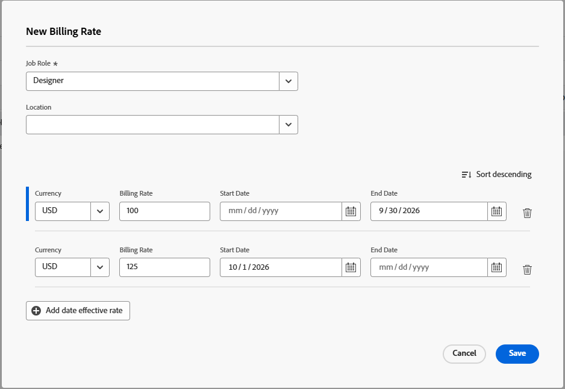

# Sostituisci le tariffe di fatturazione dei ruoli a livello aziendale

{{preview-fast-release-general}}

Quando viene creato un ruolo, è possibile selezionare una tariffa di fatturazione oraria per tale ruolo. Puoi creare più tariffe di fatturazione orarie specifiche per una società. Ogni tariffa di fatturazione è valida per un intervallo di date specifico.

A livello di progetto, è possibile abilitare un&#39;opzione per consentire alle tariffe di fatturazione a livello di società di sostituire le tariffe a livello di progetto. Per ulteriori informazioni, vedere [Sostituire le tariffe di fatturazione a livello di progetto con le tariffe di fatturazione a livello di società](../../../manage-work/projects/project-finances/override-project-level-with-company-level-billing-rates.md).

## Requisiti di accesso

+++ Espandi per visualizzare i requisiti di accesso per la funzionalità descritta in questo articolo.

<table style="table-layout:auto"> 
 <col> 
 <col> 
 <tbody> 
  <tr> 
   <td>[!DNL Adobe Workfront] pacchetto</td> 
   <td>
Per aggiungere attributi di tariffa alle tariffe di fatturazione a livello di società: Workflow Ultimate

       
Per creare tariffe di fatturazione a livello aziendale e modificare tutte le altre impostazioni delle tariffe: qualsiasi pacchetto Workfront o Workflow
</td> 
  </tr> 
  <tr> 
   <td>[!DNL Adobe Workfront] licenza</td> 
   <td>
[!UICONTROL Standard]

       
[!UICONTROL Piano]
</td>
  </tr> 
  <tr> 
   <td>Configurazioni del livello di accesso</td> 
   <td> 
Accesso amministrativo alle società se non si è amministratori di sistema

   
Modifica accesso ai dati finanziari
 </td>
  </tr> 
 </tbody> 
</table>

Per informazioni, consulta [Requisiti di accesso nella documentazione di Workfront](/help/quicksilver/administration-and-setup/add-users/access-levels-and-object-permissions/access-level-requirements-in-documentation.md).

+++

## Sostituisci o modifica una tariffa di fatturazione stabilita utilizzata per una mansione specifica

{{step-1-to-setup}}

1. Fai clic su **[!UICONTROL Aziende]**.
1. Individua l&#39;azienda a cui è assegnata la mansione.
1. Fare clic sul nome della società nell&#39;elenco.
1. Fai clic su **[!UICONTROL Tariffe di fatturazione]** nel pannello a sinistra.
1. Fai clic su **[!UICONTROL Aggiungi tariffa di fatturazione] > [!UICONTROL Nuova tariffa di fatturazione]** o **Aggiungi tariffa di fatturazione**.
1. Nella finestra di dialogo [!UICONTROL Nuova tariffa di fatturazione], seleziona una [!UICONTROL **mansione**] per definire la tariffa di fatturazione per.

### Nell’ambiente di produzione:

La [!UICONTROL **tariffa di fatturazione predefinita**] visualizza la tariffa a livello di sistema per questa mansione.

1. Nel campo [!DNL **Tariffe di fatturazione 1**] immettere la tariffa di fatturazione. Quindi, fai clic su [!UICONTROL **Salva**] per sostituire una volta la tariffa di fatturazione.

   Oppure

   Fai clic su [!UICONTROL **Aggiungi tariffa**] per aggiungere altre tariffe di fatturazione con date di validità.

1. (Condizionale) Se si stanno aggiungendo più tariffe di fatturazione, inserire le seguenti informazioni:

   * **[!UICONTROL Tariffe di fatturazione 1], 2, ecc.**: il valore della tariffa di fatturazione per il periodo di tempo.
   * **[!UICONTROL Data inizio]**: la data in cui la tariffa diventa effettiva.
   * **[!UICONTROL Data di fine]**: la data in cui termina la tariffa.

     La tariffa di fatturazione 1 non avrà una data di inizio e l&#39;ultima tariffa di fatturazione non avrà una data di fine. Alcune date vengono aggiunte automaticamente. Ad esempio, se la tariffa di fatturazione 1 non ha una data di fine e si aggiunge la tariffa di fatturazione 2 con una data di inizio del 1° maggio 2023, alla tariffa di fatturazione 1 viene aggiunta una data di fine del 30 aprile 2023 in modo che non esistano spazi vuoti.

1. Fai clic su [!UICONTROL **Salva**].

   >[!NOTE]
   >
   >I tassi di ruolo modificati nel progetto avranno effetto solo su tale progetto. I tassi modificati a livello aziendale avranno un impatto su tutti i progetti. Per ulteriori informazioni, vedere [Panoramica sull&#39;override delle tariffe di fatturazione e sul calcolo dei ricavi per un progetto](/help/quicksilver/manage-work/projects/project-finances/override-role-billing-rates-and-calculate-project-revenue.md).

### Nell’ambiente di anteprima:

1. Selezionare gli attributi per la tariffa, ad esempio Agenzia, Ubicazione o Centro di costo.

   Questi attributi vengono definiti separatamente e possono influire sui calcoli dei ricavi e dei costi. Per ulteriori informazioni, vedere [Definire gli attributi del tasso](/help/quicksilver/administration-and-setup/manage-enterprise-operations/define-rate-attributes.md).

   

1. Selezionare **Valuta** per il tasso. L&#39;amministratore di Workfront aggiunge la valuta di base nell&#39;area Configura. È possibile modificare la selezione in un&#39;altra valuta disponibile e modificare la valuta in intervalli di tempo con data di validità.

   >[!TIP]
   >
   >In questo campo sono disponibili solo le valute disponibili nell&#39;area Tassi di cambio del sistema. Se è impostata una sola valuta, sarà disponibile solo quella.

   Per informazioni sull&#39;impostazione della valuta di base in Workfront, vedere [Impostare i tassi di cambio](/help/quicksilver/administration-and-setup/manage-workfront/exchange-rates/set-up-exchange-rates.md).

   Per informazioni sulla modifica della valuta di un progetto, vedere [Modificare la valuta del progetto](/help/quicksilver/manage-work/projects/project-finances/change-project-currency.md).

1. Nel campo [!DNL **Tariffa di fatturazione**] immettere la tariffa di fatturazione per la mansione.

   Tariffa oraria fatturazione della mansione. Questo valore calcola le entrate pianificate ed effettive delle attività e dei problemi associati al ruolo e in ultima analisi le entrate pianificate ed effettive dei progetti. Inserire il tasso utilizzando la valuta selezionata.

   Se si utilizzano gli attributi, gli attributi e la mansione si combinano per definire un tasso univoco. Ad esempio, un ruolo Designer a New York per l&#39;Agenzia A può avere una tariffa separata da un ruolo Designer a Parigi per l&#39;Agenzia B.

   Per le tariffe di fatturazione effettive della data, fare clic su **Aggiungi tariffa effettiva della data**. Inserire la tariffa di fatturazione oraria per il periodo di tempo e assegnare una data di inizio e una data di fine in base alle esigenze. La prima tariffa di fatturazione non avrà una data di inizio e l’ultima tariffa di fatturazione non avrà una data di fine.

   Workfront ti consente di lasciare degli spazi tra gli intervalli di date, ma riceverai un avviso per confermare che è intenzionale.

   Per informazioni su come Workfront calcola i ricavi, vedere [Panoramica su fatturazione e ricavi](/help/quicksilver/manage-work/projects/project-finances/billing-and-revenue-overview.md).

   >[!TIP]
   >
   >Quando modifichi una tariffa esistente, puoi ordinare l’elenco in modo da visualizzare la data di inizio più recente nella parte superiore dell’elenco delle tariffe.

1. Fai clic su [!UICONTROL **Salva**].

   >[!NOTE]
   >
   >I tassi di ruolo modificati nel progetto avranno effetto solo su tale progetto. Le tariffe modificate a livello di società avranno un impatto su tutti i progetti a cui è assegnata la società. Per ulteriori informazioni, vedere [Panoramica sull&#39;override delle tariffe di fatturazione e sul calcolo dei ricavi per un progetto](/help/quicksilver/manage-work/projects/project-finances/override-role-billing-rates-and-calculate-project-revenue.md).

