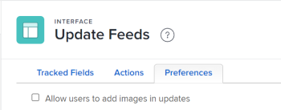

# Configurare le preferenze per gli aggiornamenti utente

<!--Audited: 08/2025-->

Puoi configurare le preferenze che consentono agli utenti di accedere a determinate funzioni quando aggiungono commenti nell&#39;area [!UICONTROL Aggiornamenti] di un oggetto.

## Requisiti di accesso

+++ Espandi per visualizzare i requisiti di accesso per la funzionalità in questo articolo.

<table style="table-layout:auto"> 
 <col> 
 <col> 
 <tbody> 
  <tr> 
   <td role="rowheader">[!DNL Adobe Workfront] pacchetto</td> 
   <td>
Qualsiasi
</td> 
  </tr> 
  <tr> 
   <td role="rowheader">[!DNL Adobe Workfront] licenza</td> 
   <td>
[!UICONTROL Standard]

   
[!UICONTROL Plan]

   </td> 
  </tr>  
  <tr> 
   <td role="rowheader">Configurazioni del livello di accesso</td> 
   <td>
dall'amministratore di sistema, per eseguire questi passaggi a livello di sistema. 

   
Planner, per eseguire questi passaggi per un gruppo, oltre a essere il manager di quel gruppo.
</td>
  </tr> 
 </tbody> 
</table>

*Per ulteriori dettagli sulle informazioni contenute in questa tabella, vedere [Requisiti di accesso nella documentazione di Workfront](/help/quicksilver/administration-and-setup/add-users/access-levels-and-object-permissions/access-level-requirements-in-documentation.md).

+++

<!--Old:
<table style="table-layout:auto"> 
 <col> 
 <col> 
 <tbody> 
  <tr> 
   <td role="rowheader">[!DNL Adobe Workfront] plan</td> 
   <td>Any</td> 
  </tr> 
  <tr> 
   <td role="rowheader">[!DNL Adobe Workfront] license*</td> 
   <td>
New: [!UICONTROL Standard]

   Or
   
Current: [!UICONTROL Plan]

   </td> 
  </tr>  
  <tr> 
   <td role="rowheader">Access level configurations</td> 
   <td>
To perform these steps at the system level, you need the [!UICONTROL System Administrator] access level.

To perform them for a group, you must be a manager of that group.
</td>
  </tr> 
 </tbody> 
</table>-->

## Consenti agli utenti di aggiungere immagini negli aggiornamenti

Per impostazione predefinita, gli utenti non possono aggiungere immagini negli aggiornamenti. Se si attiva questa preferenza, gli utenti potranno allegare immagini negli aggiornamenti. La preferenza si applica a tutti gli aggiornamenti in tutte le aree dell&#39;istanza [!DNL Workfront].

>[!NOTE]
>
>* Le immagini salvate negli aggiornamenti vengono conteggiate in base al limite di archiviazione dei documenti. Per informazioni, vedere [Controllare i limiti di archiviazione dei documenti](../../../documents/managing-documents/check-document-storage.md).
>* Le immagini sono accessibili tramite la scheda [!UICONTROL Aggiornamenti] su un oggetto e sono disponibili anche nell&#39;area [!UICONTROL Documenti] del [!UICONTROL Menu principale].
>

1. Fai clic sull&#39;icona **[!UICONTROL Main Menu]**  nell&#39;angolo superiore destro di [!DNL Adobe Workfront], quindi fai clic su **[!UICONTROL Setup]** .
1. Nel pannello a sinistra, seleziona **[!UICONTROL Interfaccia]** > **[!UICONTROL Aggiorna feed]**.
1. Selezionare la scheda **[!UICONTROL Preferenze]**.

   

1. Selezionare la casella di controllo **[!UICONTROL Consenti agli utenti di aggiungere immagini negli aggiornamenti]**.
1. Seleziona **[!UICONTROL Salva]**.

   Se questa preferenza è attivata, è possibile disattivarla in qualsiasi momento. Tutte le immagini già pubblicate negli aggiornamenti rimarranno nell&#39;area [!UICONTROL Aggiornamenti] dell&#39;oggetto.
