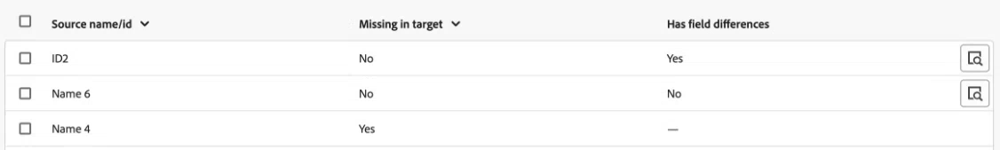

# Confrontare gli oggetti tra ambienti diversi

Puoi confrontare gli oggetti tra ambienti diversi per garantire che i pacchetti di promozione dell’ambiente contengano gli oggetti necessari.

Puoi selezionare gli ambienti e i tipi di oggetti da confrontare. Workfront confronta tutti gli oggetti dei tipi selezionati in entrambi gli ambienti e presenta i dati relativi alle differenze tra gli oggetti.

## Requisiti di accesso

Devi avere i seguenti:

<table>
  <tr>
   <td><strong>[!DNL Adobe Workfront] piano</strong>
   </td>
   <td> Prime o Ultimate (solo nuovi piani)
   </td>
  </tr>
  <tr>
   <td><strong>[!DNL Adobe Workfront] licenze</strong>
   </td>
   <td> [!UICONTROL Standard]
   </td>
  </tr>
   <tr>
   <td>Configurazioni del livello di accesso
   </td>
   <td>Devi essere un amministratore [!DNL Workfront].
   </td>
  </tr>
</table>

Per ulteriori dettagli sulle informazioni contenute in questa tabella, vedere [Requisiti di accesso nella documentazione di Workfront](/help/quicksilver/administration-and-setup/add-users/access-levels-and-object-permissions/access-level-requirements-in-documentation.md).

## Prerequisiti

Per confrontare gli oggetti tra ambienti, la tua organizzazione deve utilizzare Adobe Business Platform.

## Generare un confronto degli oggetti

1. Vai a un ambiente in cui desideri confrontare un oggetto.
1. Fai clic sull&#39;icona **[!UICONTROL Main Menu]**  nell&#39;angolo superiore destro di Adobe Workfront oppure, se disponibile, fai clic sull&#39;icona **[!UICONTROL Main Menu]**  nell&#39;angolo superiore sinistro, quindi fai clic sull&#39;icona **[!UICONTROL Setup]** .
1. Seleziona **Sistema** nell&#39;area di navigazione a sinistra, quindi seleziona **Promozione ambiente**.
1. Fai clic su **Confronta ambienti** nell&#39;angolo superiore destro dello schermo.
1. Nel campo **Ambiente Source** selezionare l&#39;ambiente in cui si desidera creare il pacchetto. Questo è l&#39;ambiente dal quale si stanno copiando gli oggetti **da**.
1. Nel campo **Ambiente di destinazione**, selezionare l&#39;ambiente in cui si desidera installare il pacchetto. Questo è l&#39;ambiente in cui si stanno copiando gli oggetti da **a**.
1. Nell&#39;area **Oggetti da confrontare**, selezionare i tipi di oggetto che si desidera confrontare tra gli ambienti.
1. Fai clic su **Genera confronto** nell&#39;angolo superiore destro dello schermo.

   La generazione del confronto potrebbe richiedere del tempo, a seconda del numero e delle dimensioni degli oggetti confrontati.

## Visualizza confronto oggetti

Al termine della generazione del confronto, viene visualizzato il confronto.

L&#39;elenco include gli oggetti dei tipi selezionati che esistono nell&#39;ambiente di origine, se tali oggetti sono mancanti nell&#39;ambiente di destinazione e se vi sono differenze di campo tra i due.

>[!BEGINSHADEBOX]

In questo esempio:

* La prima riga mostra un oggetto presente nell’ambiente di destinazione, ma diverso da quello di origine.
* La seconda riga mostra un oggetto presente nell’ambiente di destinazione ed uguale a quello dell’ambiente di origine.
* La terza riga mostra un oggetto non presente nell’ambiente di destinazione.

>[!ENDSHADEBOX]

Per visualizzare specifiche differenze tra gli oggetti:

1. Fare clic sull&#39;icona della lente di ingrandimento  nella riga dell&#39;oggetto.

   Viene visualizzata una finestra con tutti i campi dell&#39;oggetto. le differenze sono evidenziate in rosso.

## Creare un pacchetto da un confronto di oggetti

Puoi creare un pacchetto direttamente da un confronto di oggetti.

Per istruzioni, vedere [Creare un pacchetto da un confronto di oggetti](/help/quicksilver/administration-and-setup/set-up-workfront/workfront-testing-environments/environment-promotion-create-package.md#create-a-package-from-an-object-comparison) nell&#39;articolo Creare o modificare un pacchetto di promozione dell&#39;ambiente.
