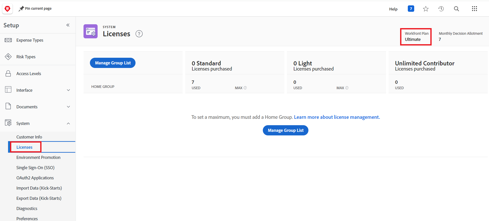

# Domande frequenti sulla promozione dell’ambiente

Di seguito sono riportate le domande frequenti sulla promozione dell’ambiente:

## È supportata la promozione tra più domini?

### Risposta

La promozione dell’ambiente tra più domini non è attualmente supportata. Devi promuovere tra ambienti dello stesso dominio.

## Come possiamo scoprire se la nostra istanza di Workfront si trova su una licenza Prime o Ultimate?

### Risposta

* Un amministratore Workfront può individuare la licenza dell’organizzazione.

   1. Fai clic sull&#39;icona **[!UICONTROL Main Menu]**  nell&#39;angolo superiore destro di Adobe Workfront oppure, se disponibile, fai clic sull&#39;icona **[!UICONTROL Main Menu]**  nell&#39;angolo superiore sinistro, quindi fai clic sull&#39;icona **[!UICONTROL Setup]** .
   1. Fai clic su **Sistema** nel pannello a sinistra
   1. Per visualizzare il piano Workfront, selezionare **Licenze**.
Il piano viene visualizzato nell’angolo superiore destro della pagina.
      

  Oppure
* Contatta il rappresentante del tuo account Workfront.

## La promozione ambientale è bidirezionale?

### Risposta

Sì. Ad esempio, puoi passare da Sandox a Produzione, oppure da Produzione a Sandbox.

## La condivisione è supportata?

### Risposta

No, la condivisione non è attualmente supportata.

## Il rollback del pacchetto è disponibile?

### Risposta

Il rollback del pacchetto è disponibile per il pacchetto più recente, entro 24 ore dall’installazione del pacchetto.

## Sarà possibile saltare la promozione dei singoli componenti? Dove sono presenti le opzioni `Use Existing`, `Overwrite` e `Save with a new Name`&quot;, è possibile aggiungere `Skip` in modo da saltare la promozione dei singoli parametri?

### Risposta

* &quot;Usa esistente&quot; equivale a &quot;ignorare&quot; o &quot;ignorare&quot; la distribuzione, perché viene mappato sull’oggetto esistente nell’ambiente di destinazione e non apporta modifiche.
* Per ignorare gli oggetti, è consigliabile rimuovere gli oggetti che non si desidera installare dal pacchetto di promozione o direttamente dall&#39;ambiente di origine. Dopo aver rimosso gli oggetti, riassemblate il pacchetto.
