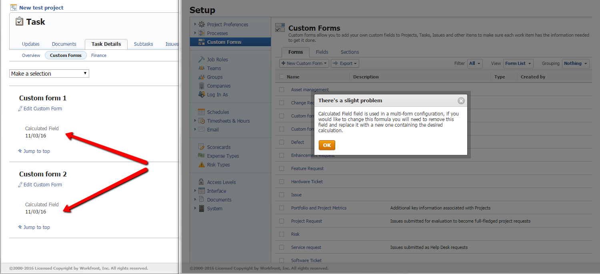

# Messaggio di errore: si è verificato un piccolo problema. Questo campo viene utilizzato in una configurazione con più moduli

## Problema

Quando si modifica un calcolo in un campo personalizzato calcolato in un modulo personalizzato, [!DNL Adobe Workfront] potrebbe visualizzare il seguente avviso:

Si è verificato un piccolo problema

[Il campo] è utilizzato in una configurazione multi-modulo. Se si desidera modificare questa formula, è necessario rimuovere il campo e sostituirlo con uno nuovo contenente il calcolo desiderato.

## Causa

Almeno due moduli personalizzati contenenti il campo personalizzato calcolato che si sta tentando di modificare sono allegati a un singolo oggetto nell&#39;istanza [!DNL Workfront].

**Esempio:** i moduli personalizzati A e B sono entrambi allegati alla stessa attività. Entrambi i moduli contengono un campo personalizzato calcolato denominato Profitto. Si verifica l&#39;errore quando si tenta di modificare il calcolo nel campo Profitto del modulo personalizzato A.

Non è possibile modificare il calcolo per il campo personalizzato in una delle maschere perché ciò sarebbe in conflitto con la formula nello stesso campo nell&#39;altra maschera.
Per risolvere il conflitto, è necessario trovare l&#39;oggetto in cui sono allegati più moduli con lo stesso campo personalizzato calcolato, quindi eseguire una delle operazioni seguenti:

* Rimuovere uno dei moduli dall&#39;oggetto.
* Modificare il calcolo in base alle esigenze, ma in tutti i moduli personalizzati associati all&#39;oggetto.
* In tutti i moduli personalizzati allegati all’oggetto, aggiungi un nuovo campo personalizzato calcolato contenente il calcolo necessario e contrassegna il vecchio campo personalizzato calcolato come obsoleto.

Questo articolo spiega come trovare l’oggetto e quindi risolvere il problema in uno di questi tre modi.

## Trovare l’oggetto a cui sono allegati i moduli personalizzati {#find-the-object-where-the-custom-forms-are-attached}

{{step-1-to-setup}}

1. Fai clic su **[!UICONTROL Forms personalizzato]** > **[!UICONTROL Campi]**.
1. Applica la visualizzazione **[!UICONTROL Elenco campi]** per trovare il campo calcolato che stai tentando di modificare e annota ogni modulo personalizzato in cui viene utilizzato (ad esempio Modulo 1, Modulo 2, Modulo 3).
1. Fai clic su **[!UICONTROL Forms]**, quindi applica la visualizzazione **[!UICONTROL Elenco moduli]**.
1. Fai clic sull&#39;elenco a discesa **[!UICONTROL Filtro]**, quindi **[!UICONTROL Nuovo filtro]**.

1. Fai clic su **[!UICONTROL Aggiungi regola filtro]**, quindi inizia a digitare &quot;nome modulo personalizzato&quot; e seleziona questo valore quando viene visualizzato nell&#39;elenco.
1. Selezionare **[!UICONTROL Uguale]** per il modificatore di filtro, iniziare a digitare il nome di ogni modulo di cui si è preso nota al passaggio 1, quindi selezionarlo quando viene visualizzato.

   **Esempio:** Nome Modulo Personalizzato È Uguale A Modulo 1, Modulo 2, Modulo 3.

1. Fai clic su **[!UICONTROL Salva filtro]**, quindi denomina il nuovo filtro e fai clic su **[!UICONTROL Salva filtro]**.

1. Nell&#39;elenco dei moduli annotare il tipo di oggetto del filtro, ad esempio Attività o Problema, visualizzato nella colonna **[!UICONTROL Tipo]**.
1. In ogni modulo personalizzato individuato al passaggio 1, crea un nuovo campo personalizzato Casella di controllo con un singolo valore predefinito di Sì.

   **Esempio:** Campo 1 nel modulo 1 = Sì, Campo 2 nel modulo 2 = Sì, Campo 3 nel modulo 3 = Sì. Ciò significa che &quot;il campo personalizzato calcolato esiste nel modulo 1&quot; o che &quot;il campo personalizzato calcolato esiste nel modulo 2&quot; e così via.

1. Nell&#39;icona **[!UICONTROL Ricerca]**  nell&#39;angolo superiore destro dello schermo, fare clic su **[!UICONTROL Ricerca avanzata]**.
1. Fai clic sull&#39;oggetto del modulo personalizzato (ad esempio Problema), fai clic su **[!UICONTROL Filtra i risultati]**, quindi su **[!UICONTROL Aggiungi un filtro]**.
1. Inizia a digitare il nome di un campo Casella di controllo nel campo **[!UICONTROL Inizia a digitare il nome del campo]** e selezionalo quando viene visualizzato nell&#39;elenco, quindi seleziona **[!UICONTROL Uguale]** e digita **[!UICONTROL Sì]** (senza virgolette) nella casella seguente.

   **Esempio:** Campo 1 Uguale (Distinzione Maiuscole/Minuscole) Sì.

1. Fai clic su **[!UICONTROL Aggiungi un filtro]** e aggiungi tutti i campi Casella di controllo alla ricerca avanzata.

   Cerca ogni possibile combinazione.

   **Esempio:** Crea diversi filtri con le combinazioni trovate, come elencato di seguito. Dovresti trovare oggetti con più moduli personalizzati allegati che contengono gli stessi campi calcolati. Potresti trovare i seguenti scenari:

   * Campo 1= Sì + Campo 2 = Sì + Campo 3 = Sì (ad esempio, nessun oggetto)
   * Campo 1= Sì + Campo 2 = Sì (ad esempio, nessun oggetto)
   * Campo 1= Sì + Campo 3 = Sì (due oggetti, ad esempio)

   Ciò significa che il campo calcolato esiste sia nel modulo 1 che nel modulo 3, poiché i campi Casella di controllo corrispondenti (campo 1 e campo 3) esistono in questi oggetti.

   Campo 2 = Sì + Campo 3 = Sì (ad esempio, nessun oggetto)

1. Passare a una delle sezioni seguenti in questo articolo:

   * [Rimuovi uno dei moduli personalizzati dall’oggetto e modifica il calcolo](#remove-one-of-the-custom-forms-from-the-object-and-edit-the-calculation-there)
   * [Apportare modifiche identiche nel calcolo in tutti i moduli personalizzati allegati](#make-identical-edits-in-the-calculation-in-all-of-the-attached-custom-forms)
   * [Aggiungi un nuovo campo calcolato contenente il calcolo modificato a uno o a tutti i moduli personalizzati allegati](#add-a-new-calculated-field-containing-the-edited-calculation-to-one-or-all-of-the-attached-custom-forms)

## Rimuovi uno dei moduli personalizzati dall’oggetto e modifica il calcolo {#remove-one-of-the-custom-forms-from-the-object-and-edit-the-calculation-there}

1. Trovare l&#39;oggetto a cui sono allegati i moduli personalizzati, come descritto in [Trovare l&#39;oggetto a cui sono allegati i moduli personalizzati](#find-the-object-where-the-custom-forms-are-attached) in questo articolo, quindi aprire l&#39;oggetto.
1. Rimuovi uno dei moduli personalizzati dall’oggetto, quindi salva l’oggetto.

   >[!NOTE]
   >
   >Per aggiungere i campi dal modulo rimosso dall’oggetto, potrebbe essere necessario modificare il modulo personalizzato che rimane allegato all’oggetto. In questo modo è possibile conservare le informazioni sui dati personalizzati dell&#39;oggetto.

1. Nel modulo personalizzato rimosso, modifica il calcolo per il campo personalizzato che stavi tentando di aggiornare originariamente, quindi fai clic su **[!UICONTROL Salva]**.

   Questa volta, [!DNL Workfront] non dovrebbe incontrare un conflitto.

1. (Facoltativo) Rimuovere i campi Casella di controllo dai moduli personalizzati o eliminarli da [!DNL Workfront].

## Apportare modifiche identiche nel calcolo in tutti i moduli personalizzati allegati {#make-identical-edits-in-the-calculation-in-all-of-the-attached-custom-forms}

>[!IMPORTANT]
>
>I dati andranno persi negli oggetti a cui è già associato il modulo personalizzato quando si esegue la procedura seguente. Tuttavia, se il campo calcolato fa riferimento a campi statici, non a campi calcolati, è possibile utilizzare l&#39;opzione [!UICONTROL Ricalcola espressioni personalizzate] sull&#39;oggetto per ripristinare i dati persi

1. Trovare l&#39;oggetto a cui sono allegati i moduli personalizzati, come spiegato in [Trovare l&#39;oggetto a cui sono allegati i moduli personalizzati](#find-the-object-where-the-custom-forms-are-attached) in questo articolo.
1. Rimuovi il campo da tutti i moduli personalizzati allegati all’oggetto, quindi salva i moduli.

1. Aggiungi nuovamente ai moduli personalizzati il campo personalizzato contenente il nuovo calcolo.

   >[!IMPORTANT]
   >
   >I calcoli devono essere identici in tutti i moduli personalizzati allegati.

1. (Facoltativo) Rimuovere i campi Casella di controllo dai moduli o eliminarli da [!DNL Workfront].

## Aggiungi un nuovo campo calcolato contenente il calcolo modificato a uno o a tutti i moduli personalizzati allegati {#add-a-new-calculated-field-containing-the-edited-calculation-to-one-or-all-of-the-attached-custom-forms}

Per evitare la perdita di dati nel campo personalizzato calcolato esistente o se è necessario modificare il calcolo in uno solo dei moduli personalizzati allegati all&#39;oggetto trovato:

1. Trovare l&#39;oggetto a cui sono allegati i moduli personalizzati, come spiegato in [Trovare l&#39;oggetto a cui sono allegati i moduli personalizzati](#find-the-object-where-the-custom-forms-are-attached) in questo articolo.
1. Aggiungere un nuovo campo personalizzato calcolato contenente il calcolo necessario per uno o tutti i moduli.
1. Rinomina il campo personalizzato calcolato precedente **Obsoleto**.

   In tutti i moduli allegati all’oggetto, questo modulo personalizzato calcolato meno recente conserva i dati storici, ma gli utenti non lo utilizzano più.

   >[!IMPORTANT]
   >
   >È possibile che in altri campi personalizzati calcolati venga fatto riferimento al campo meno recente, pertanto è necessario aggiornare tali calcoli dopo averne modificato il nome.

1. (Facoltativo) Rimuovi i campi Casella di controllo dai moduli o eliminali da Workfront.

<!--
<blockquote data-mc-conditions="QuicksilverOrClassic.Draft mode">
<h2>Problem</h2>

You get the following error while editing a calculated Custom Field on a custom form: 

<em>"<Name of custom field> field is used in a multi-form configuration, if you would like to change this formula you will need to remove this field and replace it with a new one containing the desired calculation."</em> 

<h2>Cause</h2>

The error occurs because the following setup exists: currently you have at least one object in your system that has multiple custom forms attached. The calculated field you are editing exists on multiple forms attached to these objects.

You cannot have the same calculated field with different calculations on the same object. For this reason, the system does not allow you to make a change which will result in calculations being different.

 

For example, you have a task with custom forms A and B attached to it. Both forms contain the same calculated field, Field 1. You encounter this error when you try to edit the calculation for Field 1 on custom form A. 

<h2>Solution</h2>

Remove the field from the custom form and replace it with a new one containing the desired calculation.  

To understand what custom forms are attached to objects, you can build a report for those objects and reference the Category Name field in the view of the report. For more information about referencing custom forms in reports, see the "Referencing Custom Forms in a Report View (Column)" section in <a href="../../reports-and-dashboards/reports/creating-and-managing-reports/reference-custom-form-report.md" class="MCXref xref" xrefformat="{para}">Reference a custom form in a report</a>.

To understand what custom form contains a Custom Field, see the "Accessing Custom Forms and Fields" section in <a href="../../administration-and-setup/customize-workfront/create-manage-custom-forms/custom-forms-overview.md" class="MCXref xref" xrefformat="{para}">Custom forms overview</a>.

</blockquote>
-->
