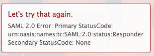

# Messaggio di errore: errore SAML 2.0: Primary StatusCode

## Problema

Impossibile stabilire una connessione ad ADFS.

>[!NOTE]
>
>Se stabilisci una connessione di prova riuscita e riscontri ancora problemi, potresti riscontrare mappature di attributi errate o problemi con gli ID federativi. Per eventuali domande, contatta l’assistenza clienti.

## Requisiti di accesso

+++ Espandi per visualizzare i requisiti di accesso per la funzionalità descritta in questo articolo.

<table style="table-layout:auto"> 
 <col> 
 <col> 
 <tbody> 
  <tr> 
   <td>[!DNL Adobe Workfront] pacchetto</td> 
   <td>
Qualsiasi
</td> 
  </tr> 
  <tr> 
   <td>[!DNL Adobe Workfront] licenza</td> 
   <td>
Standard

       
Piano
</td>
  </tr> 
  <tr> 
   <td>Configurazioni del livello di accesso</td> 
   <td>[!UICONTROL Amministratore di sistema]</td> 
  </tr> 
 </tbody> 
</table>

Per informazioni, consulta [Requisiti di accesso nella documentazione di Workfront](/help/quicksilver/administration-and-setup/add-users/access-levels-and-object-permissions/access-level-requirements-in-documentation.md).

+++

## Causa 1: l&#39;algoritmo hash sicuro è impostato su SHA-256

### Soluzione

1. In Windows, fare clic su **[!UICONTROL Avvia]** > **[!UICONTROL Amministrazione]** > **[!UICONTROL Gestione ADFS 2.0]**.\
   Viene visualizzata la finestra di dialogo Gestione ADFS 2.0.

1. Selezionare **[!UICONTROL Relazione di trust]** > **[!UICONTROL Trust tra relatori]** nel riquadro di sinistra.

1. Fare clic con il pulsante destro del mouse sull&#39;attendibilità del componente relativa a [!DNL Adobe Workfront], quindi selezionare **[!UICONTROL Proprietà]**.
1. Fai clic sulla scheda **[!UICONTROL Avanzate]**, quindi seleziona **[!UICONTROL SHA-1]** dal menu a discesa **[!UICONTROL Algoritmo hash protetto]**.
   

## Causa 2: il certificato di firma ADFS sta per scadere ed è stato sostituito da un nuovo certificato con date sovrapposte

### Soluzione

Nella pagina di configurazione SSO [!DNL Workfront] è elencata la data di scadenza del certificato. Se il certificato sta per scadere, è necessario richiamare manualmente il nuovo certificato di firma dal server ADFS:

1. In Windows, fare clic su **[!UICONTROL Avvia]** > **[!UICONTROL Amministrazione]** > **[!UICONTROL Gestione ADFS 2.0]**.\
   Viene visualizzata la finestra di dialogo Gestione ADFS 2.0.

1. Selezionare **[!UICONTROL Relazione di trust]** > **[!UICONTROL Trust tra relatori]** nel riquadro di sinistra.

1. Fare clic con il pulsante destro del mouse sull&#39;attendibilità del componente relativa a [!DNL Workfront] e selezionare **[!UICONTROL Proprietà]**.
1. Fare clic sulla scheda **[!UICONTROL Firma]**.
1. Fai clic sul nome del certificato di firma e fai clic su **[!UICONTROL Visualizza]**.
1. Fare clic su Copia nel **[!UICONTROL file]**... e selezionare **[!UICONTROL Avanti]**.

1. Selezionare **[!UICONTROL Base-64 codificato x.509 (CER)]** e fare clic su **[!UICONTROL Avanti]**.

1. Specificare il nome del file e fare clic su **[!UICONTROL Avanti]**.
1. Fai clic su **[!UICONTROL Termina]**.
1. In [!DNL Workfront], passare a **[!UICONTROL Configurazione]** > **[!UICONTROL Sistema]** > **[!UICONTROL Single Sign-On (SSO)]** e caricare manualmente il certificato di firma.

## Causa 3: la verifica della revoca del certificato non è riuscita

La soluzione dipende dalla versione di [!DNL Microsoft] ADFS in uso. Consulta la documentazione di [!DNL Microsoft] per ottenere i comandi appropriati per la tua versione.
