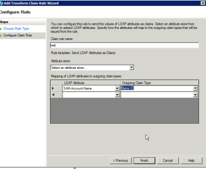

# Messaggio di errore: errore SAML 2.0: identificatore utente non trovato

## Problema

Impossibile stabilire una connessione ad ADFS.

>[!NOTE]
>
>Se stabilisci una connessione di prova riuscita e riscontri ancora problemi, potresti riscontrare mappature di attributi errate o problemi con gli ID federativi. Per eventuali domande, contatta l’assistenza clienti.

## Causa:

Le attestazioni sul server ADFS non sono corrette

## Requisiti di accesso

Per eseguire i passaggi descritti in questo articolo, è necessario disporre dei seguenti diritti di accesso:

<table style="table-layout:auto"> 
 <col> 
 <col> 
 <tbody> 
  <tr> 
   <td role="rowheader">[!DNL Adobe Workfront] piano</td> 
   <td>Qualsiasi</td> 
  </tr> 
  <tr> 
   <td role="rowheader">[!DNL Adobe Workfront] licenza</td> 
   <td>Piano</td> 
  </tr> 
  <tr> 
   <td role="rowheader">Configurazioni del livello di accesso</td> 
   <td> 
Devi essere un amministratore [!DNL Workfront]. Per ulteriori informazioni, vedere <a href="../../administration-and-setup/add-users/configure-and-grant-access/grant-a-user-full-administrative-access.md" class="MCXref xref">Concedere a un utente l'accesso amministrativo completo</a>.
 
<b>NOTA</b>: se non disponi ancora dell'accesso, chiedi all'amministratore di [!DNL Workfront] se ha impostato restrizioni aggiuntive nel tuo livello di accesso. Per informazioni su come un amministratore di [!DNL Workfront] può modificare il tuo livello di accesso, vedi <a href="../../administration-and-setup/add-users/configure-and-grant-access/create-modify-access-levels.md" class="MCXref xref">Creare o modificare livelli di accesso personalizzati</a>.
 </td> 
  </tr> 
 </tbody> 
</table>

## Soluzione

Sul server ADFS verificare che sia presente una richiesta per l&#39;ID nome:

1. In Windows, fare clic su **[!UICONTROL Avvia]** > **[!UICONTROL Amministrazione]** > **[!UICONTROL Gestione ADFS 2.0]**.\
   Viene visualizzata la finestra di dialogo Gestione ADFS 2.0.

1. Selezionare **[!UICONTROL Relazione di trust]** > **[!UICONTROL Trust tra relatori]** nel riquadro di sinistra.

1. Fare clic con il pulsante destro del mouse sull&#39;attendibilità del componente correlata ad Adobe Workfront e selezionare **[!UICONTROL Modifica regole attestazione]**.
1. Verificare che l&#39;attestazione contenga un **[!UICONTROL Tipo di attestazione in uscita]** di **[!UICONTROL ID nome]**.

