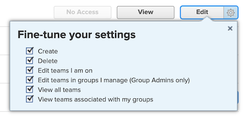

# Gli amministratori dei gruppi devono disporre di un accesso più elevato rispetto a quelli che gestiscono

Se un amministratore gruppo dispone di autorizzazioni nel proprio livello di accesso inferiori a quelle gestite, non potrà visualizzare, modificare o assegnare livelli di accesso inferiori.

## Problema

Se a un amministratore gruppo viene assegnato un livello di accesso Planner modificato con autorizzazioni di visualizzazione per i team, ma ad alcuni utenti viene assegnato un livello di accesso Worker con autorizzazioni di modifica per i team, l&#39;amministratore gruppo non potrà interagire con il livello di accesso Worker modificato.

>[!NOTE]
>
>Questa logica si applica anche al menu a discesa Ottimizza impostazioni. Entrambi i livelli di accesso possono disporre dell’accesso di modifica, ma le impostazioni nel menu a discesa Ottimizza impostazioni devono essere più alte per l’amministratore del gruppo.
> 

## Soluzione

Gli amministratori dei gruppi devono disporre di autorizzazioni più elevate in tutte le aree del livello di accesso rispetto a quelle che gestiscono.
