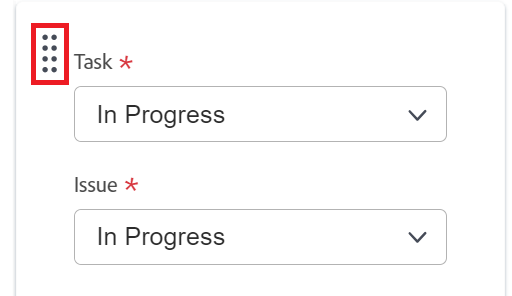

# Configura [!UICONTROL Kanban]

Puoi configurare le seguenti opzioni per i team agili durante o dopo la creazione del team. Crea un team agile (Kanban o Scrum) in [!DNL Adobe Workfront] come descritto in [Creare un team agile](../../agile/get-started-with-agile-in-workfront/create-an-agile-team.md).

## Requisiti di accesso

Per eseguire i passaggi descritti in questo articolo, è necessario disporre dei seguenti diritti di accesso:

<table style="table-layout:auto"> 
 <col> 
 </col> 
 <col> 
 </col> 
 <tbody> 
  <tr> 
   <td role="rowheader"><strong>[!DNL Adobe Workfront] piano*</strong></td> 
   <td> 
Qualsiasi
 </td> 
  </tr> 
  <tr> 
   <td role="rowheader"><strong>[!DNL Adobe Workfront] licenza*</strong></td> 
   <td> 
[!UICONTROL Work] o superiore
 </td> 
  </tr> 
 </tbody> 
</table>

&#42;Per sapere quale piano o tipo di licenza hai, contatta il tuo [!DNL Workfront] amministratore.

## Configura se le storie sono stimate in punti o ore

È possibile configurare le storie in modo da stimarle utilizzando punti o ore.

Per configurare la stima delle storie per il team agile:

1. Fai clic sul pulsante **[!UICONTROL Menu principale]** icona  nell&#39;angolo superiore destro di [!DNL Workfront], quindi fai clic su **[!UICONTROL Team]**.

1. Fai clic sul pulsante **[!UICONTROL Cambia team]** , quindi seleziona un nuovo team dal menu a discesa o cerca un team nella barra di ricerca.
1. Seleziona il team agile da gestire.
1. Fai clic sul pulsante **[!UICONTROL Altro]** quindi seleziona **[!UICONTROL Modifica]**.

   Solo i membri del team con una [!UICONTROL Pianificare] o [!UICONTROL Lavoro] licenza vedere questa opzione.\
   

1. In **[!UICONTROL Agile]** nella sezione **[!UICONTROL Storie stimate in]** area, selezionare se si desidera utilizzare punti o ore per stimare la dimensione (carico di lavoro) delle storie. Se selezioni Punti, specifica quante ore sono uguali a 1 punto. (Il valore predefinito è 1 punto = 8 ore.) Questo è il numero di ore pianificate aggiunte alla storia.

   **Esempio:** Se hai selezionato per stimare le storie in punti e 1 punto è uguale a 8 ore, e una storia è stimata in 3 punti, alla storia vengono aggiunte 24 ore pianificate.

1. Fai clic su **[!UICONTROL Salva modifiche]**.

## Configurare le colonne di stato sulla bacheca di storie agile

È possibile definire gli stati esistenti sulla scheda della storia per il team agile. Questi sono gli unici stati visualizzati sulla lavagna.

Per definire gli stati disponibili per la storiella associata al team agile:

1. Fai clic sul pulsante **[!UICONTROL Menu principale]** icona  nell&#39;angolo superiore destro di [!UICONTROL Workfront], quindi fai clic su **[!UICONTROL Team]**.

1. Fai clic sul pulsante **[!UICONTROL Cambia team]** icona , quindi seleziona un nuovo team dal menu a discesa o cerca un team nella barra di ricerca.

1. Seleziona il team agile da gestire.
1. Fai clic sul pulsante **[!UICONTROL Altro]** quindi seleziona **[!UICONTROL Modifica]**.

   Solo i membri del team con una [!UICONTROL Pianificare] o [!UICONTROL Lavoro] licenza vedere questa opzione.

   

1. In **[!UICONTROL Agile]** , individua la sezione **[!UICONTROL Scheda Storia]** area.

1. (Facoltativo) Fai clic su **[!UICONTROL Aggiungi colonna]** per aggiungere una colonna di stato aggiuntiva alla storiella.
1. (Facoltativo) Trascinate una colonna di stato utilizzando l&#39;indicatore di trascinamento della selezione per riordinare le colonne di stato sulla storiella. Non è possibile spostare la prima colonna e trascinarne un’altra davanti alla prima colonna.

   

1. Selezionare gli stati delle attività.

   >[!IMPORTANT]
   >
   >Sono disponibili solo gli stati bloccati a livello di sistema; non è possibile selezionare gli stati specifici del gruppo. Inoltre, lo stato della prima colonna corrisponde sempre a **[!UICONTROL Nuovo]**.

   Puoi aggiungere stati personalizzati se [!DNL Workfront] l’amministratore li ha configurati; gli stati personalizzati possono essere configurati come descritto in [Creare o modificare uno stato](../../administration-and-setup/customize-workfront/creating-custom-status-and-priority-labels/create-or-edit-a-status.md).

1. Fai clic su **[!UICONTROL Salva modifiche]**.

## Configura campi aggiuntivi da visualizzare sulle schede dei racconti sulla bacheca dei racconti Agile

Quando si aggiungono campi alle schede dei brani, i campi sono di sola visualizzazione e di sola visualizzazione quando il campo è compilato.

Per impostazione predefinita, nella scheda del brano vengono visualizzati i seguenti tipi di dati per attività e problemi:

* Nome della storia con un collegamento direttamente all’attività o al problema
* Nome del progetto con un collegamento diretto al progetto
* Questo collegamento viene visualizzato solo per i brani, non per le sottoattività
* Descrizione dell&#39;attività o del problema
* Impegno attuale
* Visualizza e modifica la percentuale di completamento regolando la percentuale di completamento oppure regolando il numero di punti o ore di completamento
* Utenti assegnati

È possibile visualizzare dati aggiuntivi (inclusi dati personalizzati) sulle schede delle storie. È possibile visualizzare campi aggiuntivi sulle schede delle storie per diversi motivi. Ad esempio, potrebbe essere utile visualizzare l&#39;ID cliente se si stanno lavorando a storie per più clienti nell&#39;iterazione, oppure se si desidera visualizzare la data di inizio del progetto o la data di completamento del progetto.

>[!NOTE]
>
>Se utilizzi un campo personalizzato su una scheda del brano, non può contenere un punto/punto nel nome.

Per configurare le schede delle storie assegnate al team agile in modo da visualizzare campi aggiuntivi:

1. Fai clic sul pulsante **[!UICONTROL Menu principale]** icona  nell&#39;angolo superiore destro di [!DNL Workfront], quindi fai clic su **[!UICONTROL Team]**.

1. Fai clic sul pulsante **[!UICONTROL Cambia team]** icona , quindi seleziona un nuovo team dal menu a discesa o cerca un team nella barra di ricerca.

1. Seleziona il team agile da gestire.
1. Fai clic sul pulsante **[!UICONTROL Altro]** quindi seleziona **[!UICONTROL Modifica]**.\
   Solo i membri del team con una [!UICONTROL Pianificare] o [!UICONTROL Lavoro] licenza vedere questa opzione.

   

1. In **[!UICONTROL Agile]** digitare un nome di campo per individuarlo.

   

1. Seleziona il nome del campo da aggiungere.
1. Digita il **[!UICONTROL Nome visualizzato]** per mostrare il campo sulla storia o sulla scheda del rilascio.
1. Fai clic su **[!UICONTROL Salva modifiche]**.

## Configurare il limite di lavoro in corso (WIP)

Kanban in [!DNL Workfront] consente di controllare la quantità di lavoro su cui il team sta attualmente lavorando limitando il numero di attività che possono essere visualizzate nel [!UICONTROL In corso] nella colonna [!UICONTROL Kanban] consiglio di amministrazione.

Una volta configurato il limite WIP, è possibile visualizzare il limite WIP o aggiornarlo dal [!UICONTROL Kanban] scheda di storia agile, come descritto in [Gestire il limite del lavoro in corso (WIP) per il [!UICONTROL Kanban] bacheca](../../agile/use-kanban-in-an-agile-team/work-in-progress-limit-on-the-kanban-board.md).

Per limitare WIP al team kanban:

1. Fai clic sul pulsante **[!UICONTROL Menu principale]** icona  nell&#39;angolo superiore destro di [!DNL Adobe Workfront], quindi fai clic su **[!UICONTROL Team]**.

1. Fai clic sul pulsante **[!UICONTROL Cambia team]** icona , quindi seleziona un nuovo team dal menu a discesa o cerca un team nella barra di ricerca.

1. Selezionare il team Kanban da gestire.
1. Fai clic sul pulsante **[!UICONTROL Altro]** quindi seleziona **[!UICONTROL Modifica]**.

   Solo i membri del team con una [!UICONTROL Pianificare] o [!UICONTROL Lavoro] licenza vedere questa opzione.

   

1. In **[!UICONTROL Agile]** nella sezione **[!UICONTROL Metodologia]** Assicurati che sia selezionato Kanban.

1. In **[!UICONTROL Scheda Storia]** nella sezione **[!UICONTROL LIMITE WIP]** specifica il numero massimo di elementi consentiti in ogni colonna del [!UICONTROL Kanban] tabellone di storia agile. Puoi impostare un limite diverso per ogni colonna. Il limite massimo impostabile per ogni colonna è 100.\
   Se impostato, il limite WIP visualizza un messaggio di avviso sulla [!UICONTROL Kanban] scheda di storia agile in qualsiasi momento il limite viene superato per qualsiasi colonna sulla scheda di storia. Questo messaggio di avviso viene visualizzato solo la prima volta che viene superato il limite WIP. Questo messaggio di avviso non viene visualizzato in nessuna colonna con uno stato che corrisponde a [!UICONTROL Completa].\
   Il limite WIP è semplicemente un avviso visivo e non impedisce al team di avere più elementi in una singola colonna del limite impostato.

   

1. Fai clic su **Salva modifiche**.

## Configurare le storie da aggiungere automaticamente dal backlog

Puoi configurare le storie dal backlog in modo che vengano aggiunte automaticamente alla prima colonna del [!UICONTROL Kanban] la bacheca subito dopo lo spostamento di un elemento da quella colonna.

1. Fai clic sul pulsante **[!UICONTROL Menu principale]** icona  nell&#39;angolo superiore destro di [!DNL Adobe Workfront], quindi fai clic su **[!UICONTROL Team]**.

1. Fai clic sul pulsante **[!UICONTROL Cambia team]** icona , quindi seleziona un nuovo team dal menu a discesa o cerca un team nella barra di ricerca.

1. Selezionare il team Kanban da gestire.
1. Fai clic sul pulsante **[!UICONTROL Altro]** quindi seleziona **[!UICONTROL Modifica]**.

   Solo i membri del team con una [!UICONTROL Pianificare] o [!UICONTROL Lavoro] licenza vedere questa opzione.

   

1. Seleziona **[!UICONTROL Aggiungi automaticamente il brano successivo dal backlog]** per configurare le storie da aggiungere automaticamente dal backlog alla prima colonna del [!UICONTROL Kanban] tabellone.

   Questo si verifica ogni volta che un brano viene spostato in una colonna della bacheca del racconto che rappresenta uno stato Completo (uno stato che equivale a Completo). Una volta aggiunto dal backlog, il brano con la priorità più elevata viene aggiunto alla storiella.selezionate questa opzione per configurare l&#39;elemento successivo dal backlog in modo che venga aggiunto automaticamente al **[!UICONTROL In corso]** quando un elemento viene spostato fuori dalla **[!UICONTROL In corso]** colonna.

1. Fai clic su **[!UICONTROL Salva modifiche]**.

## Configura per quanto tempo le schede rimangono sul [!UICONTROL Kanban] bacheca

È possibile scegliere per quanto tempo le carte completate rimangono sul [!UICONTROL Kanban] consiglio di amministrazione. Attività che non rientrano nel campo di applicazione [!UICONTROL Kanban] è ancora possibile accedere a bordo nel loro progetto originale.

1. Fai clic sul pulsante **[!UICONTROL Menu principale]** icona  nell&#39;angolo superiore destro di [!DNL Adobe Workfront], quindi fai clic su **[!UICONTROL Team]**.

1. (Facoltativo) Fai clic sul pulsante **[!UICONTROL Cambia team]** icona , quindi seleziona un nuovo team Kanban dal menu a discesa o cerca un team nella barra di ricerca.
1. Selezionare il team Kanban.
1. Fai clic sul pulsante **[!UICONTROL Altro]** quindi seleziona **Edit**.

   Solo i membri del team con una [!UICONTROL Pianificare] o [!UICONTROL Lavoro] licenza vedere questa opzione.

   

1. In **[!UICONTROL Numero di giorni Le schede completate rimangono sulla scheda Kanban]** menu a discesa, selezionare un valore.
1. Fai clic su **[!UICONTROL Salva modifiche]**.
