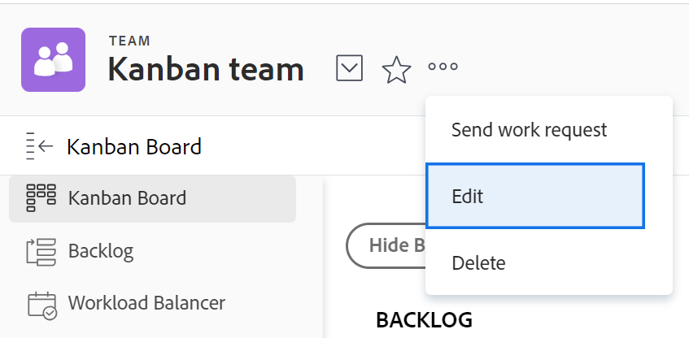

# Configura [!UICONTROL Kanban]

<!--Audited: 12/2023-->

È possibile creare un team Agile in [!DNL Adobe Workfront] come descritto in [Creare un team Agile](../../agile/get-started-with-agile-in-workfront/create-an-agile-team.md). Durante la creazione di un team agile, puoi scegliere la metodologia utilizzata dal team per completare il lavoro. Puoi scegliere tra le seguenti opzioni:

* Scrum
* Kanban

Questo articolo descrive come configurare le impostazioni per un team Kanban. Dopo aver creato un team agile e scelto la metodologia Kanban, puoi fare riferimento a questo articolo per aggiornare le seguenti impostazioni:

* Se le storie vengono stimate in punti o ore
* Le colonne di stato sullo storyboard Agile
* Campi aggiuntivi da visualizzare sulle schede delle storie sulla bacheca delle storie agile
* Limite WIP (Work In Progress)
* Come aggiungere automaticamente brani dal backlog
* Per quanto tempo le carte rimangono sul Kanban Board

Per informazioni sulla configurazione di un team Scrum, vedere [Configurare Scrum](../get-started-with-agile-in-workfront/configure-scrum.md).

## Requisiti di accesso

+++ Espandi per visualizzare i requisiti di accesso per la funzionalità in questo articolo.

<table style="table-layout:auto"> 
 <col> 
 </col> 
 <col> 
 </col> 
 <tbody> 
  <tr> 
   <td role="rowheader">Pacchetto Adobe Workfront</td> 
   <td> 
Qualsiasi
 </td> 
  </tr>

<tr> 
   <td role="rowheader">Licenza Adobe Workfront</td> 
   <td> 
Standard
 
   
Lavoro o superiore
 </td> 
  </tr>

<tr> 
   <td role="rowheader">Configurazioni del livello di accesso</td> 
   <td> 
Modificare l’accesso ai team
  </td> 
  </tr>

</tbody> 
</table>

Per ulteriori dettagli sulle informazioni contenute in questa tabella, vedere [Requisiti di accesso nella documentazione di Workfront](/help/quicksilver/administration-and-setup/add-users/access-levels-and-object-permissions/access-level-requirements-in-documentation.md).

+++

## Configura se le storie vengono stimate in punti o ore

Puoi configurare le storie in modo che vengano stimate utilizzando punti o ore.

Per configurare il modo in cui le storie vengono stimate per il tuo team agile:

{{step1-to-team}}

1. Fai clic sull&#39;icona **[!UICONTROL di]** Cambia team, quindi seleziona un nuovo team dal menu a discesa o cerca un team nella casella di ricerca.
1. Seleziona il team agile da gestire.
1. Fai clic sul menu **[!UICONTROL Altro]** , quindi seleziona **[!UICONTROL Modifica]**.

   

1. Nella sezione **[!UICONTROL Agile]**, nell&#39;area **[!UICONTROL Stima storie in]**, selezionare se si desidera utilizzare punti o ore per stimare la dimensione (carico di lavoro) delle storie. Se selezionate Punti (Points), specificate quante ore corrispondono a 1 punto. Il valore predefinito è 1 punto = 8 ore. Questo è il numero di ore pianificate che vengono aggiunte alla storia.

   **Esempio:** se hai selezionato di stimare le storie in punti e 1 punto equivale a 8 ore e una storia è stimata in 3 punti, alla storia vengono aggiunte 24 ore pianificate.

1. Fai clic su **[!UICONTROL Salva modifiche]**.

## Configurare le colonne di stato sullo storyboard Agile

Puoi definire gli stati che esistono sullo storyboard per il team agile. Questi sono gli unici stati visualizzati sullo storyboard.

Per definire gli stati disponibili per la bacheca delle storie associata al team Agile:

{{step1-to-team}}

1. Fai clic sull&#39;icona **[!UICONTROL Switch Teams]** , quindi seleziona un nuovo team dal menu a discesa o cerca un team nella barra di ricerca.

1. Seleziona il team agile da gestire.
1. Fai clic sul menu **[!UICONTROL Altro]**, quindi seleziona **[!UICONTROL Modifica]**.

   

1. Nella sezione **[!UICONTROL Agile]**, individua l&#39;area **[!UICONTROL Storyboard]**.

1. (Facoltativo) Fai clic su **[!UICONTROL Aggiungi colonna]** per aggiungere una colonna di stato aggiuntiva alla bacheca delle storie.
1. (Facoltativo) Trascinate una colonna di stato utilizzando l&#39;indicatore di trascinamento per riordinare le colonne di stato sulla bacheca delle storie. Impossibile spostare la prima colonna e trascinare un&#39;altra colonna davanti alla prima colonna.

   

1. Selezionare gli stati delle attività.

   >[!IMPORTANT]
   >
   >Solo gli stati bloccati a livello di sistema sono disponibili per la selezione. Non è possibile selezionare stati specifici del gruppo. Lo stato della prima colonna corrisponde sempre a **[!UICONTROL Nuovo]**.

   È possibile aggiungere stati personalizzati se sono stati configurati dall&#39;amministratore [!DNL Workfront]. Per ulteriori informazioni, vedere [Creare o modificare uno stato](../../administration-and-setup/customize-workfront/creating-custom-status-and-priority-labels/create-or-edit-a-status.md).

1. Fai clic su **[!UICONTROL Salva modifiche]**.

## Configura campi aggiuntivi da visualizzare sulle schede delle storie sulla bacheca delle storie agile

Quando si aggiungono campi alle schede delle storie, i campi sono di sola visualizzazione e vengono visualizzati solo quando il campo è popolato.

Per impostazione predefinita, nella scheda delle storie per le attività e i problemi vengono visualizzati i seguenti tipi di dati:

* Nome della storia con un collegamento diretto all’attività o al problema
* Il nome del progetto con un collegamento diretto al progetto
* Questo collegamento viene visualizzato solo per i brani, non per le sottoattività
* Descrizione dell’attività o del problema
* Impegno attuale
* Visualizzare e modificare la percentuale di completamento regolando la percentuale stessa o il numero di punti o ore completate
* Utenti assegnati

È possibile visualizzare dati aggiuntivi, inclusi dati personalizzati, sulle schede delle storie. È possibile visualizzare campi aggiuntivi sulle schede delle storie per diversi motivi. Ad esempio, potresti voler visualizzare l’ID cliente se stai lavorando su storie per più clienti all’interno dell’iterazione, oppure potresti voler visualizzare la Data di inizio del progetto o la Data di completamento del progetto.

>[!NOTE]
>
>Se si utilizza un campo personalizzato in una scheda brani, il nome non può contenere un punto.

Per configurare le schede delle storie assegnate al team Agile in modo da visualizzare campi aggiuntivi:

{{step1-to-team}}

1. Fai clic sull&#39;icona **[!UICONTROL Switch Teams]** , quindi seleziona un nuovo team dal menu a discesa o cerca un team nella barra di ricerca.

1. Seleziona il team agile da gestire.
1. Fai clic sul menu **[!UICONTROL Altro]**, quindi seleziona **[!UICONTROL Modifica]**.

   

1. Nella sezione **[!UICONTROL Agile]** digitare un nome di campo per individuarlo.

   

1. Seleziona il nome del campo da aggiungere.
1. Digita **[!UICONTROL Nome visualizzato]** per il campo da visualizzare sulla storia o sulla scheda problema.
1. Fai clic su **[!UICONTROL Salva modifiche]**.

## Configurare il limite WIP

Quando si definisce il limite WIP di un team Kanban, è possibile controllare il numero di elementi su cui il team sta attualmente lavorando limitando il numero di attività che possono essere visualizzate nella colonna [!UICONTROL Nuovo] o [!UICONTROL In corso] della bacheca [!UICONTROL Kanban].

Dopo aver configurato il limite WIP per un team Kanban, è possibile visualizzare il limite WIP e aggiornarlo dalla bacheca delle storie agile [!UICONTROL Kanban], come descritto in [Gestire il limite WIP (Work In Progress) sulla bacheca [!UICONTROL Kanban]](../../agile/use-kanban-in-an-agile-team/work-in-progress-limit-on-the-kanban-board.md).

Per limitare WIP per il team Kanban:

{{step1-to-team}}

1. Fai clic sull&#39;icona **[!UICONTROL Switch Teams]** , quindi seleziona un nuovo team dal menu a discesa o cerca un team nella barra di ricerca.

1. Seleziona il team Kanban da gestire.
1. Fai clic sul menu **[!UICONTROL Altro]** , quindi seleziona **[!UICONTROL Modifica]**.

   

1. Nella sezione **[!UICONTROL Agile]** della sezione **[!UICONTROL Metodologia]** verificare che sia selezionato Kanban.

1. Nella sezione **[!UICONTROL Storyboard]**, nel campo **[!UICONTROL Limite WIP]**, specifica il numero massimo di elementi consentiti in ogni colonna dello storyboard agile [!UICONTROL Kanban]. È possibile impostare un limite diverso per ogni colonna. Il limite massimo che è possibile impostare per ogni colonna è 100.
Una volta impostato, il limite WIP visualizza un messaggio di avviso sullo storyboard agile [!UICONTROL Kanban] ogni volta che viene superato il limite per qualsiasi colonna dello storyboard. Questo messaggio di avviso viene visualizzato solo la prima volta che viene superato il limite WIP. Questo messaggio di avviso non viene visualizzato in alcuna colonna con uno stato corrispondente a [!UICONTROL Complete].
Il limite WIP è semplicemente un&#39;avvertenza visiva e non impedisce al team di avere più elementi in una singola colonna rispetto al limite impostato.

   

1. Fai clic su **Salva modifiche**.

## Configurare l’aggiunta automatica di brani dal backlog

<!-- this functionality needs to be verified-->

Puoi configurare i brani del backlog da aggiungere automaticamente alla prima colonna della bacheca [!UICONTROL Kanban] subito dopo aver spostato un elemento da tale colonna.

{{step1-to-team}}

1. Fai clic sull&#39;icona **[!UICONTROL Switch Teams]** , quindi seleziona un nuovo team dal menu a discesa o cerca un team nella barra di ricerca.

1. Seleziona il team Kanban da gestire.
1. Fai clic sul menu **[!UICONTROL Altro]** , quindi seleziona **[!UICONTROL Modifica]**.

   

1. Seleziona **[!UICONTROL Aggiungi automaticamente la storia successiva dal backlog]** per configurare l&#39;aggiunta automatica dell&#39;elemento successivo dal backlog alla colonna **[!UICONTROL New]** quando un elemento viene spostato fuori dalla colonna **[!UICONTROL In corso]**.

   Per rendere effettiva questa funzionalità, gli utenti devono abilitare l&#39;impostazione **Mostra backlog** nella bacheca [!UICONTROL Kanban]. Quando gli utenti abilitano l&#39;impostazione [!UICONTROL Mostra backlog] nella [!UICONTROL bacheca Kanban], si verifica la funzionalità seguente:

   Ogni volta che un brano viene spostato dalla colonna [!UICONTROL In corso] in una colonna della bacheca delle storie che rappresenta uno stato [!UICONTROL Completo] (o uno stato che equivale a [!UICONTROL Completo]), un brano della colonna Backlog viene automaticamente spostato nella colonna [!UICONTROL Nuovo] della [!UICONTROL bacheca Kanban].
Quando viene aggiunta dal backlog, la storia con la priorità più alta viene aggiunta alla bacheca delle storie.

1. Fai clic su **[!UICONTROL Salva modifiche]**.

## Configura per quanto tempo le schede rimangono sulla bacheca [!UICONTROL Kanban]

Puoi scegliere per quanto tempo le schede completate rimangono sulla bacheca [!UICONTROL Kanban]. È comunque possibile accedere al progetto originale per le attività che non rientrano nella bacheca [!UICONTROL Kanban].

{{step1-to-team}}

1. (Facoltativo) Fai clic sull&#39;icona **[!UICONTROL Switch Teams]** , quindi seleziona un nuovo team Kanban dal menu a discesa o cerca un team nella barra di ricerca.
1. Seleziona il team Kanban.
1. Fai clic sul menu **[!UICONTROL Altro]** , quindi seleziona **[!UICONTROL Modifica]**.

   

1. Nel menu a discesa **[!UICONTROL Numero di giorni in cui le schede completate rimangono nel Kanban Board]**, seleziona un valore.

   Puoi scegliere un numero da 1 a 30 giorni.
1. Fai clic su **[!UICONTROL Salva modifiche]**.
