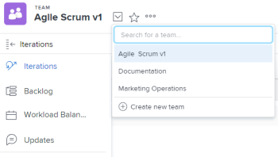

# Creare un team agile

<!--Audited: 01/2024-->

[!DNL Adobe Workfront] consente ai team agili di completare il lavoro in modo incrementale e organizzato.

Qualsiasi utente dell’organizzazione può vedere il team agile e tutti i suoi componenti, compresi il backlog, le iterazioni, lo storyboard e i singoli articoli. Tuttavia, solo i membri del team con [!UICONTROL Modifica] l’accesso a lavoro può apportare modifiche al lavoro assegnato al team.

[!DNL Workfront] supporta le seguenti metodologie agili:

* **[!UICONTROL Scrum]**: i team hanno un backlog di lavoro che deve essere completato. Quando il team è pronto a lavorare su un pezzo specifico di lavoro, il lavoro viene spostato dal backlog a un’iterazione. Per informazioni più dettagliate sulla gestione di un team Scrum, consulta [Scrum in un team agile](../../agile/use-scrum-in-an-agile-team/scrum-in-an-agile-team.md).

* **[!UICONTROL Kanban]:** I team spostano il lavoro nella vista Kanban tra stati predeterminati. Gli stati predefiniti sono: backlog, in-process e done. Per informazioni più dettagliate sulla gestione di un team Kanban, consulta [Kanban in un team agile](../../agile/use-kanban-in-an-agile-team/using-kanban-in-an-agile-team.md).

## Requisiti di accesso

+++ Espandi per visualizzare i requisiti di accesso per la funzionalità in questo articolo.

Per eseguire i passaggi descritti in questo articolo, è necessario disporre dei seguenti diritti di accesso:

<table style="table-layout:auto"> 
 <col> 
 </col> 
 <col> 
 </col> 
 <tbody> 
  <tr> 
   <td role="rowheader"><strong>[!DNL Adobe Workfront] piano*</strong></td> 
   <td> 
Qualsiasi
 </td> 
  </tr> 
  <tr> 
   <td role="rowheader"><strong>[!DNL Adobe Workfront] licenza*</strong></td> 
   <td> 
Nuovo: Standard

   Corrente: 
   <ul><li>
[!UICONTROL Plan] per creare un nuovo team agile
</li> 
   <li>
[!UICONTROL Lavoro] o versione successiva per convertire un team in un team Agile
</li></ul> </td> 
  </tr> 
 </tbody> 
</table>

Per conoscere il piano o il tipo di licenza di cui si dispone, contattare [!DNL Workfront] amministratore.

+++

## Decidere una metodologia agile

Puoi utilizzare una metodologia agile Scrum o Kanban per il tuo team agile. Ogni metodologia offre diversi vantaggi. Il funzionamento del tuo team agile determina la metodologia agile che scegli di utilizzare.

Metodologie agili Scrum e Kanban in [!DNL Workfront] consente di spostare le storie in una bacheca delle storie per indicare una modifica dello stato e l&#39;avanzamento della storia.

Metodologie agili Scrum e Kanban in [!DNL Workfront] differiscono nei seguenti modi:

### Vantaggi dell’utilizzo di Kanban in [!DNL Workfront]

Il [!DNL Kanban] metodologia agile in [!DNL Workfront] consente di spostare più facilmente le storie in un agile storyboard, limitando la quantità di lavoro in corso. Non ci sono date di inizio e fine quando si utilizza [!DNL Kanban] metodologia agile.

Le funzionalità seguenti supportano questa metodologia:

* Visualizza il backlog in [!DNL Kanban] storyboard agile.\
   Per ulteriori informazioni, consulta [Aggiungi il backlog al [!UICONTROL Kanban] scheda](../../agile/use-kanban-in-an-agile-team/view-the-backlog-on-the-kanban-board.md).

* Configura gli elementi nel backlog da aggiungere automaticamente al [!UICONTROL Kanban] storyboard agile quando altri elementi vengono spostati in uno stato che equivale a Complete (Completato).\
   Per ulteriori informazioni, consulta la sezione [Configurare i brani da aggiungere automaticamente dal backlog](../../agile/get-started-with-agile-in-workfront/configure-kanban.md#configur5) nell’articolo [Configura Kanban](../../agile/get-started-with-agile-in-workfront/configure-kanban.md).

* Configurare un limite WIP da visualizzare nella [!UICONTROL Kanban] storyboard agile.\
   Per ulteriori informazioni, consulta [Gestione del limite WIP (Work In Progress) nel Kanban Board](../../agile/use-kanban-in-an-agile-team/work-in-progress-limit-on-the-kanban-board.md).

### Vantaggi dell’utilizzo di Scrum in [!DNL Workfront]

La metodologia agile Scrum in [!DNL Workfront] consente di aggiungere un set di storie a un&#39;iterazione agile e di creare una bacheca delle storie per tale iterazione. L&#39;iterazione si basa sulle date di inizio e di fine definite.

Le funzionalità seguenti supportano questa metodologia:

* Includi problemi in [!UICONTROL Scrum] storyboard
* Includi problemi nel backlog di un team Agile
* Le sottoattività possono essere visualizzate nel [!UICONTROL Scrum] storyboard
* Visualizza un grafico a burn-down per visualizzare i progressi rispetto alle storie durante l’iterazione\
   Per ulteriori informazioni, consulta [Panoramica del grafico a burn-down Agile](../../agile/use-scrum-in-an-agile-team/burndown/burndown-chart-overview.md).

## Creare un team agile

{{step1-to-team}}

1. Fai clic su **[!UICONTROL Cambia team]** icona , quindi fai clic su **[!UICONTROL Crea nuovo team]**.

   

   Viene visualizzata la casella Nuovo team.

1. Specifica le seguenti informazioni:

   <table style="table-layout:auto"> 
    <col> 
    <col> 
    <tbody> 
     <tr> 
      <td role="rowheader"><strong>[!UICONTROL Nome team]</strong> </td> 
      <td>Digita un nome per il nuovo team agile.</td> 
     </tr> 
     <tr> 
      <td role="rowheader"><strong>[!UICONTROL Questo è un team agile]</strong> </td> 
      <td>Seleziona questa opzione per configurare il nuovo team come un team agile.</td> 
     </tr>

   <tr> 
      <td role="rowheader"><strong>[!UICONTROL È Attivo]</strong> </td> 
      <td>Selezionare questa opzione per attivare il team. I team inattivi non sono visibili agli altri utenti per l’assegnazione al lavoro. </td> 
     </tr>

   <tr data-mc-conditions="QuicksilverOrClassic.Quicksilver"> 
      <td role="rowheader"><strong>[!UICONTROL Group]</strong> </td> 
      <td> 
Inizia a digitare il nome di un gruppo da aggiungere al team, quindi selezionalo quando viene visualizzato nell’elenco a discesa.
 
<b>NOTA</b>
 
 Quando un team viene assegnato a un gruppo o a un sottogruppo, qualsiasi amministratore di gruppo di tale gruppo o sottogruppo può gestire il team senza esserne membro. Gli amministratori di gruppi possono passare all'area [!UICONTROL Teams] dal menu principale [!UICONTROL] e fare clic sulla freccia [!UICONTROL Switch Teams]  per elencare tutti i team assegnati ai gruppi che gestiscono.
 </td> 
     </tr> 
     <tr> 
      <td role="rowheader"><strong>[!UICONTROL Membri team]</strong> </td> 
      <td>Inizia a digitare il nome di un utente che deve far parte del team, quindi selezionalo quando viene visualizzato nell’elenco a discesa. Ripetere questo processo per aggiungere più utenti al team. Poiché gli utenti possono far parte di più team, possono far parte sia di team agili che di team non agili.</td> 
     </tr> 
     <tr> 
      <td role="rowheader"><strong>[!UICONTROL Descrizione]</strong> </td> 
      <td>
Digitare una descrizione per il team.
 
La descrizione viene visualizzata in alto a destra nell'area [!UICONTROL Teams] quando il team è selezionato.

      
Se la descrizione è lunga, è possibile fare clic su di essa per visualizzare la descrizione completa in un pop-up. Se si dispone dell'accesso per modificare le impostazioni del team di [!UICONTROL], è anche possibile modificare la descrizione direttamente nel pop-up.
</td>
     </tr> 
    </tbody> 
   </table>

1. Fai clic su **[!UICONTROL Crea]**.

   Per informazioni sulla configurazione di un team Agile, consulta i seguenti articoli:

   * [Configura [!UICONTROL Kanban]](../../agile/get-started-with-agile-in-workfront/configure-kanban.md)
   * [Configura [!UICONTROL Scrum]](../../agile/get-started-with-agile-in-workfront/configure-scrum.md)

## Convertire un team esistente in un team agile

Puoi convertire un team esistente in un team agile:

1. Fai clic su **[!UICONTROL Menu principale]** icona  nell&#39;angolo superiore destro di [!DNL Adobe Workfront], quindi fai clic su **[!UICONTROL Team]**.
1. Fai clic su **[!UICONTROL Cambia team]** icona , quindi selezionare un nuovo team dal menu a discesa o cercare un team nella barra di ricerca.

1. Seleziona il team da convertire in un team Agile.
1. Fai clic su **[!UICONTROL Altro]** , quindi seleziona **[!UICONTROL Modifica]**.\
   Solo i membri del team con una delle due opzioni [!UICONTROL Piano] o [!UICONTROL Lavoro] vedere questa opzione.\
   

1. In **[!UICONTROL Agile]** sezione, seleziona **[!UICONTROL Questo è un Team agile]**.

1. In **[!UICONTROL Metodologia]** , seleziona se il team utilizzerà una sezione **[!UICONTROL Scrum]** o **[!UICONTROL Kanban]** metodologia agile.

1. Clic **Salva le modifiche.**

   Il team viene salvato come team Agile. È possibile configurare il nuovo team come Scrum o Kanban quando si modifica il team.

   Per ulteriori informazioni, consulta i seguenti articoli:

   * [Configura [!UICONTROL Kanban]](../../agile/get-started-with-agile-in-workfront/configure-kanban.md)
   * [Configura [!UICONTROL Scrum]](../../agile/get-started-with-agile-in-workfront/configure-scrum.md)
