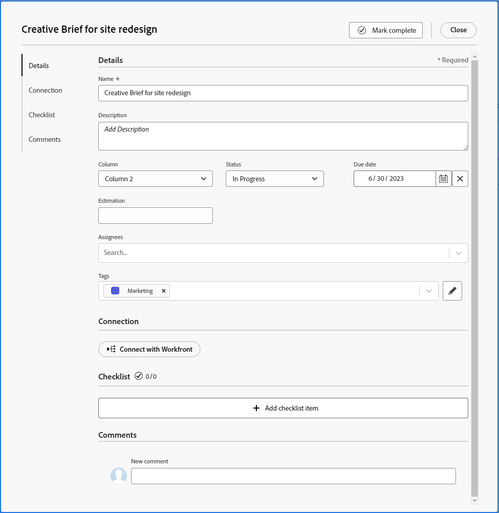

# Aggiungere una scheda ad hoc a una bacheca

Puoi aggiungere rapidamente una scheda a una bacheca e assegnarla a un membro della bacheca. La scheda può rappresentare un’attività, un problema, una persona, un gruppo o qualsiasi tipo di elemento che desideri includere nella bacheca.

>[!NOTE]
>
>Le schede ad hoc su una bacheca non sono collegate agli elementi di lavoro in [!DNL Adobe Workfront]. Per ulteriori informazioni sulle schede collegate, vedere [Utilizzare le schede collegate sulle bacheche](/help/quicksilver/agile/get-started-with-boards/connected-cards.md).

## Requisiti di accesso

Per eseguire i passaggi descritti in questo articolo, è necessario disporre dei seguenti diritti di accesso:

<table style="table-layout:auto"> 
 <col> 
 </col> 
 <col> 
 </col> 
 <tbody> 
  <tr> 
   <td role="rowheader"><strong>[!DNL Adobe Workfront] piano*</strong></td> 
   <td> 
Qualsiasi
 </td> 
  </tr> 
  <tr> 
   <td role="rowheader"><strong>[!DNL Adobe Workfront] licenza*</strong></td> 
   <td> 
[!UICONTROL Request] o versione successiva
 </td> 
  </tr> 
 </tbody> 
</table>

&#42;Per conoscere il piano, il tipo di licenza o l&#39;accesso di cui si dispone, contattare [!DNL Workfront] amministratore.

## Aggiungi una scheda ad hoc con dettagli completi

Una scheda ad hoc non è collegata a un elemento di lavoro in [!DNL Adobe Workfront].

1. Fai clic su **[!UICONTROL Menu principale]** icona  nell&#39;angolo superiore destro di [!DNL Adobe] Workfront, quindi fai clic su **[!UICONTROL Schede]**.
1. Accedi a una bacheca. Per informazioni, consulta [Creare o modificare una bacheca](../../agile/get-started-with-boards/create-edit-board.md).
1. Clic **[!UICONTROL Aggiungi scheda] > [!UICONTROL Nuova scheda]**.
1. In **[!UICONTROL Dettagli scheda]** , aggiungere le seguenti informazioni:

   <table style="table-layout:auto"> 
    <col> 
    <col> 
    <tbody> 
     <tr> 
      <td role="rowheader"><strong>[!UICONTROL Name]</strong> </td> 
      <td>Il nome della carta.</td> 
     </tr> 
     <tr> 
      <td role="rowheader"><strong>[!UICONTROL Descrizione]</strong> </td> 
      <td>Una descrizione del Card. Puoi aggiungere gli URL nella descrizione, che diventeranno collegamenti cliccabili al salvataggio della scheda.</td>
     </tr>
     <tr> 
      <td role="rowheader"><strong>[!UICONTROL Colonna]</strong> </td> 
      <td>Seleziona la colonna per la scheda. Se si lascia il <strong>[!UICONTROL Colonna]</strong> campo vuoto, la scheda viene inserita nella prima colonna a sinistra della bacheca.</td>
     </tr>
     <tr> 
      <td role="rowheader"><strong>[!UICONTROL Stato]</strong> </td> 
      <td>Selezionare uno stato per la scheda. Se si fa clic su <strong>[!UICONTROL Segna come completato]</strong> nella parte superiore della scheda, lo stato cambia automaticamente in [!UICONTROL Complete].</td> 
     </tr>
     <tr> 
      <td role="rowheader"><strong>[!UICONTROL Scadenza]</strong></td> 
      <td>Seleziona una data di scadenza per la scheda. </td>
     </tr>
     <tr> 
      <td role="rowheader"><strong>Stima [!UICONTROL]</strong></td> 
      <td>Digitare il numero stimato di ore per il completamento della scheda. Questa è solo una immissione manuale.</td>
     </tr>
     <tr> 
      <td role="rowheader"><strong>[!UICONTROL Assegnatari]</strong> </td> 
      <td> 
Per assegnare la scheda, inizia a digitare un nome nel campo di ricerca, quindi selezionalo quando viene visualizzato nell’elenco. Puoi aggiungere sia singoli utenti che team e assegnare più persone o team a una scheda.
 
Gli assegnatari devono essere membri della bacheca o non verranno visualizzati nell’elenco di selezione. Quando un team è membro della bacheca, i singoli membri del team possono essere assegnati alla scheda.
</td>
     </tr>     
     <tr> 
      <td role="rowheader"><strong>[!UICONTROL Tags]</strong></td> 
      <td>Cerca e seleziona i tag per la scheda. Per informazioni sulla creazione di nuovi tag, consulta <a href="../../agile/get-started-with-boards/add-tags.md" class="MCXref xref">Aggiungi tag</a>.</td> 
     </tr>
     <tr>
      <td role="rowheader"><strong>[!UICONTROL Connection]</strong> </td>
      <td>È possibile collegare una scheda ad hoc a un [!DNL Workfront] attività o problema. Per ulteriori informazioni, consulta "Convertire una scheda ad hoc in una scheda collegata" nell’articolo <a href="/help/quicksilver/agile/get-started-with-boards/connected-cards.md">Utilizzare le schede collegate sulle bacheche</a>.</td>
     </tr>
     <tr> 
      <td role="rowheader"><strong>Elenco di controllo di [!UICONTROL]</strong> </td> 
      <td> 
Clic <strong>[!UICONTROL Aggiungi voce elenco di controllo]</strong>. Digitare quindi il titolo dell'elemento e premere Invio. Un altro elemento viene aggiunto automaticamente. Continua a inserire i titoli per aggiungere altri elementi.
 
Il contatore nella parte superiore dell’elenco di controllo mostra il numero di elementi completati e il numero totale di elementi.
 
Per ulteriori informazioni sugli elementi dell’elenco di controllo, consulta <a href="/help/quicksilver/agile/get-started-with-boards/manage-checklist-items.md">Gestire le voci dell’elenco di controllo sulle schede</a>.
 </td> 
     </tr>
     <tr>
      <td role="rowheader"><strong>[!UICONTROL Commenti]</strong></td>
      <td>
Fai clic su nella <strong>[!UICONTROL Nuovo commento]</strong> e digita il commento. Utilizzare gli strumenti di formattazione per formattare il testo e fare clic su <strong>Aggiungi allegato</strong> icona  per allegare un file al commento. Per assegnare un tag a una persona o a un team, utilizza la casella di ricerca nella parte inferiore dell’area dei commenti. L’utente non deve essere un membro della bacheca.

<strong>NOTA:</strong> Al momento, gli utenti taggati nei commenti su schede ad hoc non ricevono una notifica e-mail.
      

Clic <strong>[!UICONTROL Submit]</strong> per aggiungere il commento alla scheda.

      
<strong>NOTA:</strong> L’area di commento sulle schede utilizza la nuova esperienza di commento di Adobe Workfront. Per ulteriori informazioni, consulta <a href="/help/quicksilver/workfront-basics/updating-work-items-and-viewing-updates/update-work.md">Aggiorna lavoro</a>.

<strong>NOTA:</strong> I commenti sulle schede sono disponibili solo tramite la funzionalità opt-in anticipato per le schede madri Workfront.
</td>
     </tr>
    </tbody> 
   </table>

   Immagine di esempio nell’ambiente di produzione quando non viene utilizzata la funzionalità opt-in anticipata:
   

   Immagine di esempio nell’ambiente di produzione quando è abilitata la funzione di opt-in anticipato:
   

   Utilizza il pannello di navigazione a sinistra per spostarti tra le sezioni dei campi nei dettagli della scheda.

1. Clic **[!UICONTROL Chiudi]** per aggiungere la scheda alla bacheca.

   Gli assegnatari, i tag, la data di scadenza, il contatore delle liste di controllo, le ore stimate e lo stato vengono visualizzati sulla scheda.

## Aggiunta rapida di una scheda ad hoc

Puoi aggiungere schede ad hoc con solo un titolo per popolare rapidamente la bacheca.

1. Accedi alla bacheca a cui desideri aggiungere le schede.
1. Fai clic su **[!UICONTROL Aggiungi]** icona  nella colonna in cui desideri aggiungere la scheda.
1. Digitare il nome della scheda e premere Invio.

   Un’altra scheda viene aggiunta automaticamente sotto la nuova scheda.

1. Continua a immettere i nomi delle schede per aggiungerne altre.
1. Per non aggiungere più schede, fai clic all’esterno della colonna.
1. Per aggiungere ulteriori dettagli, devi modificare la scheda. Per informazioni, consulta [Modificare una scheda esistente](#edit-an-existing-card) in questo articolo.

## Modificare una scheda esistente {#edit-an-existing-card}

1. Accedi alla bacheca.
1. Fai clic sul nome della scheda per modificarlo.
1. Per modificare i dettagli della scheda, fai clic sulla scheda (non nel nome della scheda).

   Oppure

   Fai clic su **[!UICONTROL Altro]** menu ![[!UICONTROL Menu Altro]](assets/more-icon-spectrum.png) sulla scheda e seleziona **[!UICONTROL Modifica]**.

1. In [!UICONTROL Dettagli scheda] , aggiornare le informazioni in base alle esigenze e fare clic su **[!UICONTROL Chiudi]** per tornare alla bacheca.

   Se sono stati abilitati i criteri di colonna per l’aggiornamento dei valori dei campi, la modifica dello stato sulla scheda sposta automaticamente la scheda nella colonna corrispondente. Per ulteriori informazioni, consulta &quot;Definire le impostazioni e i criteri delle colonne&quot; nell’articolo [Gestisci colonne bacheca](/help/quicksilver/agile/get-started-with-boards/manage-board-columns.md).
