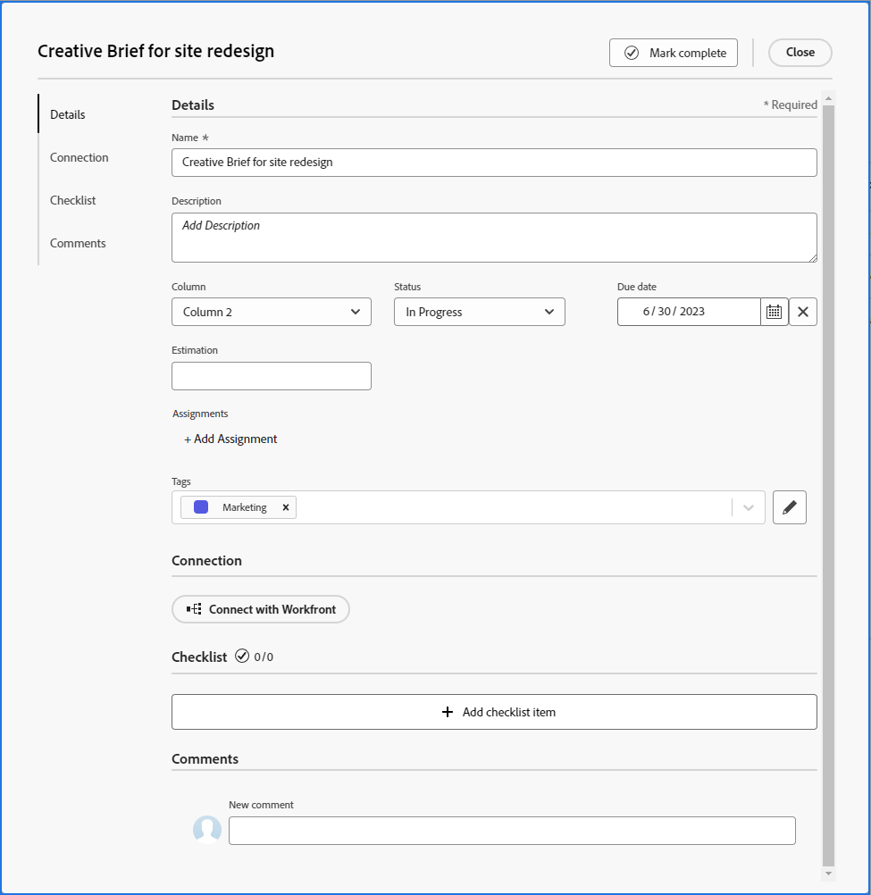

# Aggiungere una scheda ad hoc a una bacheca

Puoi aggiungere rapidamente una scheda a una bacheca e assegnarla a un membro della bacheca. La scheda può rappresentare un&#39;attività, un problema, una persona, un gruppo o qualsiasi tipo di elemento che si desidera includere nella scheda.

>[!NOTE]
>
>Le schede ad hoc di una bacheca non sono collegate agli elementi di lavoro in [!DNL Adobe Workfront]. Per informazioni dettagliate sulle schede collegate, vedere [Utilizzare le schede collegate sulle schede](/help/quicksilver/agile/get-started-with-boards/connected-cards.md).

## Requisiti di accesso

+++ Espandi per visualizzare i requisiti di accesso per la funzionalità descritta in questo articolo.

<table style="table-layout:auto"> 
 <col> 
 <col> 
 <tbody> 
  <tr> 
   <td role="rowheader">Pacchetto Adobe Workfront</td> 
   <td> 
Qualsiasi
 </td> 
  </tr> 
  <tr> 
   <td role="rowheader">Licenza di Adobe Workfront</td> 
   <td> 
   
Collaboratore o successiva
 
   
Richiedente o successiva

   </td> 
  </tr> 
 </tbody> 
</table>

Per ulteriori dettagli sulle informazioni contenute in questa tabella, consulta [Requisiti di accesso nella documentazione Workfront](/help/quicksilver/administration-and-setup/add-users/access-levels-and-object-permissions/access-level-requirements-in-documentation.md).

+++

## Aggiungi una scheda ad hoc con dettagli completi

Scheda ad hoc non connessa a un elemento di lavoro in [!DNL Adobe Workfront].

{{step1-to-boards}}

1. Accedi a una bacheca. Per informazioni, consulta [Creare o modificare una bacheca](../../agile/get-started-with-boards/create-edit-board.md).
1. Fai clic su **[!UICONTROL Aggiungi scheda] > [!UICONTROL Nuova scheda]**.

   Viene visualizzata la casella [!UICONTROL Dettagli carta].

   >[!NOTE]
   >
   >Se fai clic all’esterno del campo Nome, la scheda ad hoc viene salvata automaticamente come &quot;Senza titolo&quot; nella parte inferiore della colonna più a sinistra. Per uscire senza salvare la carta, è necessario fare clic su [!UICONTROL **Annulla**] senza fare clic in un altro punto nella casella [!UICONTROL Dettagli carta].

1. Nella casella **[!UICONTROL Dettagli carta]**, aggiungi le seguenti informazioni:

   <table style="table-layout:auto"> 
    <col> 
    <col> 
    <tbody> 
     <tr> 
      <td role="rowheader"><strong>[!Nome UICONTROL]</strong> </td> 
      <td>Il nome della carta.</td> 
     </tr> 
     <tr> 
      <td role="rowheader"><strong>[!Descrizione UICONTROL]</strong> </td> 
      <td>Descrizione della scheda. Puoi aggiungere degli URL nella descrizione, che diventeranno collegamenti cliccabili una volta salvata la scheda.</td>
     </tr>
     <tr> 
      <td role="rowheader"><strong>[!Colonna UICONTROL]</strong> </td> 
      <td>Selezionare la colonna per la scheda. Se si lascia vuoto il campo <strong>[!Colonna UICONTROL]</strong>, la scheda verrà inserita nella prima colonna a sinistra della scheda.</td>
     </tr>
     <tr> 
      <td role="rowheader"><strong>[!Stato UICONTROL]</strong> </td> 
      <td>Selezionare uno stato per la scheda. Se si fa clic su <strong>[!UICONTROL Mark Complete]</strong> nella parte superiore della scheda, lo stato viene automaticamente modificato in [!UICONTROL Complete].</td> 
     </tr>
     <tr> 
      <td role="rowheader"><strong>[!UICONTROL Scadenza]</strong></td> 
      <td>Selezionare una data di scadenza per la scheda. </td>
     </tr>
     <tr> 
      <td role="rowheader"><strong>[!Stima UICONTROL]</strong></td> 
      <td>Digitare il numero stimato di ore per il completamento della scheda. Si tratta solo di una immissione manuale.</td>
     </tr>
     <tr> 
      <td role="rowheader"><strong>[!UICONTROL Assegnazioni]</strong> </td> 
      <td>Per assegnare la scheda, fare clic su <strong>[!UICONTROL Aggiungi assegnazione]</strong> e iniziare a digitare un nome nel campo di ricerca. Quindi, selezionalo quando viene visualizzato nell'elenco dei risultati. Puoi aggiungere sia utenti singoli che team e assegnare più persone o team a una scheda.</td>
     </tr>     
     <tr> 
      <td role="rowheader"><strong>[!UICONTROL Tag]</strong></td> 
      <td>Cercare e selezionare i tag per la scheda. Per informazioni sulla creazione di nuovi tag, vedere <a href="../../agile/get-started-with-boards/add-tags.md" class="MCXref xref">Aggiungere tag</a>.</td> 
     </tr>
     <tr>
      <td role="rowheader"><strong>[!Connessione UICONTROL]</strong> </td>
      <td>È possibile connettere una scheda ad hoc a un'attività [!DNL Workfront] o a un problema. Per ulteriori informazioni, consulta "Convertire una scheda ad hoc in una scheda collegata" nell'articolo <a href="/help/quicksilver/agile/get-started-with-boards/connected-cards.md">Utilizzare schede connesse su schede</a>.</td>
     </tr>
     <tr> 
      <td role="rowheader"><strong>[!Elenco di controllo UICONTROL]</strong> </td> 
      <td> 
Fare clic su <strong>[!UICONTROL Aggiungi elemento elenco di controllo]</strong>. Digitare quindi il titolo dell'elemento e premere Invio. Viene aggiunto automaticamente un altro elemento. Continua a immettere titoli per aggiungere altri elementi.
 
Il contatore nella parte superiore dell’elenco di controllo mostra il numero di elementi completati e il numero totale di elementi.
 
Per ulteriori informazioni sugli elementi dell'elenco di controllo, vedere <a href="/help/quicksilver/agile/get-started-with-boards/manage-checklist-items.md">Gestione degli elementi dell'elenco di controllo nelle schede</a>.
 </td> 
     </tr>
     <tr>
      <td role="rowheader"><strong>[!Commenti UICONTROL]</strong></td>
      <td>
Fare clic nel campo <strong>[!UICONTROL Nuovo commento]</strong> e digitare il commento. Usate gli strumenti di formattazione per formattare il testo. (Le immagini non sono disponibili nei commenti su schede ad hoc.) Per assegnare tag a una persona o a un team, utilizza la casella di ricerca nella parte inferiore dell’area dei commenti. L'utente non deve necessariamente essere un membro della bacheca.

<strong>NOTA:</strong> al momento, gli utenti con tag nei commenti su schede ad hoc non ricevono una notifica e-mail.
      

Fare clic su <strong>[!UICONTROL Submit]</strong> per aggiungere il commento alla scheda.

      
Per ulteriori informazioni sui commenti, consulta <a href="/help/quicksilver/workfront-basics/updating-work-items-and-viewing-updates/update-work.md">Aggiornamento del lavoro</a>.
</td>
     </tr>
    </tbody> 
   </table>

   

   Utilizza il pannello di navigazione sinistro per spostarti tra le sezioni dei campi nei dettagli della scheda.

1. Fai clic su **[!UICONTROL Chiudi]** per aggiungere la scheda alla bacheca.

   Gli assegnatari, i tag, la data di scadenza, il contatore dell’elenco di controllo, le ore stimate e lo stato vengono visualizzati sulla scheda.

## Aggiunta rapida di una scheda ad hoc

Puoi aggiungere schede ad hoc con solo un titolo per popolare rapidamente la bacheca.

1. Accedi alla bacheca a cui desideri aggiungere le schede.
1. Fai clic sull&#39;icona **[!UICONTROL Aggiungi]**  nella colonna in cui desideri aggiungere la scheda.
1. Digita il nome della scheda e premi Invio.

   Un’altra scheda viene aggiunta automaticamente sotto la nuova scheda.

1. Continua a immettere i nomi delle schede per aggiungerne altre.
1. Per interrompere l&#39;aggiunta di schede, fare clic all&#39;esterno della colonna.
1. Per aggiungere ulteriori dettagli, è necessario modificare la scheda. Per ulteriori informazioni, vedere [Modificare una scheda esistente](#edit-an-existing-card) in questo articolo.

## Modificare una scheda esistente {#edit-an-existing-card}

1. Accedi alla bacheca.
1. Fai clic sul nome della scheda per modificarlo.
1. Per modificare i dettagli della carta, fai clic sulla carta (non sul nome della carta).

   Oppure

   Fai clic sul menu **[!UICONTROL Altro]** ![[!UICONTROL Altro menu]](assets/more-icon-spectrum.png) sulla scheda e seleziona **[!UICONTROL Modifica]**.

1. Nella casella [!UICONTROL Dettagli scheda], aggiorna le informazioni in base alle esigenze e fai clic su **[!UICONTROL Chiudi]** per tornare alla bacheca.

   Se sono stati abilitati i criteri colonna per l&#39;aggiornamento dei valori dei campi, quando si modifica lo stato della scheda la scheda viene automaticamente spostata nella colonna corrispondente. Per ulteriori informazioni, consulta &quot;Definire le impostazioni e i criteri delle colonne&quot; nell&#39;articolo [Gestire le colonne delle bacheche](/help/quicksilver/agile/get-started-with-boards/manage-board-columns.md).
