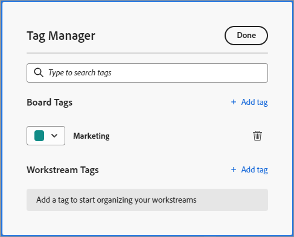

# Aggiungi tag

Puoi aggiungere tag alle schede per mostrare visivamente che sono simili. Puoi quindi filtrare in base a tali tag per visualizzare le relative schede.

>[!NOTE]
>
>I tag non sono condivisi tra bacheche.

## Requisiti di accesso

Per eseguire i passaggi descritti in questo articolo, è necessario disporre dei seguenti diritti di accesso:

<table style="table-layout:auto"> 
 <col> 
 </col> 
 <col> 
 </col> 
 <tbody> 
  <tr> 
   <td role="rowheader"><strong>[!DNL Adobe Workfront] piano*</strong></td> 
   <td> 
Qualsiasi
 </td> 
  </tr> 
  <tr> 
   <td role="rowheader"><strong>[!DNL Adobe Workfront] licenza*</strong></td> 
   <td> 
[!UICONTROL Request] o versione successiva
 </td> 
  </tr> 
 </tbody> 
</table>

&#42;Per conoscere il piano, il tipo di licenza o l&#39;accesso di cui si dispone, contattare [!DNL Workfront] amministratore.

## Creare tag per una bacheca

{{step1-to-boards}}

1. Accedi a una bacheca. Per informazioni, consulta [Creare o modificare una bacheca](../../agile/get-started-with-boards/create-edit-board.md).
1. Fai clic su **[!UICONTROL Altro]** menu  accanto al nome della bacheca, quindi scegli **[!UICONTROL Gestione tag]**.

   

1. In [!UICONTROL Gestione tag] finestra di dialogo, seleziona [!UICONTROL **Aggiungi tag**] nel [!UICONTROL Tag della bacheca] sezione.
1. Digita il nome del tag nella casella evidenziata, quindi scegli un colore per il tag dal menu a discesa. Il tag viene salvato automaticamente.
1. (Facoltativo) Ripeti i passaggi 4-5 per creare altri tag.
1. Clic **[!UICONTROL Fine]** nell’angolo in alto a destra della casella.

   

## Creare tag per un flusso di lavoro

>[!IMPORTANT]
>
>I flussi di lavoro sono disponibili solo per un gruppo specifico di clienti.

I tag del flusso di lavoro sono disponibili per tutte le bacheche di un flusso di lavoro.

{{step1-to-boards}}

1. Nel dashboard, fai clic su [!UICONTROL **Visualizza flusso di lavoro**] per aprire un workflow.
1. Apri una bacheca. Fai clic su **[!UICONTROL Altro]** menu  accanto al nome della bacheca, quindi scegli **[!UICONTROL Gestione tag]**.

   Oppure

   Clic [!UICONTROL **Configura**] per aprire [!UICONTROL Configura flusso di lavoro] pannello. Quindi, fai clic su **[!UICONTROL Gestione tag]**.

1. In [!UICONTROL Gestione tag] finestra di dialogo, seleziona [!UICONTROL **Aggiungi tag**] nella sezione Tag del flusso di lavoro.
1. Digita il nome del tag nella casella evidenziata, quindi scegli un colore per il tag dal menu a discesa. Il tag viene salvato automaticamente.
1. (Facoltativo) Ripeti i passaggi 4-5 per creare altri tag.
1. Clic **[!UICONTROL Fine]** nell’angolo in alto a destra della casella.

   

## Aggiungere un tag a una scheda

1. Accedi a una bacheca.
1. Per modificare i dettagli della scheda, fai clic sulla scheda (non nel nome della scheda).

   Oppure

   Fai clic su **[!UICONTROL Altro]** menu ![[!UICONTROL Menu Altro]](assets/more-icon-spectrum.png) sulla scheda e seleziona **[!UICONTROL Modifica]**.

1. In **[!UICONTROL Tag]** digitare il nome di un tag esistente e selezionarlo dai risultati della ricerca.\
   Oppure\
   Fai clic su **[!UICONTROL Modifica]**&#x200B;icona  e creare un nuovo tag in Gestione tag. Clic **Fine** per tornare alla scheda, seleziona il tag sulla scheda.
1. Fai clic su **Chiudi**.

## Modificare un tag

1. Accedi a una bacheca.
1. Fai clic su **[!UICONTROL Altro]** menu  accanto al nome della bacheca, quindi scegli **[!UICONTROL Gestione tag]**.

   

1. (Condizionale) Fai clic sul nome del tag per modificare il testo.
1. (Condizionale) Fai clic su [!UICONTROL colore] menu a discesa per modificare il colore del tag.
1. Clic **[!UICONTROL Fine]**.

## Rimuovere un tag da una scheda

1. Accedi a una bacheca.
1. Per modificare i dettagli della scheda, fai clic sulla scheda (non nel nome della scheda).

   Oppure

   Fai clic su **[!UICONTROL Altro]** menu ![[!UICONTROL Menu Altro]](assets/more-icon-spectrum.png) sulla scheda e seleziona **[!UICONTROL Modifica]**.

1. Trova il tag da rimuovere dalla scheda, quindi fai clic su **[!UICONTROL Rimuovi]** icona .
1. Fai clic su **[!UICONTROL Chiudi]**.

## Eliminare un tag

1. Accedi a una bacheca.
1. Fai clic su **[!UICONTROL Altro]** menu ![[!UICONTROL Menu Altro]](assets/more-icon-spectrum.png) accanto al nome della bacheca, quindi scegli **[!UICONTROL Gestione tag]**.

   

1. Individua il tag da eliminare, quindi fai clic su **[!UICONTROL Elimina]** icona .
1. Clic **[!UICONTROL Fine]**.
