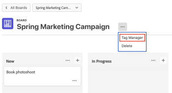
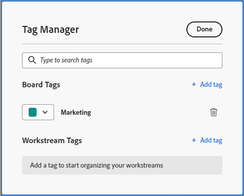
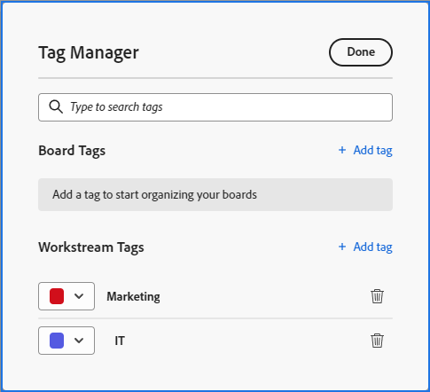

# Aggiungere tag

Puoi aggiungere tag alle schede per mostrare visivamente che sono simili. Puoi quindi filtrare in base a tali tag per visualizzare le relative schede.

>[!NOTE]
>
>I tag non sono condivisi tra bacheche.

## Requisiti di accesso

+++ Espandi per visualizzare i requisiti di accesso per la funzionalità descritta in questo articolo.

<table style="table-layout:auto"> 
 <col> 
 <col> 
 <tbody> 
  <tr> 
   <td role="rowheader">Pacchetto Adobe Workfront</td> 
   <td> 
Qualsiasi
 </td> 
  </tr> 
  <tr> 
   <td role="rowheader">Licenza di Adobe Workfront</td> 
   <td> 
   
Collaboratore o successiva
 
   
Richiedente o successiva

   </td> 
  </tr> 
 </tbody> 
</table>

Per informazioni, consulta [Requisiti di accesso nella documentazione di Workfront](/help/quicksilver/administration-and-setup/add-users/access-levels-and-object-permissions/access-level-requirements-in-documentation.md).

+++

## Creare tag per una bacheca

{{step1-to-boards}}

1. Accedi a una bacheca. Per informazioni, consulta [Creare o modificare una bacheca](../../agile/get-started-with-boards/create-edit-board.md).
1. Fai clic sul menu **[!UICONTROL Altro]**  accanto al nome della bacheca, quindi scegli **[!UICONTROL Gestione tag]**.

   

1. Nella finestra di dialogo [!UICONTROL Gestione tag], seleziona [!UICONTROL **Aggiungi tag**] nella sezione [!UICONTROL Tag bacheca].
1. Digita il nome del tag nella casella evidenziata, quindi scegli un colore per il tag dal menu a discesa. Il tag viene salvato automaticamente.
1. (Facoltativo) Ripeti i passaggi 4-5 per creare altri tag.
1. Fai clic su **[!UICONTROL Fine]** nell&#39;angolo superiore destro della casella.

   

## Creare tag per un flusso di lavoro

>[!IMPORTANT]
>
>I flussi di lavoro sono disponibili solo per un gruppo specifico di clienti.

I tag del flusso di lavoro sono disponibili per tutte le bacheche di un flusso di lavoro.

{{step1-to-boards}}

1. Nel dashboard fare clic su [!UICONTROL **Visualizza flusso di lavoro**] per aprire un flusso di lavoro.
1. Apri una bacheca. Fai clic sul menu **[!UICONTROL Altro]**  accanto al nome della bacheca, quindi scegli **[!UICONTROL Gestione tag]**.

   Oppure

   Fare clic su [!UICONTROL **Configura**] per aprire il pannello [!UICONTROL Configura flusso di lavoro]. Quindi fare clic su **[!UICONTROL Gestione tag]**.

1. Nella finestra di dialogo [!UICONTROL Gestione tag], seleziona [!UICONTROL **Aggiungi tag**] nella sezione Tag del flusso di lavoro.
1. Digita il nome del tag nella casella evidenziata, quindi scegli un colore per il tag dal menu a discesa. Il tag viene salvato automaticamente.
1. (Facoltativo) Ripeti i passaggi 4-5 per creare altri tag.
1. Fai clic su **[!UICONTROL Fine]** nell&#39;angolo superiore destro della casella.

   

## Aggiungere un tag a una scheda

1. Accedi a una bacheca.
1. Per modificare i dettagli della scheda, fai clic sulla scheda (non nel nome della scheda).

   Oppure

   Fai clic sul menu **[!UICONTROL Altro]** ![[!UICONTROL Altro menu]](assets/more-icon-spectrum.png) sulla scheda e seleziona **[!UICONTROL Modifica]**.

1. Nella casella **[!UICONTROL Tag]** digitare il nome di un tag esistente e selezionarlo dai risultati della ricerca.\
   Oppure\
   Fai clic sull&#39;icona **[!UICONTROL Modifica]**&#x200B;  e crea un nuovo tag in Gestione tag. Fai clic su **Fine** per tornare alla scheda, quindi seleziona il tag sulla scheda.
1. Fai clic su **Chiudi**.

## Modificare un tag

1. Accedi a una bacheca.
1. Fai clic sul menu **[!UICONTROL Altro]**  accanto al nome della bacheca, quindi scegli **[!UICONTROL Gestione tag]**.

   

1. (Condizionale) Fai clic sul nome del tag per modificare il testo.
1. (Condizionale) Fai clic sul menu a discesa [!UICONTROL color] per modificare il colore del tag.
1. Fai clic su **[!UICONTROL Fine]**.

## Rimuovere un tag da una scheda

1. Accedi a una bacheca.
1. Per modificare i dettagli della scheda, fai clic sulla scheda (non nel nome della scheda).

   Oppure

   Fai clic sul menu **[!UICONTROL Altro]** ![[!UICONTROL Altro menu]](assets/more-icon-spectrum.png) sulla scheda e seleziona **[!UICONTROL Modifica]**.

1. Trova il tag da rimuovere dalla scheda, quindi fai clic sull&#39;icona **[!UICONTROL Rimuovi]** .
1. Fai clic su **[!UICONTROL Chiudi]**.

## Eliminare un tag

1. Accedi a una bacheca.
1. Fai clic sul menu **[!UICONTROL Altro]** ![[!UICONTROL Altro menu]](assets/more-icon-spectrum.png) accanto al nome della bacheca, quindi scegli **[!UICONTROL Gestione tag]**.

   

1. Trova il tag da eliminare, quindi fai clic sull&#39;icona **[!UICONTROL Elimina]** .
1. Fai clic su **[!UICONTROL Fine]**.
