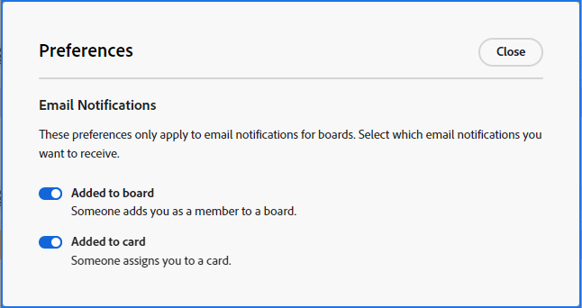

# Preferenze e notifiche e-mail delle bacheche

[!DNL Adobe Workfront] [!UICONTROL Bacheche] ti invia un&#39;e-mail quando vieni aggiunto a una bacheca e quando ti viene assegnata una carta. Le notifiche sono attivate per impostazione predefinita e puoi selezionare nelle preferenze delle bacheche le e-mail che desideri ricevere.

Riceverai un messaggio e-mail anche quando aggiungi un commento a una scheda collegata, a seconda delle impostazioni di notifica e-mail. Per ulteriori informazioni, vedere [Modifica delle notifiche e-mail personali](/help/quicksilver/workfront-basics/using-notifications/activate-or-deactivate-your-own-event-notifications.md). Al momento, gli utenti con tag nei commenti su schede ad hoc non ricevono una notifica e-mail.

## Requisiti di accesso

+++ Espandi per visualizzare i requisiti di accesso per la funzionalità descritta in questo articolo.

<table style="table-layout:auto"> 
 <col> 
 <col> 
 <tbody> 
  <tr> 
   <td role="rowheader">Pacchetto Adobe Workfront</td> 
   <td> 
Qualsiasi
 </td> 
  </tr> 
  <tr> 
   <td role="rowheader">Licenza di Adobe Workfront</td> 
   <td> 
   
Collaboratore o successiva
 
   
Richiedente o successiva

   </td> 
  </tr> 
 </tbody> 
</table>

Per ulteriori dettagli sulle informazioni contenute in questa tabella, consulta [Requisiti di accesso nella documentazione Workfront](/help/quicksilver/administration-and-setup/add-users/access-levels-and-object-permissions/access-level-requirements-in-documentation.md).

+++

## Impostare le preferenze per le e-mail delle bacheche

{{step1-to-boards}}

1. Fai clic su [!UICONTROL **Preferenze**] nel dashboard delle bacheche.
1. Seleziona se desideri ricevere e-mail relative all’aggiunta a una bacheca e all’assegnazione a una scheda.

   

   Le preferenze impostate per le e-mail si applicano a tutte le bacheche.

<!--

## Set the dark mode preference

>[!NOTE]
>
>If your organization's instance of Workfront has been onboarded to the Adobe Unified Experience, you can enable dark theme formatting for all of Adobe Experience Cloud through your preferences menu (your profile picture), and you will not see a separate dark mode option for Workfront Boards. For more information, see [Adobe Unified Experience for Workfront](/help/quicksilver/workfront-basics/navigate-workfront/workfront-navigation/adobe-unified-experience.md).

{{step1-to-boards}}

1. Click [!UICONTROL **Preferences**] on the boards dashboard.
1. In the Themes area, enable or disable Dark mode.

   The preference you set for dark mode applies to all of your boards and workstreams, and the dashboard.

-->
