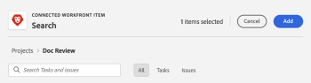

# Utilizzare le schede collegate sulle bacheche

È possibile aggiungere alla bacheca una scheda connessa alle attività e ai problemi esistenti in [!DNL Workfront].

Quando uno qualsiasi dei seguenti dettagli viene aggiornato per la scheda in una posizione, viene automaticamente aggiornato nell’altra posizione:

* [!UICONTROL Nome]
* [!UICONTROL Descrizione]
* [!UICONTROL Assegnatari]
* [!UICONTROL Stato]
* [!UICONTROL Data di completamento pianificata]
* [!UICONTROL Stima] / [!UICONTROL Punti storia]

>[!NOTE]
>È possibile aggiungere una sola attività o un singolo problema collegato una sola volta per bacheca. La stessa attività o lo stesso problema può essere collegato a più bacheche.

## Requisiti di accesso

Per eseguire i passaggi descritti in questo articolo, è necessario disporre dei seguenti diritti di accesso:

<table style="table-layout:auto"> 
 <tbody> 
  <tr> 
   <td role="rowheader"><strong>[!DNL Adobe Workfront] piano*</strong></td> 
   <td> 
Qualsiasi
 </td> 
  </tr> 
  <tr> 
   <td role="rowheader"><strong>[!DNL Adobe Workfront] licenza*</strong></td> 
   <td> 
[!UICONTROL Request] o versione successiva
 </td> 
  </tr> 
  <tr>
   <td role="rowheader"><strong>Configurazioni del livello di accesso*</strong></td>
   <td>
Accesso di [!UICONTROL View] o versione successiva ad attività e problemi
</td>
  </tr>
  <tr>
   <td role="rowheader"><strong>Autorizzazioni oggetto</strong></td>
   <td>
Autorizzazioni di [!UICONTROL View] o superiori per l'attività o il problema di Workfront
</td>
  </tr>
 </tbody> 
</table>

&#42;Per conoscere il piano, il tipo di licenza o l&#39;accesso di cui si dispone, contattare [!DNL Workfront] amministratore.

## Aggiungere una scheda collegata

1. Fai clic su **[!UICONTROL Menu principale]** icona  nell’angolo superiore destro di Adobe Workfront, quindi fai clic su **[!UICONTROL Schede]**.
1. Accedi a una bacheca. Per informazioni, consulta [Creare o modificare una bacheca](../../agile/get-started-with-boards/create-edit-board.md).
1. Clic **[!UICONTROL Aggiungi scheda] > [!UICONTROL Scheda connessa]**.
1. Scegli un progetto, quindi scegli un’attività o un problema da aggiungere come scheda sulla bacheca.

   È possibile selezionare più oggetti che verranno aggiunti come schede separate.

   >[!NOTE]
   >
   >* Nei risultati della ricerca sono disponibili solo gli oggetti per i quali si dispone di autorizzazioni. Se un elemento viene oscurato, è già stato aggiunto alla bacheca.
   >* Quando si filtra per **[!UICONTROL Progetti di mia proprietà]** o **[!UICONTROL Progetti a cui collaboro]**, i progetti che corrispondono a uno stato Complete (Completato), Dead (Inattivo) o Rejected (Rifiutato) non sono inclusi. Puoi comunque cercare tali progetti con **[!UICONTROL Tutti]** filtro.

1. Clic **[!UICONTROL Aggiungi]**.

   

   La scheda viene aggiunta nella parte inferiore della colonna più a sinistra. La connessione [!DNL Workfront] L&#39;oggetto e i relativi assegnatari vengono visualizzati sulla scheda.

   >[!NOTE]
   >
   >Se un assegnatario su [!DNL Workfront] l’attività o il problema non è un membro della bacheca, non è assegnato alla scheda.

   

1. Clic  per aprire [!DNL Workfront] attività o problema in una nuova scheda del browser.
1. Per modificare i dettagli della scheda, fai clic sulla scheda (non nel nome della scheda).

   Oppure

   Fai clic su **[!UICONTROL Altro]** menu  sulla scheda e seleziona **[!UICONTROL Modifica]**.

1. In **[!UICONTROL Dettagli scheda]** , aggiungere o aggiornare le seguenti informazioni:

   <table style="table-layout:auto"> 
    <tbody> 
     <tr> 
      <td role="rowheader"><strong>[!UICONTROL Name]</strong></td> 
      <td>La modifica del nome comporta anche la modifica del nome della connessione [!DNL Workfront] oggetto.</td> 
     </tr> 
     <tr> 
      <td role="rowheader"><strong>[!UICONTROL Descrizione]</strong></td> 
      <td>La modifica della descrizione comporta anche la modifica della descrizione nella connessione [!DNL Workfront] oggetto. Puoi aggiungere gli URL nella descrizione, che diventeranno collegamenti cliccabili al salvataggio della scheda.</td> 
     </tr>
     <tr>
      <td role="rowheader"><strong>[!UICONTROL Colonna]</strong></td>
      <td>Seleziona la colonna per la scheda.</td>
     </tr>
     <tr>
      <td role="rowheader"><strong>[!UICONTROL Stato]</strong></td>
      <td>
Selezionare uno stato per la scheda. Le impostazioni predefinite sono [!UICONTROL Nuovo], [!UICONTROL In corso] e [!UICONTROL Completo], ma sono definiti eventuali stati personalizzati per l'elemento in [!DNL Workfront] sono inoltre disponibili.

      
Se sono stati abilitati i criteri di colonna per l’aggiornamento dei valori dei campi, la modifica dello stato sulla scheda sposta automaticamente la scheda nella colonna corrispondente. Per ulteriori informazioni, consulta "Definire le impostazioni e i criteri delle colonne" nell’articolo <a href="/help/quicksilver/agile/get-started-with-boards/manage-board-columns.md" class="MCXref xref">Gestisci colonne bacheca</a>.

      
Se si fa clic su <strong>[!UICONTROL Segna come completato]</strong> nella parte superiore della scheda, lo stato cambia automaticamente in Completato.
</td>
     </tr>
     <tr>
      <td role="rowheader"><strong>[!UICONTROL completamento pianificato]</strong></td>
      <td>La modifica di questa data comporta anche la modifica della data di completamento pianificata nella connessione [!DNL Workfront] oggetto.</td>
     </tr>
      <tr>
      <td role="rowheader"><strong>Stima [!UICONTROL]</strong></td>
      <td>
Il numero di ore per il completamento della scheda.

La modifica della stima cambia anche il valore dei punti della storia sulla connessione [!DNL Workfront] oggetto.
</td>
     </tr>
     <tr>
      <td role="rowheader"><strong>[!UICONTROL Assegnatari]</strong></td>
      <td>
Per assegnare più persone o un team alla scheda, inizia a digitare un nome nel campo di ricerca, quindi selezionalo quando viene visualizzato nell’elenco. Puoi aggiungere sia singoli utenti che team. Su una scheda connessa è consentita una sola assegnazione team.

      
Gli assegnatari devono essere membri della bacheca o non verranno visualizzati nell’elenco di selezione. Quando un team è membro della bacheca, i singoli membri del team possono essere assegnati alla scheda.

      
Tutti gli assegnatari selezionati vengono assegnati anche all'attività o al problema in [!DNL Workfront].
</td>
     </tr>
     <tr>
      <td role="rowheader"><strong>[!UICONTROL Tags]</strong></td>
      <td>
Cerca e seleziona i tag per la scheda.

      
Per informazioni sulla creazione di nuovi tag, consulta <a href="../../agile/get-started-with-boards/add-tags.md" class="MCXref xref">Aggiungi tag</a>.
</td>
     </tr>
     <tr>
      <td role="rowheader"><strong>[!UICONTROL Campi personalizzati]</strong></td>
      <td>
Tutti i campi personalizzati aggiunti verranno visualizzati in quest'area.

      
Per ulteriori informazioni, consulta <a href="/help/quicksilver/agile/get-started-with-boards/customize-fields-on-card.md">Personalizzare i campi visualizzati su una scheda</a>.
</td>
     </tr>
     <tr> 
      <td role="rowheader"><strong>Elenco di controllo di [!UICONTROL]</strong> </td> 
      <td> 
Clic <strong>[!UICONTROL Aggiungi voce elenco di controllo]</strong>. Digitare quindi il titolo dell'elemento e premere Invio. Un altro elemento viene aggiunto automaticamente. Continua a inserire i titoli per aggiungere altri elementi.
 
Il contatore nella parte superiore dell’elenco di controllo mostra il numero di elementi completati e il numero totale di elementi.
 
Per ulteriori informazioni sugli elementi dell’elenco di controllo, consulta <a href="/help/quicksilver/agile/get-started-with-boards/manage-checklist-items.md">Gestire le voci dell’elenco di controllo sulle schede</a>.
</td>
     </tr>
     <tr>
      <td role="rowheader"><strong>[!UICONTROL Hours]</strong></td>
      <td>Consulta "Registrare le ore su una scheda collegata", di seguito.</td>
     </tr>
     <tr>
      <td role="rowheader"><strong>[!UICONTROL Commenti]</strong></td>
      <td>
Fai clic su nella <strong>[!UICONTROL Nuovo commento]</strong> e digita il commento. Utilizzare gli strumenti di formattazione per formattare il testo e fare clic su <strong>Aggiungi allegato</strong> icona  per allegare un file al commento. Per assegnare un tag a una persona o a un team, utilizza la casella di ricerca nella parte inferiore dell’area dei commenti. L’utente non deve essere un membro della bacheca. Gli utenti taggati sulle schede collegate riceveranno notifiche e-mail.

Clic <strong>[!UICONTROL Submit]</strong> per aggiungere il commento alla scheda.

      
<strong>NOTA:</strong> L’area di commento sulle schede utilizza la nuova esperienza di commento di Adobe Workfront. Per ulteriori informazioni, consulta <a href="/help/quicksilver/workfront-basics/updating-work-items-and-viewing-updates/update-work.md">Aggiorna lavoro</a>.

<strong>NOTA:</strong> I commenti sulle schede sono disponibili solo tramite la funzionalità opt-in anticipato per le schede madri Workfront.
</td>
     </tr>
     <tr> 
      <td role="rowheader"><strong>[!UICONTROL Attività di sistema]</strong></td> 
      <td>
Se è stato <strong>Attività di sistema</strong> abilitata come sezione scheda, l’attività viene visualizzata in quest’area.
 
Per ulteriori informazioni, consulta <a href="/help/quicksilver/agile/get-started-with-boards/customize-fields-on-card.md">Personalizzare i campi visualizzati su una scheda</a> e <a href="/help/quicksilver/administration-and-setup/set-up-workfront/system-tracked-update-feeds/system-tracked-update-feeds.md">Aggiornamenti monitorati dal sistema</a>.

<strong>NOTA:</strong> L’attività del sistema è disponibile solo tramite la funzionalità opt-in anticipato per le schede madri Workfront.
</td>
     </tr>     
    </tbody> 
   </table>

   Utilizza il pannello di navigazione a sinistra per spostarti tra le sezioni dei campi nei dettagli della scheda.

1. Clic **[!UICONTROL Chiudi]** per tornare alla bacheca.
L’oggetto connesso, gli assegnatari, i tag, la data di scadenza, il contatore della lista di controllo, le ore stimate e lo stato vengono visualizzati sulla scheda.

   

## Scollegare una scheda collegata

È possibile scollegare una scheda collegata dal relativo oggetto Workfront e la scheda rimane sulla scheda come scheda ad hoc modificabile.

Per disconnettersi a livello di scheda:

1. Accedi alla bacheca.
1. Fai clic su **[!UICONTROL Altro]** menu  sulla scheda collegata e selezionare **[!UICONTROL Disconnetti]**.
1. Clic **[!UICONTROL Disconnetti]** sul messaggio di conferma.

Per disconnettersi a livello di scheda:

1. Accedere alla scheda e aprire la scheda collegata.
1. Fai clic su **[!UICONTROL Altro]** menu  nell’area Connection (Connessione) dei dettagli della scheda, quindi seleziona **[!UICONTROL Disconnetti]**.
1. Clic **[!UICONTROL Disconnetti]** sul messaggio di conferma.

## Convertire una scheda ad hoc in una scheda collegata

Dopo aver creato una scheda ad hoc, è possibile convertirla in una scheda collegata. Per informazioni dettagliate sulle schede ad hoc, consulta [Aggiungere una scheda ad hoc a una bacheca](/help/quicksilver/agile/get-started-with-boards/add-card-to-board.md).

1. Accedi alla bacheca e apri la scheda ad hoc.
1. Verifica il nome e la descrizione sulla scheda. Verranno aggiunte all’attività o al problema creato in [!DNL Workfront].
1. In [!UICONTROL Connessione] nell’area dei dettagli della scheda, fai clic su **[!UICONTROL Connettersi con Workfront]**.
1. Il giorno [!UICONTROL Collega scheda] , selezionare se si sta creando un&#39;attività o un problema.
1. Cerca e seleziona un progetto a cui aggiungere l’attività o il problema.

   >[!NOTE]
   >
   >* Nei risultati della ricerca sono disponibili solo gli oggetti per i quali si dispone di autorizzazioni.
   >* Quando si filtra per **[!UICONTROL Progetti di mia proprietà]** o **[!UICONTROL Progetti a cui collaboro]**, progetti che equivalgono a un [!UICONTROL Completa], [!UICONTROL Morto], o [!UICONTROL Rifiutato] non sono inclusi. Puoi comunque cercare tali progetti con **[!UICONTROL Tutti]** filtro.

1. Clic **[!UICONTROL Connetti]**.

   

   Il nome del progetto viene visualizzato nell’area Connessione sui dettagli della scheda.

1. Clic **[!UICONTROL Chiudi]** per tornare alla bacheca.

## Registra ore su una scheda collegata

È necessario disporre delle autorizzazioni corrette per registrare le ore per l’attività o il problema connesso.

Per impostazione predefinita, i campi di registrazione ora non vengono visualizzati sulle schede collegate. Devi abilitare [!UICONTROL **Ore**] nel [!UICONTROL Configura] area sotto [!UICONTROL Schede]. Per ulteriori informazioni, consulta [Personalizzare i campi visualizzati su una scheda](/help/quicksilver/agile/get-started-with-boards/customize-fields-on-card.md).

1. Immetti il numero di ore per l’attività o il problema.
1. Seleziona un [!UICONTROL Tipo di Ora] dal menu a discesa, se è diverso dal valore predefinito.
1. Clic [!UICONTROL **Tempo di connessione**].

   

   L’ora registrata sulla scheda viene salvata anche sull’attività o sul problema connesso.

Il tempo di registrazione sulla scheda è lo stesso di quello su un’attività o un problema. Per ulteriori informazioni, consulta &quot;Registrare il tempo su un progetto, un’attività o un problema&quot; nell’articolo [Tempo di connessione](/help/quicksilver/timesheets/create-and-manage-timesheets/log-time.md).

