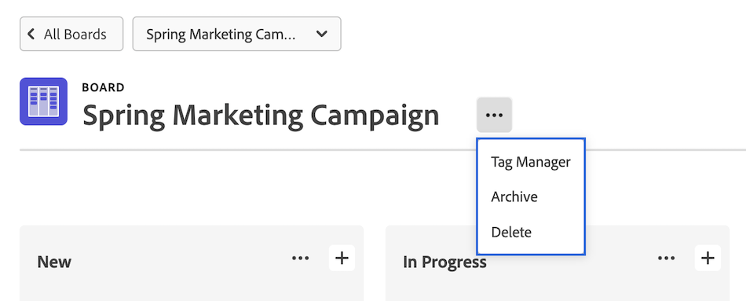
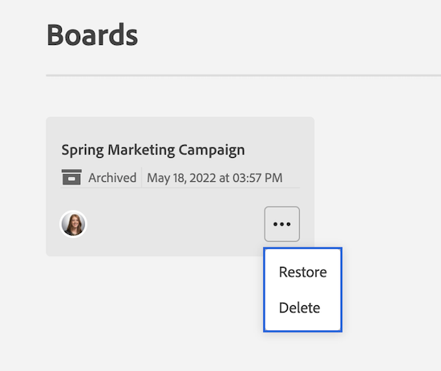

# Eliminare o archiviare una bacheca

È possibile eliminare o archiviare una bacheca in [!DNL Workfront]. Se si elimina una bacheca, questa viene rimossa definitivamente da [!DNL Workfront], mentre l&#39;archiviazione di una bacheca conserva tutte le schede e ne consente il ripristino in un secondo momento.

Solo il proprietario della bacheca può eliminarla.

## Requisiti di accesso

+++ Espandi per visualizzare i requisiti di accesso per la funzionalità descritta in questo articolo.

<table style="table-layout:auto"> 
 <col> 
 <col> 
 <tbody> 
  <tr> 
   <td role="rowheader">Pacchetto Adobe Workfront</td> 
   <td> 
Qualsiasi
 </td> 
  </tr> 
  <tr> 
   <td role="rowheader">Licenza di Adobe Workfront</td> 
   <td> 
   
Collaboratore o successiva
 
   
Richiedente o successiva

   </td> 
  </tr> 
 </tbody> 
</table>

Per informazioni, consulta [Requisiti di accesso nella documentazione di Workfront](/help/quicksilver/administration-and-setup/add-users/access-levels-and-object-permissions/access-level-requirements-in-documentation.md).

+++

## Eliminare una bacheca

Quando si elimina una bacheca, questa viene rimossa definitivamente da [!DNL Workfront] e non può essere ripristinata. Tutte le schede sulla bacheca vengono eliminate insieme alla bacheca.

{{step1-to-boards}}

1. Nel dashboard, seleziona la bacheca da aprire.
1. Fai clic sul menu **[!UICONTROL Altro]** ![[!UICONTROL Altro menu]](assets/more-icon-spectrum.png) accanto al nome della bacheca e seleziona **[!UICONTROL Elimina]**. Quindi, fai clic su **[!UICONTROL Elimina bacheca]** nel messaggio di conferma.

   >[!NOTE]
   >
   >Puoi eliminare solo le bacheche che hai creato o di cui sei stato nominato proprietario, non quelle di cui sei stato aggiunto come membro.

   

## Archiviare una bacheca

Le bacheche archiviate conservano tutte le schede e le assegnazioni. Qualsiasi utente può archiviare o ripristinare una bacheca in qualsiasi momento.

{{step1-to-boards}}

1. Nel dashboard, seleziona la bacheca da aprire.
1. Fai clic sul menu **[!UICONTROL Altro]** ![[!UICONTROL Altro menu]](assets/more-icon-spectrum.png) accanto al nome della bacheca e seleziona **[!UICONTROL Archivia]**.

   

## Ripristinare una bacheca

Una bacheca archiviata può essere ripristinata in qualsiasi momento. Qualsiasi utente può ripristinare una bacheca archiviata.

{{step1-to-boards}}

1. Nel dashboard, fai clic sull&#39;icona del filtro  e seleziona **[!UICONTROL Bacheche archiviate]**.
1. Individuare la bacheca da ripristinare, fare clic sul menu **[!UICONTROL Altro]**  accanto al nome della bacheca e selezionare **[!UICONTROL Ripristina]**.

   
