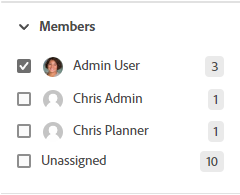
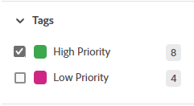
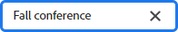

# Filtrare ed eseguire ricerche in una bacheca

Puoi filtrare una bacheca per visualizzarla:

* Schede assegnate a determinate persone
* Schede con determinati tag
* Schede con uno stato specifico
* Schede in scadenza in un determinato intervallo di tempo
* Schede archiviate
* Schede connesse a un progetto specifico

L’ordinamento della bacheca ordina tutte le schede nelle colonne. Non è possibile ordinare una singola colonna e la colonna backlog o acquisizione non è ordinata.

La ricerca consente inoltre di individuare una scheda specifica sulla bacheca.

Quando vengono applicati filtri, nella bacheca  viene visualizzato un indicatore. Fai clic su **[!UICONTROL Cancella tutto]** per rimuovere tutti i filtri dalla bacheca, quindi fai clic sull&#39;icona di compressione per chiudere il pannello dei filtri.

## Requisiti di accesso

+++ Espandi per visualizzare i requisiti di accesso per la funzionalità in questo articolo.

<table style="table-layout:auto"> 
 <col> 
 <col> 
 <tbody> 
  <tr> 
   <td role="rowheader">Pacchetto Adobe Workfront</td> 
   <td> 
Qualsiasi
 </td> 
  </tr> 
  <tr> 
   <td role="rowheader">Licenza Adobe Workfront</td> 
   <td> 
   
Collaboratore o versione successiva
 
   
Richiedi o superiore

   </td> 
  </tr> 
 </tbody> 
</table>

Per ulteriori dettagli sulle informazioni contenute in questa tabella, vedere [Requisiti di accesso nella documentazione di Workfront](/help/quicksilver/administration-and-setup/add-users/access-levels-and-object-permissions/access-level-requirements-in-documentation.md).

+++

## Filtrare una bacheca per assegnatari

{{step1-to-boards}}

1. Accedi a una bacheca. Per informazioni, consulta [Creare o modificare una bacheca](../../agile/get-started-with-boards/create-edit-board.md).
1. Fai clic su [!UICONTROL **Filtro**], espandi la sezione [!UICONTROL Membri] e seleziona la persona o le persone di cui desideri visualizzare le schede. Puoi anche visualizzare le schede non assegnate.

   

## Filtrare una bacheca per tag

1. Accedi alla bacheca.
1. Fai clic su [!UICONTROL **Filtro**], espandi la sezione [!UICONTROL Tag] e seleziona i tag che desideri visualizzare.

   

## Filtrare una bacheca per stato

1. Accedi alla bacheca.
1. Fai clic su [!UICONTROL **Filtro**], espandi la sezione [!UICONTROL Stati] e seleziona i tipi di stato che desideri visualizzare.

   Puoi anche nascondere le schede completate.

   

## Filtrare una bacheca per data di scadenza

1. Accedi alla bacheca.
1. Fai clic su [!UICONTROL **Filtro**], espandi la sezione [!UICONTROL Data di scadenza] e seleziona le opzioni di data che desideri visualizzare.

   Vengono visualizzate solo le schede negli intervalli di date selezionati.

   

## Filtrare una bacheca per mostrare le schede archiviate

Per impostazione predefinita, su una bacheca vengono visualizzate solo le schede attive. Puoi filtrare la bacheca per visualizzare anche eventuali schede archiviate.

1. Accedi alla bacheca.
1. Fai clic su [!UICONTROL **Configura**] a destra della bacheca per aprire il pannello Configura.
1. Espandi [!UICONTROL **Schede**].
1. Attiva [!UICONTROL **Visualizza schede archiviate sulla bacheca**].
1. Fai clic su [!UICONTROL **Filtro**], espandi la sezione [!UICONTROL Schede archiviate] e seleziona **[!UICONTROL Schede archiviate]** per visualizzare le schede archiviate.

   Il filtro mostra il numero di schede archiviate.

   

   >[!NOTE]
   >
   >La sezione [!UICONTROL Schede archiviate] non è disponibile nel filtro se non è stata attivata l&#39;impostazione di configurazione per la visualizzazione delle schede archiviate. Per ulteriori informazioni, vedere [Personalizzare i campi visualizzati in una scheda](/help/quicksilver/agile/get-started-with-boards/customize-fields-on-card.md).

1. Seleziona di nuovo **[!UICONTROL Schede archiviate]** per cancellare l&#39;opzione e visualizzare solo le schede attive.

## Filtrare una bacheca per connessione

1. Accedi alla bacheca.
1. Fai clic su [!UICONTROL **Filtro**], espandi la sezione [!UICONTROL Connessione] e seleziona i [!DNL Workfront] progetti per le schede connesse che desideri visualizzare.

   È inoltre possibile visualizzare schede non collegate a un progetto.

   

## Ordinare su una bacheca

Quando si seleziona un&#39;opzione in base alla quale eseguire l&#39;ordinamento, vengono ordinate tutte le colonne. Non è possibile ordinare una singola colonna e la colonna backlog o acquisizione non è ordinata.

1. Accedi alla bacheca.
1. Fai clic su [!UICONTROL **Ordina per**] e seleziona [!UICONTROL **Nome**], [!UICONTROL **Data di scadenza**], [!UICONTROL **Stima**], [!UICONTROL **Stato**] o [!UICONTROL **Connessione**].

   La connessione (nome progetto) si applica solo alle schede collegate e le altre opzioni ordinano le schede connesse e quelle ad hoc nelle colonne.

   L’opzione &quot;user order&quot; (Ordine utente) riporta le schede nell’ordine in cui sono state impostate manualmente, prima che venissero applicate altre opzioni di ordinamento. Questo è l’ordinamento predefinito per le colonne.

1. Selezionare [!UICONTROL **Ordine inverso**] per ordinare le colonne in ordine inverso rispetto all&#39;opzione di ordinamento.

   La freccia sull&#39;icona di ordinamento indica se le colonne sono in ordine crescente o decrescente.

   Quando viene applicato un ordinamento diverso da quello predefinito, sull&#39;icona di ordinamento  viene visualizzato un indicatore.

   

## Cerca in una bacheca

1. Accedi alla bacheca.
1. Fai clic su [!UICONTROL **Cerca**] e digita un termine di ricerca. Quindi premere Invio.

   Vengono visualizzate tutte le schede che contengono il termine di ricerca.

   Fare clic sulla X per annullare la ricerca.

   
