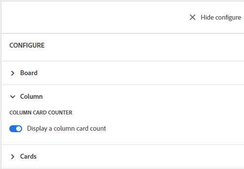

# Gestire le colonne di una bacheca

<!-- Audited: 05/2024 -->

Per impostazione predefinita, una nuova bacheca contiene tre colonne. È possibile aggiungere altre colonne, modificare l&#39;ordine delle colonne, rinominare le colonne ed eliminare le colonne non necessarie.

Le impostazioni delle colonne includono i criteri, che consentono di definire le opzioni per ciò che accade a una scheda quando viene spostata in quella colonna.

Per informazioni sull&#39;ordinamento delle schede in colonne, vedere [Filtrare e cercare in una bacheca](/help/quicksilver/agile/get-started-with-boards/filter-search-in-board.md).

## Requisiti di accesso

+++ Espandi per visualizzare i requisiti di accesso per la funzionalità in questo articolo.

<table style="table-layout:auto"> 
 <col> 
 </col> 
 <col> 
 </col> 
 <tbody> 
  <tr> 
   <td role="rowheader">Pacchetto Adobe Workfront</td> 
   <td> 
Qualsiasi
 </td> 
  </tr> 
  <tr> 
   <td role="rowheader">Licenza Adobe Workfront</td> 
   <td> 
   
Collaboratore o versione successiva
 
   
Richiedi o superiore

   </td> 
  </tr> 
 </tbody> 
</table>

Per ulteriori dettagli sulle informazioni contenute in questa tabella, vedere [Requisiti di accesso nella documentazione di Workfront](/help/quicksilver/administration-and-setup/add-users/access-levels-and-object-permissions/access-level-requirements-in-documentation.md).

+++

## Aggiungere una colonna a una bacheca

{{step1-to-boards}}

1. Accedi a una bacheca. Per informazioni, consulta [Creare o modificare una bacheca](../../agile/get-started-with-boards/create-edit-board.md).
1. Fai clic su **[!UICONTROL Aggiungi colonna]** a destra delle colonne esistenti.
1. Nella nuova colonna digitare un nome e fare clic su **[!UICONTROL Aggiungi colonna]**.

   

>[!TIP]
>
>Per aggiungere una colonna acquisizione, vedere [Aggiungere una colonna acquisizione a una bacheca](/help/quicksilver/agile/use-boards-agile-planning-tools/add-intake-column-to-board.md).

## Riordinare le colonne su una bacheca

1. Accedi alla bacheca.
1. Trascinare le colonne nell&#39;ordine corretto. Assicurarsi di selezionare la parte superiore della colonna prima di trascinarla in un&#39;altra posizione.

   

## Rinominare una colonna della bacheca

1. Accedi alla bacheca.
1. Fare clic sul nome della colonna, digitare il nuovo nome e premere Invio.

   Oppure

   Fai clic sul menu **[!UICONTROL Altro]**  nella colonna e seleziona **[!UICONTROL Modifica]**. Nell&#39;area Impostazioni digitare il nuovo nome nel campo **[!UICONTROL Nome colonna]** e fare clic su **[!UICONTROL Chiudi]**.

## Eliminare una colonna della bacheca

Quando elimini una colonna da una bacheca, non può essere recuperata.

1. Accedi alla bacheca.
1. Fai clic sul menu **[!UICONTROL Altro]**  nella colonna e seleziona **[!UICONTROL Elimina]**.

   >[!NOTE]
   >
   >Impossibile eliminare le colonne che contengono schede, incluse le schede archiviate. Se tenti di eliminare una colonna che contiene schede, devi scegliere un’altra colonna per tali schede.

## Visualizza conteggio schede

Puoi utilizzare un’impostazione di configurazione per visualizzare il numero di schede in ogni colonna.

Se si utilizza il limite WIP in una colonna, non viene aggiunto un contatore di schede separato. Per ulteriori informazioni sui limiti WIP, vedere [Gestione del limite [!UICONTROL Work in Progress] (WIP) in una bacheca](/help/quicksilver/agile/use-boards-agile-planning-tools/manage-wip-limit-on-board.md).

1. Accedi alla bacheca.
1. Fai clic su **[!UICONTROL Configura]** a destra della bacheca per aprire il pannello Configura.
1. Espandi **[!UICONTROL Colonna]**.
1. Attiva **[!UICONTROL Visualizza un numero di colonne della scheda]**.

   

   Il contatore di schede viene visualizzato nella parte superiore di ogni colonna.

1. Fai clic su **[!UICONTROL Nascondi configurazione]** per chiudere il pannello [!UICONTROL Configura].

## Definire le impostazioni e i criteri delle colonne

I criteri colonna includono l&#39;aggiornamento automatico dei valori dei campi e l&#39;impostazione di un limite work in progress.

Il criterio per l’aggiornamento dello stato funziona automaticamente sia per la scheda che per la colonna:

* Quando una scheda viene spostata in una colonna con una policy, lo stato della scheda viene aggiornato allo stato definito nella policy. Questo vale sia per le schede ad hoc che per quelle connesse.
* Quando lo stato di una scheda ad hoc o connessa viene aggiornato sulla scheda in modo che corrisponda allo stato della colonna nel criterio o lo stato di una scheda connessa viene aggiornato in un’altra posizione in Workfront, la scheda viene automaticamente spostata in tale colonna. Inoltre, se uno stato personalizzato di una scheda corrisponde allo stato di sistema assegnato alla colonna, la scheda viene spostata in tale colonna.

Una scheda rimarrà in una colonna in cui viene posizionata se lo stato della scheda non corrisponde a nessuno stato impostato nei criteri di colonna esistenti.

1. Accedi alla bacheca.
1. Fai clic sul menu **[!UICONTROL Altro]**  nella colonna e seleziona **[!UICONTROL Modifica]**.

   Verrà visualizzata l&#39;area [!UICONTROL Impostazioni]. Il **[!UICONTROL Nome colonna]** consente di sapere per quale colonna si stanno definendo le impostazioni.

1. Abilita il criterio **[!UICONTROL Aggiorna automaticamente i valori dei campi]** per modificare automaticamente alcuni valori dei campi quando una scheda viene spostata in questa colonna.

   

1. (Facoltativo) Imposta un valore per lo stato della scheda:

   1. Selezionare la casella di controllo **[!UICONTROL Stato]**.

   1. Selezionare lo stato da applicare a una scheda quando viene spostata in questa colonna.

      

      Vengono visualizzate anche le opzioni di traduzione dello stato per le schede collegate. La traduzione dello stato non si applica alle schede ad hoc. Queste opzioni determinano lo stato personalizzato applicato all&#39;attività o al problema in [!DNL Workfront] quando una scheda connessa viene spostata in questa colonna.

   1. Seleziona uno stato [!UICONTROL **Personalizzato**] da applicare alla scheda per le attività e per i problemi.

      Quando una scheda viene spostata in questa colonna, [!DNL Workfront] tenta prima di applicare lo stato personalizzato (ad esempio, Risolto). Se lo stato personalizzato selezionato non è disponibile per tale scheda, viene richiesto di scegliere un altro stato che corrisponda allo stato del sistema (dal passaggio b sopra). Per ulteriori informazioni sugli stati, vedere [Panoramica sugli stati](/help/quicksilver/administration-and-setup/customize-workfront/creating-custom-status-and-priority-labels/statuses-overview.md).

      Inoltre, se lo stato dell’attività o del problema connesso viene modificato nello stato personalizzato o di sistema impostato nella policy di colonna, la scheda viene automaticamente spostata nella colonna.

1. (Facoltativo) Imposta un valore per gli assegnatari della carta:

   1. Selezionare la casella di controllo **[!UICONTROL Assegnatari]**.
   1. Seleziona un’azione.

      * **[!UICONTROL Aggiungi assegnatari]:** Gli assegnatari selezionati vengono aggiunti all&#39;elenco esistente di assegnatari su una scheda quando questa viene spostata in questa colonna.
      * **[!UICONTROL Sostituisci assegnatari]:** Gli assegnatari selezionati sovrascrivono tutti gli altri assegnatari e diventano gli unici assegnatari su una scheda quando viene spostata in questa colonna.

   1. Fai clic su [!UICONTROL **Aggiungi assegnazione**] e cerca un utente. Selezionare gli assegnatari dai risultati della ricerca. Tutti gli utenti e i team di Workfront sono disponibili tra cui scegliere.

      

1. (Facoltativo) Imposta un valore per i tag della scheda:

   1. Selezionare la casella di controllo **[!UICONTROL Schede]**.
   1. Seleziona un’azione.

      * **[!UICONTROL Aggiungi su tag]:** I tag selezionati vengono aggiunti all&#39;elenco esistente di tag su una scheda quando viene spostata in questa colonna.
      * **[!UICONTROL Ignora tag]:** I tag selezionati sovrascrivono tutti gli altri tag e diventano gli unici tag di una scheda quando viene spostata in questa colonna.

   1. Seleziona i tag dall’elenco a discesa. Solo i tag già creati in [!UICONTROL Tag Manager] sono disponibili per la scelta. Per informazioni sull&#39;aggiunta di nuovi tag, vedere [Aggiungi tag](/help/quicksilver/agile/get-started-with-boards/add-tags.md).

      

1. Abilita il criterio **[!UICONTROL Limite work in progress]** per limitare il numero di schede che possono essere aggiunte alla colonna. Digitare quindi il numero di limite nel campo **[!UICONTROL Imposta limite]**.

   

   Per ulteriori informazioni, vedere [Gestire il limite WIP in una bacheca](/help/quicksilver/agile/use-boards-agile-planning-tools/manage-wip-limit-on-board.md).

1. Fai clic su **[!UICONTROL Chiudi]** per uscire dall&#39;area Impostazioni e visualizzare la colonna e le relative schede.
