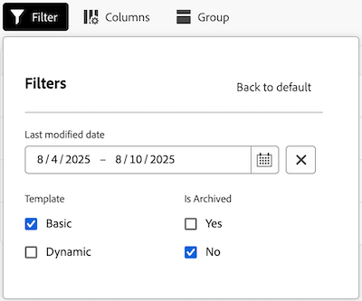

# Gestire la visualizzazione Amministratore delle bacheche

La Vista di amministrazione delle bacheche contiene un elenco di tutte le bacheche nel tuo account che gli amministratori di sistema possono utilizzare per ottenere un’istantanea rapida dei dettagli complessivi delle bacheche, tra cui quando sono state aggiornate l’ultima volta, quante schede ciascuna e altro ancora.

Da quest’area, puoi eseguire le seguenti azioni:

* Filtrare l’elenco Bacheche
* Configurare le colonne dell’elenco Bacheche
* Raggruppare l’elenco Bacheche

## Requisiti di accesso

+++ Espandere per visualizzare i requisiti di accesso.

<table style="table-layout:auto"> 
 <col> 
 </col> 
 <col> 
 </col> 
 <tbody> 
  <tr> 
   <td role="rowheader">piano Adobe Workfront</td> 
   <td> 
Qualsiasi
 </td> 
  </tr> 
  <tr> 
   <td role="rowheader">Licenza Adobe Workfront</td> 
   <td> 
Collaboratore o versione successiva 

        
 Richiedi o superiore 
</td> 
  </tr> 
 </tbody> 
</table>

Per ulteriori dettagli sulle informazioni contenute in questa tabella, vedere [Requisiti di accesso nella documentazione di Workfront](/help/quicksilver/administration-and-setup/add-users/access-levels-and-object-permissions/access-level-requirements-in-documentation.md).

+++

## Prerequisiti

È necessario creare una bacheca prima di visualizzarla dalla visualizzazione Amministratore.

Per ulteriori informazioni, vedere [Creare o modificare una bacheca](/help/quicksilver/agile/get-started-with-boards/create-edit-board.md).

## Filtrare l’elenco Bacheche

{{step1-to-boards}}

1. Nella pagina **Bacheche**, selezionare la scheda **Visualizzazione amministratore**.

1. Seleziona **Filtro**. Viene aperto il pannello **Filtri**.

1. Per configurare il filtro, effettua le seguenti operazioni:

   1. (Facoltativo) Fai clic sull&#39;icona **Calendario** , quindi seleziona un intervallo di date per filtrare in base alle Bacheche che sono state modificate per ultime in tale arco temporale.

   1. (Facoltativo) Nella sezione **Modello**, seleziona il tipo di modello della bacheca in base al quale verrà filtrato l&#39;elenco. È possibile selezionare più tipi di modello.
Per ulteriori informazioni sui tipi di modello della bacheca, vedere [Creare o modificare una bacheca](/help/quicksilver/agile/get-started-with-boards/create-edit-board.md).

   1. (Facoltativo) Nella sezione **E&#39; archiviato**, seleziona se verranno visualizzate le bacheche archiviate o non archiviate. È possibile selezionare più opzioni.

      

1. Fai clic all&#39;esterno del pannello **Filtri** per chiuderlo. Le selezioni del filtro rimarranno applicate all’elenco Bacheche fino a quando non verrà ripristinata la visualizzazione predefinita.

   >[!NOTE]
   >
   >Per rimuovere un filtro, apri il pannello **Filtri** e fai clic su **Torna all&#39;impostazione predefinita** nell&#39;angolo superiore destro.

## Configurare le colonne dell’elenco Bacheche

{{step1-to-boards}}

1. Nella pagina **Bacheche**, selezionare la scheda **Visualizzazione amministratore**.

1. Seleziona **Colonne**. Viene aperto il pannello **Visibilità campi e ordine**.

1. Configura le colonne da visualizzare nell’elenco Bacheche selezionando o deselezionando l’interruttore in linea con ciascuna colonna:

   * **Proprietario**
   * **Ultimo aggiornamento**
   * **Membri**
   * **Archiviato**
   * **Modello**
   * **Numero di carte**

1. (Facoltativo) Per modificare l&#39;ordine di visualizzazione dei campi, fai clic sull&#39;icona **Trascina** a sinistra di un campo, quindi trascinala in una nuova posizione.

   

1. Fai clic all&#39;esterno del pannello **Visibilità campi e ordine** per chiuderlo. Le configurazioni delle colonne rimarranno applicate all’elenco Bacheche fino a quando non verranno modificate.

   >[!NOTE]
   >
   > Quando si modificano le colonne dell&#39;elenco Bacheche, sopra l&#39;icona **Colonne** viene visualizzato un punto blu per indicare che la visualizzazione corrente è stata modificata rispetto a quella predefinita.

## Raggruppare l’elenco Bacheche per un campo specifico

{{step1-to-boards}}

1. Nella pagina **Bacheche**, selezionare la scheda **Visualizzazione amministratore**.

1. Seleziona **Gruppo**. Viene aperto il pannello **Raggruppa per**.

1. Selezionare il campo in base al quale si desidera raggruppare l&#39;elenco Bacheche:

   * **Archiviato**
   * **Proprietario**
   * **Modello**

1. (Facoltativo) Per espandere o comprimere il raggruppamento dal pannello **Raggruppa per**, fare clic su **Comprimi tutto** o **Espandi tutto**.

   

1. (Facoltativo) Per cambiare l&#39;ordine di visualizzazione del raggruppamento da A-Z a Z-A, selezionare il campo in base al quale è attualmente stato eseguito il raggruppamento, quindi selezionare **Z-A** dal menu a discesa.

   

1. Fare clic all&#39;esterno del pannello **Raggruppa per** per chiuderlo. Da qui è possibile comprimere o espandere il raggruppamento applicato nell&#39;elenco selezionando la freccia accanto al titolo del raggruppamento.

   

   >[!NOTE]
   >   
   >Quando viene modificato il raggruppamento dell&#39;elenco Bacheche, sopra l&#39;icona **Gruppo** viene visualizzato un punto blu per indicare che la visualizzazione corrente è diversa da quella predefinita.  
   >Per rimuovere un raggruppamento, apri il pannello **Raggruppa per** e seleziona **Cancella tutto** nell&#39;angolo superiore destro.
