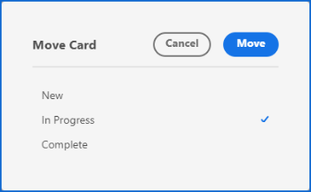

# Gestione delle schede

Potete spostare una scheda in qualsiasi colonna della bacheca o copiare una scheda.

Se i criteri colonna sono abilitati per l’aggiornamento dei valori dei campi, lo stato, le assegnazioni e i tag possono essere aggiornati automaticamente quando si sposta una scheda da una colonna a un’altra. Per ulteriori informazioni, consulta &quot;Definire le impostazioni e i criteri delle colonne&quot; nell’articolo [Gestire le colonne della bacheca](/help/quicksilver/agile/get-started-with-boards/manage-board-columns.md).

>[!NOTE]
>
>Non è possibile spostare una scheda da una bacheca a un&#39;altra bacheca.

## Requisiti di accesso

Per eseguire i passaggi descritti in questo articolo, è necessario disporre dei seguenti diritti di accesso:

<table style="table-layout:auto"> 
 <col> 
 </col> 
 <col> 
 </col> 
 <tbody> 
  <tr> 
   <td role="rowheader"><strong>[!DNL Adobe Workfront] piano*</strong></td> 
   <td> 
Qualsiasi
 </td> 
  </tr> 
  <tr> 
   <td role="rowheader"><strong>[!DNL Adobe Workfront] licenza*</strong></td> 
   <td> 
[!UICONTROL Request] o superiore
 </td> 
  </tr> 
 </tbody> 
</table>

&#42;Per sapere quale piano, tipo di licenza o accesso hai, contatta il tuo [!DNL Workfront] amministratore.

## Sposta le schede tra le colonne

1. Fai clic sul pulsante **[!UICONTROL Menu principale]** icona  nell&#39;angolo superiore destro di [!DNL Adobe Workfront], quindi fai clic su **[!UICONTROL Schede]**.
1. Accedete a una bacheca. Per informazioni, consulta [Creare o modificare una bacheca](../../agile/get-started-with-boards/create-edit-board.md).
1. Trascinate la scheda in un&#39;altra colonna nella posizione desiderata.

   Oppure

   Fai clic sul pulsante **[!UICONTROL Altro]** menu  sulla scheda e seleziona **[!UICONTROL Sposta]**. Quindi, sul **[!UICONTROL Sposta elemento]** scegliere un&#39;altra colonna e selezionare **[!UICONTROL Sposta]**.

   

   >[!NOTE]
   >
   >Quando utilizzi la **[!UICONTROL Sposta elemento]** la scheda viene sempre spostata nella parte superiore della colonna.

## Sposta le schede nella parte superiore o inferiore di una colonna

1. Accedete alla bacheca.
1. Trascinate la scheda nella posizione desiderata nella colonna.

   Oppure

   Fai clic sul pulsante **[!UICONTROL Altro]** menu  sulla scheda e seleziona **[!UICONTROL Parte superiore colonna]** o **[!UICONTROL Parte inferiore della colonna]**.

   

## Copiare una scheda

Copiare una scheda ad hoc duplica tutti i campi della scheda, incluse le voci di elenco di controllo.

>[!NOTE]
>
>Non è possibile copiare le schede collegate.

1. Accedete alla bacheca.
1. Fai clic sul pulsante **[!UICONTROL Altro]** menu ![[!UICONTROL Menu Altro]](assets/more-icon-spectrum.png) sulla scheda e seleziona **[!UICONTROL Copia]**.

   

   Una nuova scheda viene aggiunta nella stessa colonna con il titolo &quot;copia di - [nome della carta originale].&quot;
