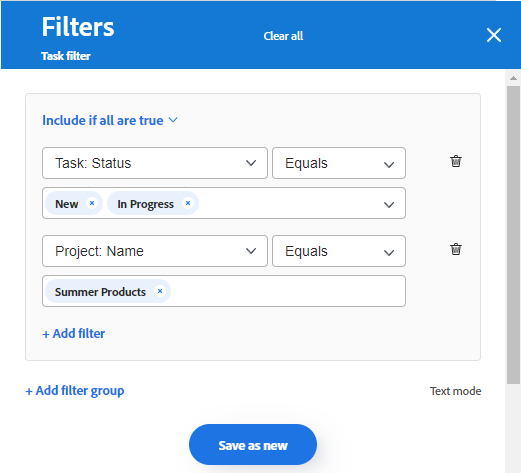

# Aggiungere una colonna Acquisizione a una bacheca

Facoltativamente, puoi aggiungere alla bacheca una colonna di acquisizione che richiama automaticamente le attività e i problemi come schede collegate quando vengono aggiunte in [!DNL Workfront], in base ai filtri definiti. La colonna Acquisizione può fungere da colonna di backlog per un team Kanban, da posizione di acquisizione per un team di supporto per visualizzare i problemi man mano che vengono aggiunti a una coda di richieste o per qualsiasi altro scopo.

È consentita una sola colonna di acquisizione su una bacheca, che viene sempre visualizzata come la colonna più a sinistra.

La colonna Acquisizione non è disponibile su una bacheca dinamica. Tuttavia, puoi aggiornare i filtri che definiscono quali schede vengono inserite in una bacheca dinamica. Quando si modificano questi filtri su una scheda dinamica, le impostazioni della scheda che non fanno parte dell’attività o del problema di Workfront (come i tag) vengono reimpostate.

>[!NOTE]
>
>Per motivi di sicurezza, solo il proprietario di una bacheca può modificarne i filtri nel pannello Configura.

La colonna Assunzione è limitata a 300 attività e 300 problemi. L’ordine predefinito degli elementi nella colonna Acquisizione è il seguente:

Attività:

* Ordine principale: nome progetto
* Ordine secondario: struttura dettaglio lavoro

Problemi:

* Ordine principale: nome progetto
* Ordine secondario: numero di riferimento

>[!IMPORTANT]
>
>Si consiglia di aggiornare frequentemente la bacheca se più utenti lavorano contemporaneamente sulla bacheca. L’aggiornamento della pagina consente di mantenere aggiornate le modifiche visive sulla bacheca e impedisce problemi come lo spostamento di schede duplicate nella bacheca dalla colonna acquisizione.

Per ulteriori informazioni sulle colonne, vedere [Gestisci colonne bacheca](/help/quicksilver/agile/get-started-with-boards/manage-board-columns.md). Per informazioni sulle schede collegate, vedere [Utilizzare le schede collegate sulle schede](/help/quicksilver/agile/get-started-with-boards/connected-cards.md).

## Requisiti di accesso

+++ Espandi per visualizzare i requisiti di accesso per la funzionalità in questo articolo.

Per eseguire i passaggi descritti in questo articolo, è necessario disporre dei seguenti diritti di accesso:

<table style="table-layout:auto"> 
 <col> 
 <col> 
 <tbody> 
  <tr> 
   <td role="rowheader">[!DNL Adobe Workfront]</td> 
   <td> 
Qualsiasi
 </td> 
  </tr> 
  <tr> 
   <td role="rowheader">[!DNL Adobe Workfront] licenza</td> 
   <td> 
   
Nuovo: [!UICONTROL Contributor] o versione successiva
 
   
oppure

   
Corrente: [!UICONTROL Request] o versione successiva

   </td> 
  </tr> 
 </tbody> 
</table>

Per ulteriori dettagli sulle informazioni contenute in questa tabella, vedere [Requisiti di accesso nella documentazione di Workfront](/help/quicksilver/administration-and-setup/add-users/access-levels-and-object-permissions/access-level-requirements-in-documentation.md).

+++

## Creare una colonna di acquisizione utilizzando filtri semplici

{{step1-to-boards}}

1. Accedi a una bacheca. Per informazioni, consulta [Creare o modificare una bacheca](../../agile/get-started-with-boards/create-edit-board.md).
1. Fai clic su **[!UICONTROL Configura]** a destra della bacheca per aprire il pannello Configura.
1. Espandi **[!UICONTROL Bacheca]**.
1. Attiva **[!UICONTROL acquisizione dinamica di elementi nella bacheca]**.

   

   La colonna Acquisizione viene aggiunta a sinistra della bacheca. Rimane vuoto finché non vengono applicati dei filtri.

1. (Facoltativo) Cerca e seleziona [!DNL Workfront] [!UICONTROL **Progetti**].
1. (Facoltativo) Cerca e seleziona l&#39;utente o il team [!UICONTROL **Assegnazioni**].
1. Selezionare [!UICONTROL **Includi lavoro completato**] per visualizzare le attività e i problemi con stato Completato nella colonna Acquisizione.

   >[!NOTE]
   >
   >Se questa opzione non è selezionata, quando le schede in altri stati sono contrassegnate come complete, esse &quot;cadono&quot; dalla bacheca e non vengono più visualizzate.

1. Fare clic su [!UICONTROL **Applica**].

   Tutti gli oggetti vengono visualizzati nella colonna di acquisizione della bacheca come schede collegate.

   

## Creare una colonna di acquisizione utilizzando filtri avanzati

{{step1-to-boards}}

1. Accedi a una bacheca. Per informazioni, consulta [Creare o modificare una bacheca](../../agile/get-started-with-boards/create-edit-board.md).
1. Fai clic su **[!UICONTROL Configura]** a destra della bacheca per aprire il pannello Configura.
1. Espandi **[!UICONTROL Bacheca]**.
1. Attiva **[!UICONTROL acquisizione dinamica di elementi nella bacheca]**.

   La colonna Acquisizione viene aggiunta a sinistra della bacheca. Rimane vuoto finché non vengono applicati dei filtri.

1. Fare clic su [!UICONTROL **Usa filtri avanzati**].
1. Fai clic su **[!UICONTROL Aggiungi origini filtro]** e seleziona **[!UICONTROL Attività]** o **[!UICONTROL Problemi]**.

   

   >[!NOTE]
   >
   >È possibile filtrare la colonna Acquisizione in modo da includere sia attività che problemi, ma è necessario impostare i filtri separatamente per ogni tipo di oggetto.
   >
   >Inoltre, i filtri salvati e i filtri predefiniti di sistema sono disponibili per la selezione.

1. Nel pannello dei filtri, fai clic su **[!UICONTROL Nuovo filtro]** per iniziare.

   

1. Genera il filtro e fai clic su **[!UICONTROL Salva come nuovo]**.

   

   In questo esempio viene visualizzato un filtro per le attività di un progetto specifico con stato [!UICONTROL Nuovo] o [!UICONTROL In corso].

   >[!NOTE]
   >
   >Si consiglia di non utilizzare il carattere jolly &quot;Me&quot; (utente connesso) in un filtro della bacheca, perché non è garantito che vengano sempre visualizzate le attività o i problemi per l’utente connesso. Dopo aver configurato la bacheca con le attività e i problemi corretti, puoi filtrarla per mostrare gli elementi per un assegnatario specifico. Per ulteriori informazioni, consulta [Filtrare e cercare in una bacheca](/help/quicksilver/agile/get-started-with-boards/filter-search-in-board.md).

   Per ulteriori dettagli sulla creazione di un filtro, vedere la sezione &quot;Creare o modificare un filtro nel generatore standard&quot; nell&#39;articolo [Creare o modificare filtri in [!DNL Adobe Workfront]](/help/quicksilver/reports-and-dashboards/reports/reporting-elements/create-filters.md).

1. Denomina il filtro e fai clic su **[!UICONTROL Salva]**.

   

   Assegnando al filtro un nome univoco è possibile cercarlo in un secondo momento.

1. Il filtro viene visualizzato nell’elenco dei filtri salvati e viene applicato automaticamente alla colonna Acquisizione. Fai clic sulla X nella parte superiore del pannello del filtro per chiuderlo.

   

1. (Facoltativo) Per condividere il filtro con altri utenti, passa il puntatore del mouse sul filtro salvato, fai clic sul menu **[!UICONTROL Altro]**  e seleziona **[!UICONTROL Condividi]**. Scegliere gli utenti o i team con cui condividere i dati nella casella Condivisione filtro. Per ulteriori informazioni, vedere [Condividere un filtro, una visualizzazione o un raggruppamento](/help/quicksilver/reports-and-dashboards/reports/reporting-elements/share-filter-view-grouping.md).
1. (Facoltativo) Per includere sia attività che problemi nella colonna Acquisizione, fare clic su **[!UICONTROL Filtra origini]** e selezionare l&#39;altro oggetto per creare un altro filtro.
1. Dopo aver aggiunto i filtri, controlla la colonna Acquisizione per verificare che vengano visualizzate le attività e i problemi corretti.

   

   >[!NOTE]
   >
   >Puoi aggiornare i filtri in qualsiasi momento aprendo il pannello Configura, facendo clic su **[!UICONTROL Filtra origini]** e selezionando **[!UICONTROL Attività]** o **[!UICONTROL Problemi]**.

## Utilizzare la colonna Acquisizione

Le schede nella colonna Acquisizione non sono modificabili finché non vengono spostate in altre colonne della bacheca. Puoi fare clic sulla scheda per aprirla in una visualizzazione di sola lettura, oppure fare clic su  per aprire l&#39;attività o il problema in una nuova scheda del browser.

Puoi riordinare manualmente gli elementi nella colonna Acquisizione.

Le icone in alto a destra nella colonna Acquisizione mostrano quante schede ci sono attualmente nella colonna e quanti filtri vengono applicati.

1. (Facoltativo) Per cercare un elemento nella colonna Acquisizione, fare clic su  nella colonna.
1. (Facoltativo) Per spostare una scheda dalla colonna Acquisizione a un’altra colonna, trascina e rilascia la scheda nella posizione in cui desideri che venga visualizzata.

   Oppure

   Fai clic sul menu **[!UICONTROL Altro]**  sulla scheda e seleziona **[!UICONTROL Sposta]**. Nella casella **[!UICONTROL Sposta elemento]** scegliere un&#39;altra colonna e selezionare **[!UICONTROL Sposta]**.

1. (Facoltativo) Per eliminare la colonna Acquisizione, fai clic sul menu **[!UICONTROL Altro]**  e seleziona **[!UICONTROL Elimina]**.
