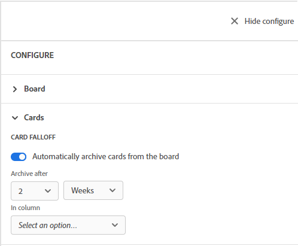

# Configurare la perdita di dati della scheda

È possibile configurare una bacheca in modo che le schede vengano archiviate, o che &quot;cadano&quot; dalla bacheca, in base a una pianificazione. È possibile impostare le schede in una particolare colonna in modo che cadano dalla bacheca in un determinato numero di giorni o settimane.

Quando una scheda cade dalla bacheca, viene archiviata. Puoi visualizzare le schede archiviate con un filtro. Per ulteriori informazioni, consulta [Filtrare e cercare in una bacheca](/help/quicksilver/agile/get-started-with-boards/filter-search-in-board.md).

## Requisiti di accesso

+++ Espandi per visualizzare i requisiti di accesso per la funzionalità descritta in questo articolo.

<table style="table-layout:auto"> 
 <col> 
 <col> 
 <tbody> 
  <tr> 
   <td role="rowheader">Pacchetto Adobe Workfront</td> 
   <td> 
Qualsiasi
 </td> 
  </tr> 
  <tr> 
   <td role="rowheader">Licenza di Adobe Workfront</td> 
   <td> 
   
Collaboratore o successiva
 
   
Richiedente o successiva

   </td> 
  </tr> 
 </tbody> 
</table>

Per ulteriori dettagli sulle informazioni contenute in questa tabella, consulta [Requisiti di accesso nella documentazione Workfront](/help/quicksilver/administration-and-setup/add-users/access-levels-and-object-permissions/access-level-requirements-in-documentation.md).

+++

## Configurare la perdita di dati della scheda

{{step1-to-boards}}

1. Accedi a una bacheca. Per informazioni, consulta [Creare o modificare una bacheca](../../agile/get-started-with-boards/create-edit-board.md).
1. Fai clic su **[!UICONTROL Configura]** a destra della bacheca per aprire il pannello Configura.
1. Espandi **[!UICONTROL Schede]**.
1. Attiva **[!UICONTROL Archivia automaticamente le schede dalla bacheca]**.

   

1. Seleziona quando archiviare le schede dalla bacheca. Puoi scegliere fino a 8 settimane o fino a 60 giorni.

   La data è determinata dall’ultima modifica apportata alla scheda.

1. Seleziona la colonna da cui rimuovere le schede.
1. Fai clic su **[!UICONTROL Salva]** nel messaggio di conferma.
1. Fai clic su **[!UICONTROL Nascondi configurazione]** per chiudere il pannello [!UICONTROL Configura]. Le impostazioni di configurazione vengono applicate automaticamente quando si aggiorna la scheda.
