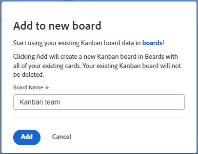
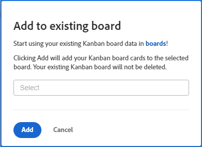

# Migrazione delle schede Kanban del team Agile alle bacheche Workfront

Puoi migrare gli elementi di lavoro da una bacheca Kanban del team Agile a una bacheca Workfront nuova o esistente. Quando esegui la migrazione, tutte le schede sulla bacheca Kanban vengono copiate nella bacheca Workfront. Non è consentito scegliere schede specifiche.

Il posizionamento delle schede sulla bacheca Workfront si basa su criteri colonna. Ad esempio, una policy potrebbe spostare tutte le carte con lo stato &quot;In corso&quot; in una colonna specifica. Per ulteriori informazioni sui criteri delle colonne, vedere [Gestisci colonne bacheca](/help/quicksilver/agile/get-started-with-boards/manage-board-columns.md).) Se non ci sono criteri o le schede non corrispondono ai criteri, le schede vengono posizionate nella colonna più a sinistra sulla bacheca. Al momento, le schede nella colonna Backlog nella bacheca legacy non vengono aggiunte alla bacheca Workfront.

Le schede non vengono rimosse dalla bacheca Kanban del team Agile e le modifiche di stato delle schede verranno sincronizzate con entrambe le bacheche. È possibile mantenere entrambe le schede attive fino a quando non si è pronti a passare alle schede Workfront.

## Requisiti di accesso

+++ Espandi per visualizzare i requisiti di accesso per la funzionalità descritta in questo articolo.

<table style="table-layout:auto"> 
 <col> 
 <col> 
 <tbody> 
  <tr> 
   <td role="rowheader">Pacchetto Adobe Workfront</td> 
   <td> 
Qualsiasi
 </td> 
  </tr> 
  <tr> 
   <td role="rowheader">Licenza di Adobe Workfront</td> 
   <td> 
   
Collaboratore o successiva
 
   
Richiedente o successiva

   </td> 
  </tr> 
 </tbody> 
</table>

Per informazioni, consulta [Requisiti di accesso nella documentazione di Workfront](/help/quicksilver/administration-and-setup/add-users/access-levels-and-object-permissions/access-level-requirements-in-documentation.md).

+++

## Migrare schede Kanban a una nuova bacheca

{{step1-to-team}}

1. Accedi a un Kanban Board.
1. Fai clic su [!UICONTROL **Aggiungi alle bacheche**] e seleziona [!UICONTROL **Nuova bacheca**].
1. Nella finestra di dialogo [!UICONTROL Aggiungi a nuova bacheca], digita un nome per la nuova bacheca (viene visualizzato automaticamente il nome della bacheca [!UICONTROL Kanban] corrente) e fai clic su [!UICONTROL **Aggiungi**].

   

1. (Facoltativo) Nel messaggio di successo visualizzato, fai clic sul collegamento per aprire la nuova bacheca.

## Migrare schede Kanban a una bacheca esistente

{{step1-to-team}}

1. Accedi a un Kanban Board.
1. Fai clic su [!UICONTROL **Aggiungi alle bacheche**] e seleziona [!UICONTROL **Bacheca esistente**].
1. Nella finestra di dialogo [!UICONTROL Aggiungi alla bacheca esistente], cerca e seleziona la bacheca in cui migrare le schede. Quindi fare clic su [!UICONTROL **Aggiungi**].

   

1. (Facoltativo) Nel messaggio di successo visualizzato, fai clic sul collegamento per aprire la bacheca.
