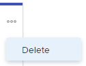

# Elimina storie o problemi dalla bacheca [!UICONTROL Kanban]

Puoi eliminare una storia o un problema dalla bacheca [!UICONTROL Kanban]. Quando elimini una storia o un problema, questa viene spostata nel Cestino per 30 giorni e può essere ripristinata solo dall&#39;amministratore di sistema.

## Requisiti di accesso

+++ Espandi per visualizzare i requisiti di accesso per la funzionalità descritta in questo articolo.

<table style="table-layout:auto"> 
 <col> 
 </col> 
 <col> 
 </col> 
 <tbody> 
  <tr> 
   <td role="rowheader">Pacchetto Adobe Workfront</td> 
   <td> 
Qualsiasi
 </td> 
  </tr> 
  <tr> 
   <td role="rowheader">Licenza di Adobe Workfront</td> 
   <td> 
Standard
 
   
Work o successiva
 </td> 
  </tr>
  <tr> 
   <td role="rowheader">Autorizzazioni sugli oggetti</td> 
   <td>Gestire l’accesso all’attività o al problema </td> 
  </tr> 
 </tbody> 
</table>

Per ulteriori dettagli sulle informazioni contenute in questa tabella, consulta [Requisiti di accesso nella documentazione Workfront](/help/quicksilver/administration-and-setup/add-users/access-levels-and-object-permissions/access-level-requirements-in-documentation.md).

+++

## Eliminare una storia o un problema

{{step1-to-team}}

1. (Facoltativo) Fai clic sull&#39;icona **[!UICONTROL Cambia team]** , quindi seleziona un nuovo team di [!UICONTROL Kanban] dal menu a discesa o cerca un team nella barra di ricerca.
1. Fai clic sull&#39;icona **[!UICONTROL Altro]** sulla storia o sul problema e seleziona **[!UICONTROL Elimina]**.

   

1. Nel messaggio di conferma, fare clic su **[!UICONTROL Sì, eliminarlo]**.
