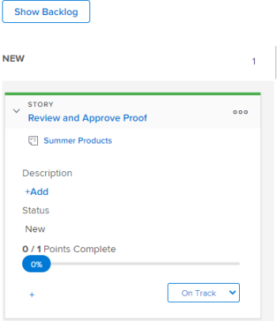

# Modificare le informazioni della storia

## Comprendere quali informazioni possono essere visualizzate e modificate {#understand-what-information-can-be-viewed-and-edited}

Quando si visualizza un riquadro storia sulla bacheca [!UICONTROL Kanban], sono disponibili le informazioni riportate nella tabella seguente. Puoi modificare la maggior parte delle informazioni in linea, direttamente dal riquadro del brano.

<table style="table-layout:auto"> 
 <col> 
 <col> 
 <col> 
 <thead> 
  <tr> 
   <th><strong>Informazioni</strong> </th> 
   <th><strong>Visibile</strong> </th> 
   <th><strong>In linea modificabile</strong> </th> 
  </tr> 
 </thead> 
 <tbody> 
  <tr> 
   <td>Il nome del brano con un collegamento diretto all’attività o al problema</td> 
   <td>✓</td> 
   <td> </td> 
  </tr> 
  <tr> 
   <td> 
Il nome del progetto con un collegamento diretto al progetto
 </td> 
   <td>✓ </td> 
   <td> </td> 
  </tr> 
  <tr> 
   <td> 
Il numero di punti o ore completate sul brano e il numero di punti o ore assegnate al brano Questi numeri vengono utilizzati per calcolare e visualizzare la percentuale di completamento per ogni brano.
 </td> 
   <td>✓</td> 
   <td> </td> 
  </tr> 
  <tr> 
   <td> 
Il [!UICONTROL Percent Complete] per ogni storia e problema. [!UICONTROL The Percent Complete] per l'iterazione viene calcolato in base al [!UICONTROL Percent Complete] per ogni storia. 
 
Quando aggiorni [!UICONTROL Percent Complete] per una storia o un problema, puoi scegliere un numero qualsiasi tra 0 e 100.
 </td> 
   <td>✓</td> 
   <td>✓</td> 
  </tr> 
  <tr> 
   <td> 
A chi è assegnata la storia
 </td> 
   <td>✓</td> 
   <td>✓</td> 
  </tr> 
  <tr> 
   <td> 
Colore o categoria della sezione
 </td> 
   <td>✓</td> 
   <td>✓</td> 
  </tr> 
  <tr> 
   <td> 
Eventuali campi aggiuntivi (inclusi i campi personalizzati) che potrebbero essere stati aggiunti alla visualizzazione Agile modificando la visualizzazione Agile, come descritto in "Creazione e personalizzazione di una visualizzazione Agile" in <a href="../../reports-and-dashboards/reports/reporting-elements/views-overview.md" class="MCXref xref">Panoramica delle visualizzazioni in [!DNL Adobe Workfront]</a>
 </td> 
   <td>✓</td> 
   <td>✓</td> 
  </tr> 
 </tbody> 
</table>

## Requisiti di accesso

+++ Espandi per visualizzare i requisiti di accesso per la funzionalità descritta in questo articolo.

<table style="table-layout:auto"> 
 <col> 
 </col> 
 <col> 
 </col> 
 <tbody> 
  <tr> 
   <td role="rowheader">Pacchetto Adobe Workfront</td> 
   <td> 
Qualsiasi
 </td> 
  </tr> 
  <tr> 
   <td role="rowheader">Licenza di Adobe Workfront</td> 
   <td> 
Standard
 
   
Work o successiva
 </td> 
  </tr>
 </tbody> 
</table>

Per informazioni, consulta [Requisiti di accesso nella documentazione di Workfront](/help/quicksilver/administration-and-setup/add-users/access-levels-and-object-permissions/access-level-requirements-in-documentation.md).

+++

## Visualizzare e modificare le informazioni su un riquadro del brano

{{step1-to-team}}

1. (Facoltativo) Fai clic sull&#39;icona **[!UICONTROL Cambia team]** , quindi seleziona un nuovo team Kanban dal menu a discesa o cerca un team nella barra di ricerca.

1. Vai alla bacheca [!UICONTROL Kanban].
1. Espandere il riquadro del brano per visualizzare tutti i campi associati al brano.

   

1. (Facoltativo) Per modificare un campo, fai clic sul campo e apporta le modifiche necessarie.
Per modificare il riquadro della storia, è necessario disporre dei diritti [!UICONTROL Modifica] per l&#39;attività o il problema.
Per ulteriori informazioni su ciascun campo e sulla possibilità di modificarlo, vedere [Informazioni sulle informazioni visualizzabili e modificabili](#understand-what-information-can-be-viewed-and-edited).

>[!NOTE]
>
>Per modificare la [!UICONTROL Percentuale completata], è necessario digitare un numero compreso tra 0 e 100. Il campo non è un dispositivo di scorrimento da spostare.
