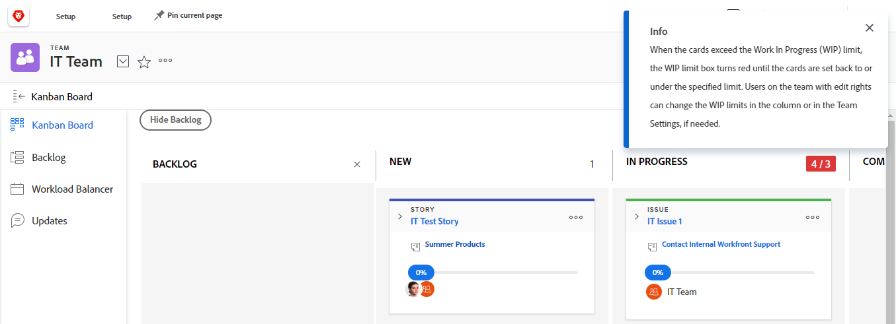

# Gestisci il limite [!UICONTROL work in progress] (WIP) sul Kanban Board

È possibile configurare un limite di [!UICONTROL Work In Progress] (WIP) per ogni colonna della bacheca [!UICONTROL Kanban], come descritto nell&#39;articolo [Configura Kanban](../../agile/get-started-with-agile-in-workfront/configure-kanban.md).

Il limite WIP è semplicemente un&#39;avvertenza visiva e non impedisce al team di avere più elementi in ogni colonna di stato rispetto al limite impostato.

## Requisiti di accesso

Per eseguire i passaggi descritti in questo articolo, è necessario disporre dei seguenti diritti di accesso:

<table style="table-layout:auto"> 
 <col> 
 <col> 
 <tbody> 
  <tr> 
   <td role="rowheader"><strong>[!DNL Adobe Workfront] piano*</strong></td> 
   <td> 
Qualsiasi
 </td> 
  </tr> 
  <tr> 
   <td role="rowheader"><strong>[!DNL Adobe Workfront] licenza*</strong></td> 
   <td> 
[!UICONTROL Work] o versione successiva
 </td> 
  </tr> 
  <tr> 
   <td role="rowheader"><strong>Configurazioni del livello di accesso*</strong></td> 
   <td> 
[!UICONTROL Worker] o versione successiva
 
Nota: se non disponi ancora dell'accesso, chiedi all'amministratore [!DNL Workfront] se ha impostato restrizioni aggiuntive nel tuo livello di accesso. Per informazioni su come un amministratore di [!DNL Workfront] può modificare il livello di accesso, vedere <a href="../../administration-and-setup/add-users/configure-and-grant-access/create-modify-access-levels.md" class="MCXref xref">Creare o modificare livelli di accesso personalizzati</a>.
 </td> 
  </tr> 
 </tbody> 
</table>

&#42;Per conoscere il piano, il tipo di licenza o l&#39;accesso di cui si dispone, contattare l&#39;amministratore [!DNL Workfront].

## Visualizza il limite [!UICONTROL Work In Progress] (WIP) per la bacheca [!UICONTROL Kanban]

Quando per il team agile è configurato un limite WIP, questo viene visualizzato nell&#39;angolo superiore destro di ogni colonna sulla bacheca Kanban (ad eccezione della colonna [!UICONTROL Complete]).

Ogni volta che il limite viene superato per una colonna della bacheca [!UICONTROL Kanban], il limite viene evidenziato in rosso e viene visualizzato un messaggio.\

## Aggiorna il limite [!UICONTROL Work In Progress] (WIP) dalla bacheca [!UICONTROL Kanban]

I membri del team con diritti di [!UICONTROL Modifica] possono aggiornare il limite WIP per ogni colonna di stato direttamente dalla bacheca [!UICONTROL Kanban]. In alternativa, è possibile aggiornare il limite WIP come descritto nell&#39;articolo [Configurare Kanban](../../agile/get-started-with-agile-in-workfront/configure-kanban.md).

1. Fai clic sull&#39;icona  del **[!UICONTROL menu principale]** nell&#39;angolo superiore destro di [!DNL Adobe Workfront], quindi fai clic su **[!UICONTROL Team]**.

1. (Facoltativo) Fai clic sull&#39;icona **[!UICONTROL Cambia team]** , quindi seleziona un nuovo team di [!UICONTROL Kanban] dal menu a discesa o cerca un team nella barra di ricerca.

1. Nella bacheca [!UICONTROL Kanban], individua il limite WIP nell&#39;angolo superiore destro di ogni colonna della bacheca Kanban.
1. Fare clic sul limite WIP da modificare, quindi specificare un nuovo limite.
1. Premere **[!UICONTROL Invio]**.
