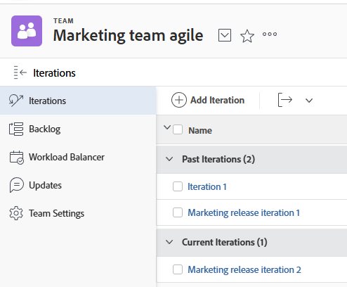
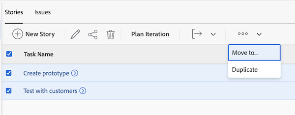

# Creare un’iterazione

Le iterazioni sono un componente chiave per i team Scrum Agile nella pianificazione della capacità di lavoro. [!DNL Adobe Workfront] consente ai team di Scrum Agile di gestire il proprio lavoro creando più iterazioni per soddisfare le esigenze del team.

## Requisiti di accesso

+++ Espandi per visualizzare i requisiti di accesso per la funzionalità descritta in questo articolo.

<table style="table-layout:auto"> 
 <col> 
 </col> 
 <col> 
 </col> 
 <tbody> 
  <tr> 
   <td role="rowheader">Pacchetto Adobe Workfront</td> 
   <td> 
Qualsiasi
 </td> 
  </tr> 
  <tr> 
   <td role="rowheader">Licenza di Adobe Workfront</td> 
   <td> 
Leggero o superiore
 
   
Revisione o superiore
 </td> 
  </tr>
 </tbody> 
</table>

Per ulteriori dettagli sulle informazioni contenute in questa tabella, consulta [Requisiti di accesso nella documentazione Workfront](/help/quicksilver/administration-and-setup/add-users/access-levels-and-object-permissions/access-level-requirements-in-documentation.md).

+++

## Aggiungere un&#39;iterazione

È possibile aggiungere un&#39;iterazione all&#39;elenco per creare rapidamente un&#39;iterazione e aggiungervi attività e problemi in un secondo momento.

{{step1-to-team}}

1. (Facoltativo) Fai clic sull&#39;icona **[!UICONTROL Cambia team]** , quindi seleziona un nuovo team Scrum dal menu a discesa o cerca un team nella barra di ricerca.

1. Nella scheda **[!UICONTROL Iterazioni]** fare clic su **[!UICONTROL Aggiungi iterazione]**.

   

1. Specificate quanto segue:

   <table style="table-layout:auto">
    <col> 
    <col> 
    <tbody> 
     <tr> 
      <td role="rowheader"><strong>[!Nome iterazione UICONTROL]</strong></td> 
      <td>Immettere il nome dell'iterazione.</td> 
     </tr> 
     <tr> 
      <td role="rowheader"><strong>[!UICONTROL Obiettivo]</strong></td> 
      <td>Aggiungi eventuali obiettivi per l’iterazione.</td> 
     </tr> 
     <tr> 
      <td role="rowheader"><strong>[!UICONTROL Data di inizio]</strong></td> 
      <td>Immettere la data di inizio dell'iterazione.</td> 
     </tr> 
     <tr> 
      <td role="rowheader"><strong>[!UICONTROL Data di fine]</strong></td> 
      <td>
Immettere la data di fine dell'iterazione. [!DNL Workfront] consiglia di impostare una data di fine non superiore a 4 settimane dalla data di inizio.

Suggerimento: scegli un giorno lavorativo come data di fine. Il grafico a dispersione usa solo giorni lavorativi nei suoi calcoli. Per impostazione predefinita, il grafico a dispersione utilizza la pianificazione predefinita per definire i giorni lavorativi (come descritto in <a href="../../../administration-and-setup/set-up-workfront/configure-timesheets-schedules/create-schedules.md" class="MCXref xref">Creare una pianificazione</a>). In alternativa, per incorporare i giorni non lavorativi specifici del team, i team Agile possono scegliere di utilizzare una pianificazione alternativa, come descritto in "Definizione di una pianificazione alternativa del team per i grafici Burndown" in <a href="../../../agile/get-started-with-agile-in-workfront/create-an-agile-team.md" class="MCXref xref">Creazione di un team Agile</a>).
</td> 
     </tr> 
     <tr> 
      <td role="rowheader"><strong>[!UICONTROL Capacity]</strong></td> 
      <td> Specificare la capacità per l'iterazione. Questo è il numero di punti o ore che il team è in grado di raggiungere nell’iterazione. Il numero immesso deve essere uguale o maggiore del numero di punti o ore dalla somma di tutti i brani nell'iterazione.Per impostazione predefinita,  [!DNL Workfront] precompila questo campo con una capacità di 50. </td> 
     </tr> 
     <tr> 
      <td role="rowheader"><strong>[!UICONTROL Focus]</strong></td> 
      <td>Specificare la percentuale di attivazione del team. Se tutti i membri del team si concentreranno completamente su questa iterazione, l'attenzione sarà al 100%. [!DNL Workfront] precompila questo campo con 100% per impostazione predefinita. </td> 
     </tr> 
    </tbody> 
   </table>

1. Fare clic su **[!UICONTROL Aggiungi iterazione]**. Ora che hai creato un’iterazione, devi aggiungere delle storie. Per ulteriori informazioni, vedere [Aggiungere brani a un&#39;iterazione esistente](../../../agile/use-scrum-in-an-agile-team/iterations/add-stories-to-existing-iteration.md).

## Pianificare un&#39;iterazione nella scheda [!UICONTROL Backlog]

Utilizzare la funzionalità [!UICONTROL Iterazione del piano] per creare un&#39;iterazione utilizzando le attività nel backlog.

{{step1-to-team}}

1. (Facoltativo) Fai clic sull&#39;icona **[!UICONTROL Cambia team]** , quindi seleziona un nuovo team Scrum dal menu a discesa o cerca un team nella barra di ricerca.

1. Seleziona **[!UICONTROL Backlog]** nel pannello sinistro.

1. Nella scheda **Storie** o **Problemi**, selezionare gli elementi di lavoro che si desidera aggiungere all&#39;iterazione, quindi fare clic su **[!UICONTROL Iterazione del piano]**.

>[!NOTE]
>
> Non è possibile passare dalla scheda Storie alla scheda Problemi e non è possibile aggiungere altre attività durante la pianificazione di un&#39;iterazione nella scheda Backlog. Puoi aggiungere storie o problemi esistenti una volta creata l’iterazione. Per ulteriori informazioni, vedere [Aggiungere attività o problemi a un&#39;iterazione esistente nella scheda Backlog](#add-tasks-or-issues-to-an-existing-iteration-on-the-backlog-tab).

1. Specificate le seguenti informazioni:

   <table style="table-layout:auto"> 
    <col> 
    <col> 
    <tbody> 
     <tr> 
      <td role="rowheader"><strong>[!Nome iterazione UICONTROL]</strong></td> 
      <td>Specificare un nome per l'iterazione.</td> 
     </tr> 
     <tr> 
      <td role="rowheader"><strong>[!UICONTROL Data di inizio]</strong></td> 
      <td> Specificare la data di inizio dell'iterazione.</td> 
     </tr> 
     <tr> 
      <td role="rowheader"><strong>[!Data Di Fine UICONTROL]</strong> </td> 
      <td>
Specificare la data di fine dell'iterazione. [!DNL Workfront] consiglia di impostare una data di fine non più lunga di 4 settimane dalla data di inizio.

Suggerimento: assicurati di scegliere un giorno lavorativo come data di fine. Il grafico a dispersione usa solo giorni lavorativi nei suoi calcoli. Per impostazione predefinita, il grafico a dispersione utilizza la pianificazione predefinita per definire i giorni lavorativi, come descritto in <a href="../../../administration-and-setup/set-up-workfront/configure-timesheets-schedules/create-schedules.md" class="MCXref xref">Creare una pianificazione</a>. In alternativa, per includere i giorni non lavorativi specifici del team, i team Agile possono scegliere di utilizzare una pianificazione alternativa (come descritto in <a href="../../../agile/use-scrum-in-an-agile-team/burndown/use-alt-team-schedule-burndown-charts.md" class="MCXref xref">Utilizzare una pianificazione alternativa per i grafici di masterizzazione</a>).
</td> 
     </tr> 
     <tr> 
      <td role="rowheader"><strong>[!UICONTROL Focus]</strong></td> 
      <td>Specificare la percentuale di attivazione del team. Se tutti i membri del team si concentreranno completamente su questa iterazione, l'attenzione sarà al 100%. [!DNL Workfront] precompila questo campo con il valore medio delle iterazioni precedenti del team. Se questa è la prima iterazione del team, il valore predefinito di questo campo è 0.</td> 
     </tr> 
     <tr> 
      <td role="rowheader"> <strong>[!Capacità UICONTROL]</strong></td> 
      <td> Specificare la capacità per l'iterazione. Questo è il numero di punti o ore che il team è in grado di raggiungere nell’iterazione. Il numero immesso deve essere uguale o maggiore del numero di punti o ore dalla somma di tutti i brani nell'iterazione. [!DNL Workfront] precompila questo campo con il valore medio delle iterazioni passate del team. Se si tratta della prima iterazione del team, il valore del campo è 0 per impostazione predefinita.</td> 
     </tr> 
     <tr> 
      <td role="rowheader"> <strong>[!UICONTROL Obiettivo]</strong></td> 
      <td> Specificare un obiettivo per l'iterazione. Questo campo non è obbligatorio.</td> 
     </tr> 
    </tbody> 
   </table>

1. Fai clic su **[!UICONTROL Salva].** L&#39;iterazione è stata creata.

## Aggiungere attività o problemi a un&#39;iterazione esistente nella scheda Backlog

1. Dalla scheda **Backlog**, fai clic sulla scheda **Storie** o **Problemi**.

1. Seleziona i brani o i problemi da aggiungere all’iterazione. Le storie nella parte superiore del backlog hanno priorità più alta.

   

   >[!NOTE]
   >
   >  Quando si aggiungono attività a un&#39;iterazione, la data di inizio dell&#39;attività viene calcolata come descritto in [[!UICONTROL Informazioni] sul calcolo delle date di inizio dell&#39;attività quando viene aggiunta a un&#39;iterazione](#understand-how-task-start-dates-are-calculated-when-added-to-an-iteration).

## Informazioni sul calcolo delle date di inizio delle attività aggiunte a un&#39;iterazione {#understand-how-task-start-dates-are-calculated-when-added-to-an-iteration}

Quando si aggiunge un&#39;attività come brano a un&#39;iterazione, per ogni brano viene utilizzato il vincolo [!UICONTROL Deve finire il giorno dell&#39;attività]. Nella maggior parte dei casi, la data di inizio pianificata dell&#39;attività viene calcolata in base alla formula seguente:

[!UICONTROL Data fine iterazione] meno (-) [!UICONTROL Durata attività] è uguale (=) [!UICONTROL Data inizio attività pianificata]

Viene utilizzata la [!UICONTROL Data di fine progetto] anziché la data di fine iterazione se la data di inizio del progetto è successiva alla data di inizio dell&#39;iterazione e la data di fine del progetto è successiva alla data di fine dell&#39;iterazione.

È possibile configurare singoli team Scrum in modo che utilizzino le date del progetto per impostazione predefinita, anziché le date delle iterazioni. Per informazioni, vedere la sezione [Configurare le modalità di applicazione delle date quando si aggiungono elementi di lavoro a un&#39;iterazione](../../../agile/get-started-with-agile-in-workfront/configure-scrum.md#configure-how-dates-are-applied-when-adding-work-items-to-an-iteration) nell&#39;articolo [Configurare Scrum](../../../agile/get-started-with-agile-in-workfront/configure-scrum.md).
