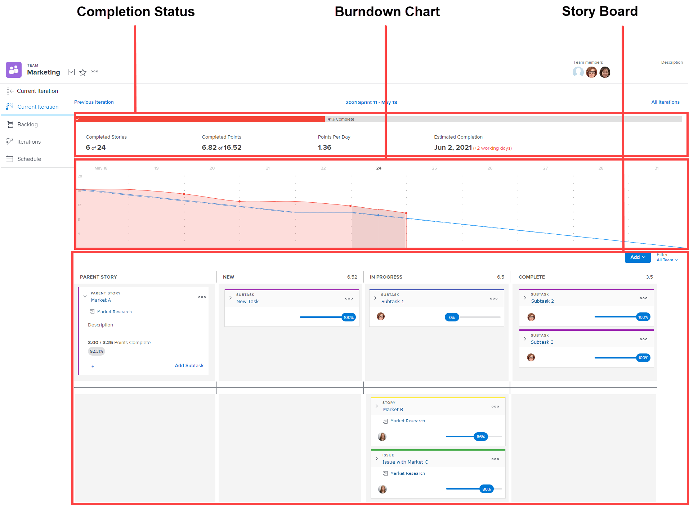

# Panoramica delle iterazioni

Le iterazioni di Agile sono costituite da tre aree: stato di completamento, burndown e storiella.

Per informazioni sul grafico a discesa e sullo stato di completamento, consulta la sezione [[!UICONTROL Burn]](../../../agile/use-scrum-in-an-agile-team/burndown/burndown.md) sezione .

Per ulteriori informazioni sulla bacheca della storia, consultate la sezione [[!UICONTROL Scratto] bacheca](../../../agile/use-scrum-in-an-agile-team/scrum-board/scrum-board.md) sezione .
