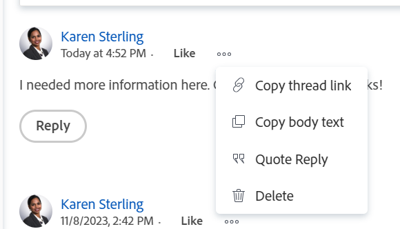

# Gestisci commenti iterazione

È possibile aggiungere aggiornamenti a un’iterazione quando si lavora in un ambiente Scrum, per collaborare con altri in Adobe Workfront.

## Gestire gli aggiornamenti su un’iterazione

1. Vai a un team agile, quindi fai clic su **Iterazioni** nel pannello a sinistra.
1. Fare clic sul nome di un&#39;iterazione per aprirla.
1. Clic **Aggiornamenti** per aprire nella sezione dal pannello a sinistra.

   
1. Clic **Avvia un nuovo aggiornamento,** quindi digita l’aggiornamento.
1. (Facoltativo) Utilizza le opzioni nella barra degli strumenti Testo formattato per formattare il testo, aggiungere emoticon, collegamenti o immagini all’aggiornamento, per migliorare i contenuti. Per ulteriori informazioni, consulta la sezione &quot;Utilizzare Rich Text in un aggiornamento di Workfront&quot; nell’articolo [Aggiorna lavoro](/help/quicksilver/workfront-basics/updating-work-items-and-viewing-updates/update-work.md).
1. (Facoltativo) Quando aggiungete un aggiornamento all&#39;iterazione, aggiornate uno dei seguenti elementi:

   <table style="table-layout:auto"> 
    <col> 
    <col> 
    <tbody> 
     <tr> 
      <td role="rowheader"><strong>Notifica</strong></td> 
      <td>Identifica gli utenti a cui deve essere notificato l’aggiornamento. 
Per informazioni su come includere altri utenti in un aggiornamento, consulta <a href="/help/quicksilver/workfront-basics/updating-work-items-and-viewing-updates/tag-others-on-updates.md">Assegna tag ad altri utenti in caso di aggiornamenti</a>.
</td> 
     </tr> 
     <tr> 
      <td role="rowheader"><strong>Privato per la mia azienda</strong></td> 
      <td> 
Disattiva questa opzione per impedire agli utenti esterni alla società di avere accesso alla visualizzazione di questo aggiornamento.
 
      
<b>NOTA</b>

      
Questa opzione viene visualizzata solo quando il profilo utente di Workfront è associato a una società.

      
Questa opzione non è disponibile in tutte le aree da cui è possibile aggiungere aggiornamenti. Ad esempio, non è disponibile nelle applicazioni di terze parti da cui puoi aggiungere aggiornamenti. 

      </td> 
     </tr> 
    </tbody> 
   </table>

1. Clic **Aggiorna** per aggiungere l&#39;aggiornamento all&#39;iterazione.

   >[!NOTE]
   >
   >Una piccola finestra pop-up apparirà per sette secondi dopo aver fatto clic su **Aggiorna**, che consente di fare clic su **Annulla commento** e annullare l’aggiornamento e tornare al riquadro di modifica prima che l’aggiornamento venga pubblicato. L’aggiornamento viene pubblicato se salti il pop-up di annullamento, attendi che scompaia o esci dalla pagina.
   >
   >Se l&#39;amministratore di Workfront seleziona l&#39;impostazione &quot;Non consentire agli utenti di eliminare commenti&quot; nel proprio livello di accesso, non è possibile annullare un commento. Per ulteriori informazioni, consulta [Creare e modificare livelli di accesso personalizzati](/help/quicksilver/administration-and-setup/add-users/configure-and-grant-access/create-modify-access-levels.md).

1. Per rispondere a un aggiornamento, fai clic su **Rispondi**.

   Per ulteriori informazioni, consulta [Rispondi agli aggiornamenti](/help/quicksilver/workfront-basics/updating-work-items-and-viewing-updates/reply-to-updates.md).

1. (Facoltativo) Per copiare il contenuto di un commento, fare clic su **Altro** icona  a destra di un aggiornamento, quindi fai clic su una delle seguenti opzioni:

   * **Copia collegamento thread**
   * **Copia corpo del testo**
   * **Risposta preventivo**

   

   Per ulteriori informazioni, consulta la sezione [Copiare un aggiornamento](#copy-an-update) in questo articolo.
1. (Facoltativo) Per eliminare un commento, fai clic sul pulsante **Altro** icona  a destra di un aggiornamento, quindi fai clic su **Elimina**.

## Copiare un aggiornamento

È possibile copiare il contenuto di un aggiornamento e riutilizzarlo nei modi seguenti:

* [Copia link thread](#copy-thread-link)
* [Copia corpo del testo](#copy-body-text)
* [Risposta preventivo](#quote-reply)

### Copia link thread

Questa opzione consente di copiare il collegamento thread completo negli Appunti, in modo da poter condividere il thread con altri utenti.

1. Passare al thread di aggiornamento da copiare.

1. Fai clic su **Altro** , quindi fai clic su **Copia collegamento thread**.

1. Incolla il collegamento copiato nel passaggio precedente in un’e-mail o in un’altra applicazione per condividerlo con altri utenti. Il collegamento condiviso apre il commento da cui hai condiviso il collegamento.

### Copia corpo del testo

Questa opzione consente di copiare il testo da un aggiornamento specifico negli Appunti.

1. Vai all’aggiornamento o alla risposta che desideri copiare.
1. Fai clic su **Altro** , quindi fai clic su **Copia corpo del testo**.

### Risposta preventivo

L&#39;opzione Risposta preventivo copia il commento originale in una nuova risposta sotto forma di un&#39;offerta di blocco.

1. Vai all’aggiornamento o alla risposta che desideri copiare.
1. Fai clic su **Altro** , quindi fai clic su **Risposta preventivo**.

   Viene visualizzata una nuova casella di commento e la risposta tra virgolette viene inclusa nel nuovo commento e contrassegnata come virgolette.

1. Continua ad aggiungere il tuo aggiornamento e fai clic su **Rispondi** per aggiungere il commento.
