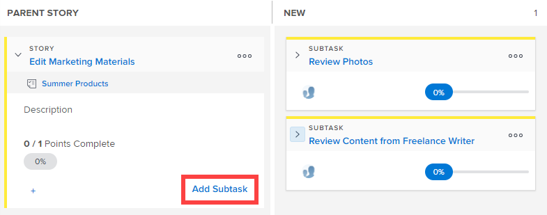
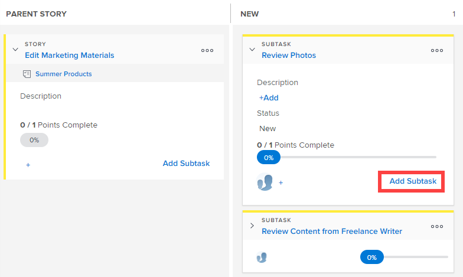

# Aggiungi un&#39;attività secondaria a una storia esistente nella bacheca [!UICONTROL Scrum]

Quando create sottoattività per i brani esistenti, tenete presente quanto segue:

**Quando l&#39;impostazione della [!UICONTROL Modalità di completamento] per il progetto è impostata su [!UICONTROL Manuale]:**

* Se si sposta una storia padre con sottoattività in [!UICONTROL Complete], la storia padre viene aggiornata al 100% e lo stato [!UICONTROL Status] in [!UICONTROL Complete]. Le sottoattività non vengono aggiornate.
* Per aggiornare la [!UICONTROL Percentuale completata] per la storia, è necessario aggiornarla dalla scheda [!UICONTROL Storie] o dalla pagina [!UICONTROL Dettagli] dell&#39;oggetto.

**Quando l&#39;impostazione [!UICONTROL Modalità di completamento] per il progetto è impostata su [!UICONTROL Automatico]**:

* Se si sposta una storia padre con sottoattività in [!UICONTROL Complete], la storia padre viene aggiornata al 100% e lo stato [!UICONTROL Status] in [!UICONTROL Complete]. Anche le sottoattività vengono aggiornate al 100% e lo [!UICONTROL Stato] viene aggiornato a [!UICONTROL Completo].
* Per aggiornare [!UICONTROL Percent Complete] per la storia, è necessario aggiornare [!UICONTROL Percent Complete] per le sottoattività. La [!UICONTROL Percentuale completata] per il brano viene calcolata in base alla [!UICONTROL Percentuale completata] di tutte le sottoattività.

## Requisiti di accesso

+++ Espandi per visualizzare i requisiti di accesso per la funzionalità descritta in questo articolo.

Per eseguire i passaggi descritti in questo articolo, devi disporre dei seguenti diritti di accesso:

<table style="table-layout:auto"> 
 <tbody> 
  <tr> 
   <td role="rowheader">[!DNL Adobe Workfront] piano</td> 
   <td> 
Qualsiasi
 </td> 
  </tr> 
  <tr> 
   <td role="rowheader">[!DNL Adobe Workfront] licenza</td> 
   <td> 
Nuovo: [!UICONTROL Standard]
 
   oppure
   
Corrente: [!UICONTROL Work] o versione successiva
 </td> 
  </tr>
   <tr> 
   <td role="rowheader">Autorizzazioni sugli oggetti</td> 
   <td>Accesso [!UICONTROL Contribute] o [!UICONTROL Manage] all'attività su cui si trova la sottoattività </td> 
  </tr>
 </tbody> 
</table>

Per informazioni, consulta [Requisiti di accesso nella documentazione di Workfront](/help/quicksilver/administration-and-setup/add-users/access-levels-and-object-permissions/access-level-requirements-in-documentation.md).

+++

## Aggiungere un’attività secondaria a una storia esistente sulla bacheca Scrum

{{step1-to-team}}

1. (Facoltativo) Fai clic sull&#39;icona **[!UICONTROL Cambia team]** , quindi seleziona un nuovo team Scrum dal menu a discesa o cerca un team nella barra di ricerca.

1. Passa all’iterazione o al progetto Agile contenente il brano in cui desideri aggiungere un’attività secondaria. Per informazioni su come passare a un&#39;iterazione, vedere [Visualizzare un&#39;iterazione](../../../agile/use-scrum-in-an-agile-team/iterations/view-iteration.md).
1. Passare alla sezione del brano sullo storyboard in cui si desidera aggiungere un&#39;attività secondaria.
1. Fai clic su **[!UICONTROL Aggiungi sottoattività]** nella scheda del brano principale per creare una sottoattività al brano.

   

   Oppure

   Fare clic su **[!UICONTROL Aggiungi sottoattività]** in un riquadro di sottoattività per creare una sottoattività per la sottoattività.

   [!DNL Workfront] supporta un numero infinito di livelli di sottoattività, ma solo due livelli (sottoattività di sottoattività) vengono visualizzati nello storyboard Agile.

   

   Quando si aggiunge un&#39;attività secondaria a un brano che al momento non ha una corsia di scorrimento, l&#39;attività principale viene promossa alla colonna [!UICONTROL Storia principale] e la sottoattività si sposta all&#39;interno della corsia di spostamento.

1. Specifica le seguenti informazioni:

   <table style="table-layout:auto">
    <col>
    <col>
    <tbody>
     <tr>
      <td role="rowheader"><strong>[!UICONTROL Nome sottoattività]</strong></td>
      <td> Specificare un nome per la sottoattività.</td>
     </tr>
     <tr>
      <td role="rowheader"><strong>[!UICONTROL Descrizione]</strong></td>
      <td>Specificare una descrizione per la sottoattività.</td>
     </tr>
     <tr>
      <td role="rowheader"><strong>[!UICONTROL Stima]</strong></td>
      <td>Specifica la stima per l’attività secondaria. 
Quando crei delle stime, tieni presente quanto segue:

       <ul>
        <li>Se il team agile è configurato per stimare le storie in punti, per impostazione predefinita 1 punto equivale a 8 ore. Le stime vengono aggiunte come [!UICONTROL Lavoro Necessario] alla storia.</li>
        <li>Le stime combinate per tutte le sottoattività determinano la stima del brano padre. Per ulteriori informazioni, vedere <a href="../../../agile/use-scrum-in-an-agile-team/scrum-board/update-status-of-stories-and-subtasks.md" class="MCXref xref">Aggiornare lo stato delle storie e delle sottoattività sulla bacheca Scrum</a>.</li>
        <li>Quando si crea una nuova sottoattività, il campo [!UICONTROL Stima] è già impostato. Se si reimposta la stima per l'attività secondaria, si reimposta la stima per la storia padre (perché la storia padre è la somma di tutte le relative sottoattività).</li>
       </ul> </td>
     </tr>
     <tr>
      <td role="rowheader"><strong>[!UICONTROL Ore pianificate]</strong></td>
      <td> (Disponibile solo nei progetti) Specifica il numero di ore pianificate per l'attività.</td>
     </tr>
     <tr>
      <td role="rowheader"><strong>[!UICONTROL Assegnazione]</strong></td>
      <td>Iniziare a digitare il nome del team a cui si desidera assegnare la sottoattività, quindi fare clic su di esso quando viene visualizzato nell'elenco a discesa.</td>
     </tr>
    </tbody>
   </table>

1. Fai clic su **[!UICONTROL Crea]**.
