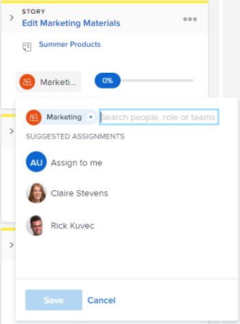

# Assegnare gli utenti a una storia nella bacheca [!UICONTROL Scrum]

## Requisiti di accesso

+++ Espandi per visualizzare i requisiti di accesso per la funzionalità descritta in questo articolo.

Per eseguire i passaggi descritti in questo articolo, devi disporre dei seguenti diritti di accesso:

<table style="table-layout:auto"> 
 <tbody> 
  <tr> 
   <td role="rowheader">[!DNL Adobe Workfront] piano</td> 
   <td> 
Qualsiasi
 </td> 
  </tr> 
  <tr> 
   <td role="rowheader">[!DNL Adobe Workfront] licenza</td> 
   <td> 
Nuovo: [!UICONTROL Standard]
 
   oppure
   
Corrente: [!UICONTROL Work] o versione successiva
 </td> 
  </tr>
 </tbody> 
</table>

Per ulteriori dettagli sulle informazioni contenute in questa tabella, consulta [Requisiti di accesso nella documentazione Workfront](/help/quicksilver/administration-and-setup/add-users/access-levels-and-object-permissions/access-level-requirements-in-documentation.md).

+++

## Assegnare gli utenti a una storia nella bacheca [!UICONTROL Scrum]

{{step1-to-team}}

1. (Facoltativo) Fai clic sull&#39;icona **[!UICONTROL Cambia team]** , quindi seleziona un nuovo team [!UICONTROL Scrum] dal menu a discesa o cerca un team nella barra di ricerca.

1. Accedete all’iterazione Agile o al progetto che contiene la storyboard in cui desiderate assegnare gli utenti. Per informazioni su come passare a un&#39;iterazione, vedere [Visualizzare un&#39;iterazione](../../../agile/use-scrum-in-an-agile-team/iterations/view-iteration.md).
1. Accedete al riquadro della storia in cui desiderate aggiungere un utente.
1. Fai clic sull’avatar del team nel riquadro del brano (o su un avatar dell’utente, se ne è già assegnato uno), inizia a digitare il nome dell’utente che desideri assegnare al brano, quindi fai clic sul nome quando viene visualizzato. Puoi anche scegliere un utente suggerito.

   >[!TIP]
   >
   >Potete anche assegnare un ruolo a un brano. Puoi assegnare solo utenti attivi e ruoli attivi.

   
