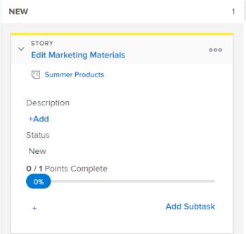

# Visualizza e modifica le informazioni sulla storia nella bacheca [!UICONTROL Scrum]

## Informazioni che possono essere visualizzate e modificate

Quando visualizzate una porzione di brano nell’area brani, sono disponibili le informazioni riportate nella tabella seguente. Potete modificare la maggior parte delle informazioni direttamente dal riquadro del brano.

<table style="table-layout:auto"> 
 <col> 
 <col> 
 <col> 
 <thead> 
  <tr> 
   <th><strong>Informazioni</strong> </th> 
   <th><strong>Visibile</strong> </th> 
   <th><strong>In linea modificabile</strong> </th> 
  </tr> 
 </thead> 
 <tbody> 
  <tr> 
   <td>Nome del brano con un collegamento diretto all'attività o al problema</td> 
   <td>✓</td> 
   <td> </td> 
  </tr> 
  <tr> 
   <td> 
Il nome del progetto con un collegamento diretto al progetto Questo collegamento viene visualizzato solo nei brani (attività padre e non sottoattività) quando si utilizza la visualizzazione Agile in un'iterazione; non viene visualizzato quando si utilizza una visualizzazione Agile in un progetto.
 </td> 
   <td> </td> 
   <td> </td> 
  </tr> 
  <tr> 
   <td> 
Il numero di punti o ore completate nel brano e il numero di punti o ore assegnato al brano Questi numeri vengono utilizzati per calcolare e visualizzare [!UICONTROL Percent Complete] per ogni brano.
 </td> 
   <td>✓</td> 
   <td>✓</td> 
  </tr> 
  <tr> 
   <td> 
Il [!UICONTROL Percent Complete] per ogni brano e problema. Il valore [!UICONTROL Percent Complete] per l'iterazione viene calcolato in base al valore [!UICONTROL Percent Complete] per ogni brano.
 
Quando si aggiorna [!UICONTROL Percent Complete] per un brano o un problema, è possibile scegliere un numero compreso tra 0 e 100.
 </td> 
   <td>✓</td> 
   <td>✓</td> 
  </tr> 
  <tr> 
   <td> 
A chi è assegnato il brano
 </td> 
   <td>✓</td> 
   <td>✓</td> 
  </tr> 
  <tr> 
   <td> 
Colore o categoria della porzione
 </td> 
   <td>✓</td> 
   <td>✓</td> 
  </tr> 
  <tr> 
   <td> 
Eventuali campi aggiuntivi (inclusi i campi personalizzati) che potrebbero essere stati aggiunti alla visualizzazione Agile modificando la visualizzazione Agile, come descritto in "Creazione e personalizzazione di una visualizzazione [!UICONTROL Agile]" in <a href="../../../reports-and-dashboards/reports/reporting-elements/views-overview.md" class="MCXref xref">Panoramica delle visualizzazioni in [!UICONTROL Adobe Workfront]</a>.
 </td> 
   <td>✓</td> 
   <td>✓</td> 
  </tr> 
 </tbody> 
</table>

## Requisiti di accesso

+++ Espandi per visualizzare i requisiti di accesso per la funzionalità descritta in questo articolo.

Per eseguire i passaggi descritti in questo articolo, devi disporre dei seguenti diritti di accesso:

<table style="table-layout:auto"> 
 <tbody> 
  <tr> 
   <td role="rowheader">[!DNL Adobe Workfront] piano</td> 
   <td> 
Qualsiasi
 </td> 
  </tr> 
  <tr> 
   <td role="rowheader">[!DNL Adobe Workfront] licenza</td> 
   <td> 
Nuovo: [!UICONTROL Standard]
 
   oppure
   
Corrente: [!UICONTROL Work] o versione successiva
 </td> 
  </tr>
   <tr> 
   <td role="rowheader">Autorizzazioni sugli oggetti</td> 
   <td>Accesso [!UICONTROL Contribute] o [!UICONTROL Manage] all'attività o al problema</td> 
  </tr>
 </tbody> 
</table>

Per ulteriori dettagli sulle informazioni contenute in questa tabella, consulta [Requisiti di accesso nella documentazione Workfront](/help/quicksilver/administration-and-setup/add-users/access-levels-and-object-permissions/access-level-requirements-in-documentation.md).

+++

## Visualizzare e modificare le informazioni su una porzione del brano

{{step1-to-team}}

1. (Facoltativo) Fai clic sull&#39;icona **[!UICONTROL Cambia team]** , quindi seleziona un nuovo team Scrum dal menu a discesa o cerca un team nella barra di ricerca.

1. Nel pannello a sinistra, seleziona **[!UICONTROL Iterazioni]** per scegliere un&#39;iterazione specifica oppure **[!UICONTROL Iterazione corrente]**.

1. Vai alla [!UICONTROL Scrum] Agile story board.
1. Espandete il riquadro [!UICONTROL brano] per visualizzare tutti i campi associati al brano.

   

1. (Facoltativo) Per modificare un campo, fai clic sul campo e apporta le modifiche desiderate.

   Per modificare il riquadro del brano, è necessario disporre dei diritti di [!UICONTROL Modifica] per l&#39;attività o il problema.

>[!NOTE]
>
>Per modificare la [!UICONTROL percentuale di completamento], è necessario digitare un numero compreso tra 0 e 100. Il campo non è un dispositivo di scorrimento che è possibile spostare.
