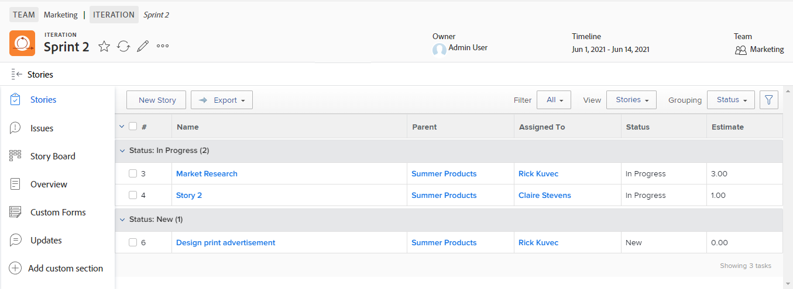

# Creare una storia agile

È possibile creare una storia agile su un&#39;iterazione in vari modi. Dopo aver creato una storia agile, è possibile aggiungere sottoattività alla storia.

Quando si aggiunge un brano o una sottoattività in un&#39;iterazione, Tipo di durata è impostato su [!UICONTROL Semplice] e il Vincolo attività è impostato su Date fisse, con le date bloccate all&#39;interno dell&#39;iterazione. Non è possibile modificare il tipo di durata o il vincolo di attività in un&#39;iterazione. Inoltre, la durata dell&#39;attività deve essere maggiore di 0 minuti.

Per informazioni su come gestire il brano dopo essere stato aggiunto all’iterazione, consulta [Iterazioni](../../agile/use-scrum-in-an-agile-team/iterations/iterations.md).

## Requisiti di accesso

Per eseguire i passaggi descritti in questo articolo, è necessario disporre dei seguenti diritti di accesso:

<table style="table-layout:auto"> 
 <col> 
 </col> 
 <col> 
 </col> 
 <tbody> 
  <tr> 
   <td role="rowheader"><strong>[!DNL Adobe Workfront] piano*</strong></td> 
   <td> 
Qualsiasi
 </td> 
  </tr> 
  <tr> 
   <td role="rowheader"><strong>[!DNL Adobe Workfront] licenza*</strong></td> 
   <td> 
[!UICONTROL Work] o superiore
 </td> 
  </tr> 
  <tr> 
   <td role="rowheader"><strong>Configurazioni a livello di accesso*</strong></td> 
   <td> 
[!UICONTROL Worker] o superiore
 
Nota: Se non hai ancora accesso, chiedi [!DNL Workfront] amministratore se imposta ulteriori restrizioni nel livello di accesso. Per informazioni su come [!DNL Workfront] l'amministratore può modificare il livello di accesso, vedi <a href="../../administration-and-setup/add-users/configure-and-grant-access/create-modify-access-levels.md" class="MCXref xref">Creare o modificare livelli di accesso personalizzati</a>.
 </td> 
  </tr> 
  <tr> 
   <td role="rowheader"><strong>Autorizzazioni oggetto</strong></td> 
   <td> 
Accesso a [!UICONTROL Gestire] il progetto su cui si trova la storia
 
Per informazioni sulla richiesta di accesso aggiuntivo, vedi <a href="../../workfront-basics/grant-and-request-access-to-objects/request-access.md" class="MCXref xref">Richiedere l’accesso agli oggetti </a>.
 </td> 
  </tr> 
 </tbody> 
</table>

&#42;Per sapere quale piano, tipo di licenza o accesso hai, contatta il tuo [!DNL Workfront] amministratore.

## Creare una storia agile in un&#39;iterazione

1. Vai all&#39;iterazione agile in cui desideri creare la storia:

   1. Fai clic sul pulsante **[!UICONTROL Menu principale]** icona  nell&#39;angolo superiore destro di [!DNL Adobe Workfront], quindi fai clic su **[!UICONTROL Team]**.

   1. (Facoltativo) Fai clic sul pulsante **[!UICONTROL Cambia team]** icona , quindi seleziona un nuovo team Scrum dal menu a discesa o cerca un team nella barra di ricerca.

   1. Nel pannello a sinistra, seleziona **[!UICONTROL Iterazioni]** per scegliere un&#39;iterazione specifica o selezionare **[!UICONTROL Iterazione corrente]**.
   1. Fare clic sul nome dell&#39;iterazione specifica in cui si desidera creare un brano.

   

1. Fai clic su **[!UICONTROL Nuova storia].**
1. Specifica le seguenti informazioni:

   <table style="table-layout:auto">
    <col>
    <col>
    <tbody>
     <tr>
      <td role="rowheader"><strong>[!UICONTROL Nome Story]</strong></td>
      <td>Digitate un nome per la storia.</td>
     </tr>
     <tr>
      <td role="rowheader"><strong>[!UICONTROL Descrizione]</strong></td>
      <td>Digita una descrizione della storia.</td>
     </tr>
     <tr>
      <td role="rowheader"><strong>[!UICONTROL Ready]</strong></td>
      <td>Seleziona questa opzione se il brano è pronto per essere aggiunto a un’iterazione. Quando questa opzione è selezionata, indica agli utenti quali storie nel backlog sono pronte per essere aggiunte a un'iterazione. Un brano può essere aggiunto a un'iterazione indipendentemente dal fatto che sia contrassegnato o meno <strong>[!UICONTROL Ready].</strong></td>
     </tr>
     <tr>
      <td role="rowheader"><strong>Stima [!UICONTROL] (punti)</strong></td>
      <td>Specifica la stima per la storia. Se il team agile è configurato per stimare le storie in punti, per impostazione predefinita 1 punto è uguale a 8 ore. Le stime vengono aggiunte come [!UICONTROL Pianifica ore] sulla storia. Ad esempio, se stimate una storia come 3 punti, il comportamento predefinito consiste nell’aggiungere 24 ore di pianificazione alla storia. Se un brano contiene sottoattività, ricordare che le stime combinate per tutte le sottoattività determinano la stima del brano padre. Per ulteriori informazioni, consulta <a href="../../agile/use-scrum-in-an-agile-team/iterations/add-stories-to-existing-iteration.md" class="MCXref xref">Aggiungere storie a un'iterazione esistente</a>.</td>
     </tr>
     <tr>
      <td role="rowheader"><strong>[!UICONTROL Progetto padre]</strong></td>
      <td>Inizia a digitare il nome del progetto a cui verrà associato il brano. Per impostazione predefinita, il colore della storia viene visualizzato con lo stesso colore degli altri brani di questo progetto. Lo stato del progetto deve essere impostato su [!UICONTROL Current]. Se lo stato del progetto è diverso da [!UICONTROL Current], non viene visualizzato nel menu a discesa.</td>
     </tr>
     <tr>
      <td role="rowheader"><strong>[!UICONTROL Attività padre]</strong></td>
      <td>Dopo aver scelto un progetto padre, è possibile scegliere un'attività padre. Quando si seleziona un'attività padre, il brano viene creato come sottoattività dell'attività padre sul progetto selezionato. Inizia a digitare il nome dell'attività principale per il brano, quindi fai clic su di esso quando viene visualizzato nell'elenco a discesa.</td>
     </tr>
     <tr>
      <td role="rowheader"><strong>[!UICONTROL Custom Forms]</strong></td>
      <td>Seleziona i moduli personalizzati da aggiungere al brano.</td>
     </tr>
    </tbody>
   </table>

1. Fai clic su **[!UICONTROL Salva storia]**.

## Crea una storia agile nel backlog

Puoi creare una storia agile dal backlog agile, come descritto nella sezione . [Crea nuove storie sul backlog](../../agile/work-in-an-agile-environment/manage-the-agile-backlog.md#creating-new-stories) nell&#39;articolo [[!UICONTROL Gestisci] backlog agile](../../agile/work-in-an-agile-environment/manage-the-agile-backlog.md).

## Aggiungere un&#39;attività o un problema come storia agile

È possibile aggiungere un&#39;attività o un problema esistente come storia a un&#39;iterazione. Per ulteriori informazioni, consulta [Aggiungere storie a un&#39;iterazione esistente](../../agile/use-scrum-in-an-agile-team/iterations/add-stories-to-existing-iteration.md) o [Aggiungi storie e problemi dal [!UICONTROL Scratto] bacheca](../../agile/use-scrum-in-an-agile-team/scrum-board/add-story-from-scrum-board.md).

## Creare sottoattività in un racconto agile

È possibile creare una sottoattività per una storia agile utilizzando uno dei metodi seguenti:

* Utilizzando **[!UICONTROL Sottoattività]** , come descritto in [Creare sottoattività](../../manage-work/tasks/create-tasks/create-subtasks.md#creating-subtasks) in [Creare sottoattività](../../manage-work/tasks/create-tasks/create-subtasks.md).

* Direttamente dalla bacheca della storia, come descritto in [Creare un’iterazione](../../agile/use-scrum-in-an-agile-team/iterations/create-an-iteration.md).
