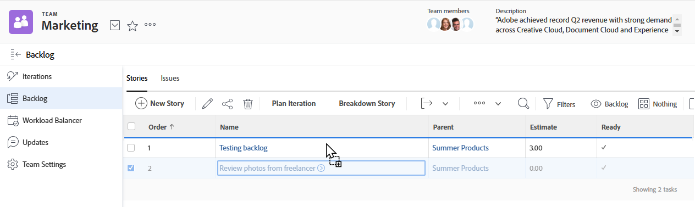

# Gestire il backlog Agile

I seguenti elementi di lavoro possono essere assegnati a un team Agile e aggiunti al backlog del team come storie, a seconda della metodologia Agile utilizzata dal team:

* **[!UICONTROL Team Agile Scrum]:** È possibile assegnare attività e problemi al team Agile e aggiungerli al backlog.
* **[!UICONTROL Team Kanban Agile]:** Le attività possono essere assegnate al team Agile e aggiunte al backlog. Gli utenti possono visualizzare il backlog direttamente dalla bacheca delle storie di Agile, come descritto in [[!UICONTROL Aggiungere il backlog] alla bacheca Kanban](../../agile/use-kanban-in-an-agile-team/view-the-backlog-on-the-kanban-board.md). Il team utilizza questo backlog per assegnare la priorità e gestire la coda di lavoro.

Le attività o i problemi possono essere assegnati al team (e successivamente aggiunti al backlog del team) da qualsiasi posizione in [!DNL Adobe Workfront]. Ad esempio, a un singolo team possono essere assegnate assegnazioni di lavoro da più progetti.

>[!NOTE]
>
>Se aggiungi più team a un elemento del backlog, l’attività o il problema viene visualizzato solo nel backlog del team principale. Il team principale è il team assegnato per primo.

## Requisiti di accesso

+++ Espandi per visualizzare i requisiti di accesso per la funzionalità descritta in questo articolo.

<table style="table-layout:auto"> 
 <col> 
 </col> 
 <col> 
 </col> 
 <tbody> 
  <tr> 
   <td role="rowheader">Pacchetto Adobe Workfront</td> 
   <td> 
Qualsiasi
 </td> 
  </tr> 
  <tr> 
   <td role="rowheader">Licenza Adobe Workfront</td> 
   <td> 
Standard
 
   
Work o successiva
 </td> 
  </tr>
  <tr> 
   <td role="rowheader">Autorizzazioni oggetto</td> 
   <td>Gestire l'accesso al progetto a cui appartiene il brano </td> 
  </tr> 
 </tbody> 
</table>

Per ulteriori dettagli sulle informazioni contenute in questa tabella, vedere [Requisiti di accesso nella documentazione di Workfront](/help/quicksilver/administration-and-setup/add-users/access-levels-and-object-permissions/access-level-requirements-in-documentation.md).

+++

## Creazione e gestione di brani nel backlog

* [Riordinare le storie](#reorder-stories)
* [[!UICONTROL Suddividi] storie](#break-down-stories)
* [Modifica storie](#edit-stories)

### Riordinare le storie {#reorder-stories}

È possibile riordinare i brani nell&#39;elenco dei backlog utilizzando il metodo di trascinamento della selezione.

1. Vai al backlog Agile in cui desideri riordinare le storie.
1. Nel menu a discesa **[!UICONTROL Visualizza]**, selezionare la visualizzazione **[!UICONTROL Backlog]** o una visualizzazione personalizzata contenente la colonna **[!UICONTROL Ordine]**.

   >[!NOTE]
   >
   >Se a un’attività o a un problema è assegnato un team Agile e lo stato del progetto non è Corrente, il team non viene visualizzato nel backlog. Tuttavia, influiscono ancora sul conteggio del backlog nella colonna Ordine.

1. Seleziona uno o più brani, quindi trascina i brani nell’ordine in cui desideri che vengano visualizzati nel backlog.
   

### Suddividere storie {#break-down-stories}

Poiché le storie in un backlog hanno dimensioni diverse, gli utenti possono suddividerle in dimensioni utilizzabili per un’iterazione. La suddivisione di un brano crea sottoattività sull&#39;attività rappresentata e sostituisce l&#39;attività originale nel backlog. Puoi assegnare un’attività padre o le relative sottoattività a un team Agile, ma non puoi assegnarle entrambe contemporaneamente a un team.

>[!NOTE]
>
>Considera le seguenti limitazioni quando suddividi le storie:
>
>* È possibile suddividere solo le storie che rappresentano attività. Non è possibile analizzare le storie che rappresentano problemi.
>* Le storie possono essere suddivise solo se sono associate a un progetto.

Per suddividere una storia:

1. Vai al backlog contenente la storia che desideri scomporre.
1. Seleziona la storia da scomporre, quindi fai clic su **[!UICONTROL Dettaglio]**.
Viene visualizzata la finestra di dialogo [!UICONTROL Breakdown Story].
   

1. Specificate un nome e una stima per il brano, quindi selezionate se il brano è pronto.
1. Fai clic su **[!UICONTROL Aggiungi storia]** per creare un&#39;altra storia dal brano originale.
1. Fai clic su **[!UICONTROL Salva]**.

### Modifica storie {#edit-stories}

Puoi modificare i brani direttamente dalle schede [!UICONTROL Storie] o [!UICONTROL Problemi] nel backlog, così come si modificano attività o problemi all&#39;interno di un progetto in blocco, come descritto in [Modifica attività in blocco](../../manage-work/tasks/manage-tasks/edit-tasks.md#edit-tasks-in-bulk) in [Modifica attività](../../manage-work/tasks/manage-tasks/edit-tasks.md) e [Modifica problemi](../../manage-work/issues/manage-issues/edit-issues.md).

## Crea nuove storie nel backlog {#create-new-stories-on-the-backlog}

Puoi creare nuovi brani nel backlog creando il brano direttamente dal backlog o assegnando un’attività o un problema esistente a un team Agile.

* [Creare una storia dal backlog](#create-a-story-from-the-backlog)
* [Assegnare un’attività o un problema a un team Agile](#assign-a-task-or-issue-to-an-agile-team)

### Creare una storia dal backlog {#create-a-story-from-the-backlog}

Quando crei una storia dal backlog, questa viene creata come un’attività o un problema all’interno di un progetto.

Per creare una storia dal backlog:

1. Fai clic sull&#39;icona **[!UICONTROL Main Menu]**  nell&#39;angolo superiore destro di Adobe Workfront oppure, se disponibile, fai clic sull&#39;icona **[!UICONTROL Main Menu]**  nell&#39;angolo superiore sinistro, quindi fai clic su **[!UICONTROL Teams]**.

1. (Facoltativo) Fai clic sull&#39;icona **[!UICONTROL Cambia team]** , quindi seleziona un nuovo team Scrum dal menu a discesa oppure cerca un team nella barra di ricerca e selezionalo quando viene visualizzato.

1. Seleziona **[!UICONTROL Backlog]** dal pannello a sinistra.
1. Effettua una delle seguenti operazioni, a seconda che desideri creare un’attività o un problema:

   * **Per creare un&#39;attività:** Fai clic su **[!UICONTROL Storie]**.

   * **Per creare un problema:** Fai clic su **[!UICONTROL Problemi]**.

1. Fai clic su **[!UICONTROL Nuova storia]** o **[!UICONTROL Nuovo problema]**.

1. Specifica le seguenti informazioni:

   <table style="table-layout:auto">
    <col>
    <col>
    <tbody>
     <tr>
      <td role="rowheader"><strong>[!UICONTROL Nome brano]</strong></td>
      <td> Digitate un nome per il brano.</td>
     </tr>
     <tr>
      <td role="rowheader"><strong>[!UICONTROL Descrizione]</strong></td>
      <td>(Facoltativo) Digitate una descrizione del brano.</td>
     </tr>
     <tr>
      <td role="rowheader"><strong>[!UICONTROL Pronto]</strong></td>
      <td> Selezionate se il brano è pronto per essere aggiunto a un'iterazione. Questa impostazione è puramente informativa. Le storie possono essere aggiunte a un’iterazione indipendentemente dallo stato di questa impostazione.</td>
     </tr>
     <tr>
      <td role="rowheader"><strong>[!UICONTROL Stima]</strong></td>
      <td>Specificate un punto o una stima oraria per il brano. Le stime influiscono sul grafico a dispersione. Il grafico a burn-down per un'iterazione è accurato solo se ogni storia contiene una stima accurata. Se fornisci una stima puntuale, devi avere già indicato nelle impostazioni del team quante ore ogni punto rappresenta.</td>
     </tr>
     <tr>
      <td role="rowheader"><strong>Progetto padre </strong></td>
      <td>Inizia a digitare il nome del progetto in cui verrà creato il brano, quindi fai clic sul nome quando viene visualizzato nell’elenco a discesa. Lo stato del progetto deve essere impostato su [!UICONTROL Current]. Se lo stato del progetto è diverso da [!UICONTROL Current], non viene visualizzato nel menu a discesa.</td>
     </tr>
     <tr>
      <td role="rowheader"><strong>[!UICONTROL Attività Padre]</strong></td>
      <td>(Facoltativo) Iniziate a digitare il nome dell'attività padre a cui è subordinato il brano, quindi fate clic sul nome quando viene visualizzato nell'elenco a discesa.</td>
     </tr>
     <tr>
      <td role="rowheader"><strong>[!UICONTROL Custom Forms]</strong></td>
      <td> (Facoltativo) Seleziona i moduli personalizzati da aggiungere a questa storia.</td>
     </tr>
    </tbody>
   </table>

1. Fai clic su **[!UICONTROL Salva storia]**.

### Assegnare un’attività o un problema a un team Agile {#assign-a-task-or-issue-to-an-agile-team}

Puoi assegnare un’attività o un problema a un team Agile. Dopo l’assegnazione, l’attività o il problema viene visualizzato come un nuovo brano nel backlog del team.

Per assegnare un’attività o un problema a un team Agile:

1. Passare al progetto contenente l&#39;attività che si desidera assegnare.
1. Seleziona l’attività o il problema nell’elenco.
1. Fai clic su **[!UICONTROL Modifica]**.
1. Fai clic su **[!UICONTROL Assegnazioni]**.
1. (Facoltativo) Elimina eventuali assegnatari esistenti.
1. Fai clic su **[!UICONTROL Aggiungi assegnatario]**.
1. Inizia a digitare il nome del team Agile che desideri assegnare all’attività o al problema, quindi fai clic sul nome del team quando viene visualizzato nell’elenco a discesa.
1. Fai clic su **[!UICONTROL Salva modifiche]**.
L’attività o il problema è ora disponibile nel backlog del team.

## Spostare i brani nel backlog o fuori da esso

* [Spostare i brani dal backlog a un’iterazione o bacheca](#move-stories-from-the-backlog-to-an-iteration-or--board)
* [Sposta i brani esistenti nel backlog](#move-existing-stories-to-the-backlog)
* [Esporta storie dal backlog](#export-stories-from-the-backlog)

### Spostare i brani dal backlog a un’iterazione o bacheca

1. Vai al backlog del team Agile.
1. Seleziona i brani da spostare in un&#39;iterazione o una bacheca Kanban, quindi fai clic su **[!UICONTROL Altro]** > **[!UICONTROL Sposta in]**.
Se si sposta la storia in una bacheca [!UICONTROL Kanban], viene visualizzata la bacheca [!UICONTROL Move Story to the Kanban].
Se si sposta il brano in un&#39;iterazione, viene visualizzata la finestra di dialogo [!UICONTROL Sposta brano in un&#39;iterazione].
   

1. Effettuare una delle seguenti operazioni:

   * **Per i team Scrum:** Nel campo **[!UICONTROL Seleziona iterazione]**, selezionare l&#39;iterazione in cui si desidera spostare le storie.

   * **Per i team Kanban:** Nel campo **[!UICONTROL Seleziona Kanban Board]**, seleziona il team [!UICONTROL Kanban]. I team Kanban possono avere una sola bacheca [!UICONTROL Kanban].

1. Fai clic su **[!UICONTROL Sposta storia]**.

### Sposta i brani esistenti nel backlog {#move-existing-stories-to-the-backlog}

Se si decide che il team non è ancora pronto per lavorare su una storia, è possibile spostare la storia nel backlog.

Per ulteriori informazioni, vedere [Spostare una storia Agile](../../agile/work-in-an-agile-environment/move-an-agile-story.md).

### Esporta storie dal backlog {#export-stories-from-the-backlog}

Puoi esportare uno o più brani (attività e problemi inclusi) direttamente dal backlog.

Le storie vengono esportate dal backlog nello stesso modo in cui si esportano altri dati in [!DNL Workfront], come descritto in [Esporta dati](../../reports-and-dashboards/reports/creating-and-managing-reports/export-data.md).
