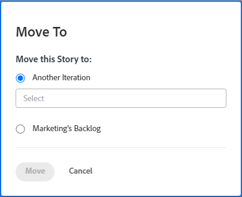

# Spostare una storia Agile

Puoi spostare una storia Agile in un’iterazione diversa (per i team Scrum) o nel backlog (per i team Kanban e Scrum).

## Requisiti di accesso

+++ Espandi per visualizzare i requisiti di accesso per la funzionalità descritta in questo articolo.

<table style="table-layout:auto"> 
 <col> 
 </col> 
 <col> 
 </col> 
 <tbody> 
  <tr> 
   <td role="rowheader">Pacchetto Adobe Workfront</td> 
   <td> 
Qualsiasi
 </td> 
  </tr> 
  <tr> 
   <td role="rowheader">Licenza di Adobe Workfront</td> 
   <td> 
Standard
 
   
Work o successiva
 </td> 
  </tr>
  <tr> 
   <td role="rowheader">Autorizzazioni sugli oggetti</td> 
   <td>Gestire l’accesso alla storia</td> 
  </tr> 
 </tbody> 
</table>

Per informazioni, consulta [Requisiti di accesso nella documentazione di Workfront](/help/quicksilver/administration-and-setup/add-users/access-levels-and-object-permissions/access-level-requirements-in-documentation.md).

+++

## Spostare una storia da un&#39;iterazione o bacheca Kanban al backlog

1. Passare all&#39;iterazione o bacheca Kanban contenente il brano da spostare nel backlog.
1. Fai clic sull’intestazione dell’iterazione nella parte superiore della pagina.
1. Nella scheda **[!UICONTROL Storie]**, seleziona le storie che desideri spostare.
1. Fai clic su **[!UICONTROL Altro]** > **[!UICONTROL Sposta in]**. Viene visualizzata la finestra di dialogo **[!UICONTROL Sposta in]**.

   

1. Seleziona il backlog di **team_name**. Nell&#39;esempio precedente, il nome del team è **Marketing**.

1. Fare clic su **[!UICONTROL Sposta]**.

## Spostare una storia in un&#39;iterazione diversa

Se siete un amministratore di sistema o un membro del team a cui è associata l&#39;iterazione, potete spostare una storia in un&#39;iterazione diversa per il team Scrum.

>[!NOTE]
>
> L&#39;opzione **[!UICONTROL Sposta in]** non è disponibile per i brani principali in un&#39;iterazione. È possibile spostare solo le sottoattività in un&#39;altra iterazione.

1. Passare all&#39;iterazione contenente il brano che si desidera spostare.
1. Fai clic sull’intestazione dell’iterazione nella parte superiore della pagina.
1. Nella scheda **[!UICONTROL Storie]**, seleziona le storie che desideri spostare.
1. Fai clic su **[!UICONTROL Altro]** > **[!UICONTROL Sposta in]**. Viene visualizzata la finestra di dialogo **[!UICONTROL Sposta in]**.

   

1. Selezionare **[!UICONTROL Un&#39;altra iterazione]**.
1. Nel menu a discesa visualizzato, selezionate l&#39;iterazione in cui desiderate spostare il brano.

   >[!NOTE]
   >
   >L&#39;elemento di lavoro [!UICONTROL Data inizio pianificata] e [!UICONTROL Data completamento pianificata] è interessato da un&#39;impostazione nella pagina [!UICONTROL Modifica team]. Per informazioni, vedere la sezione [[!UICONTROL Configurare] come vengono applicate le date quando si aggiungono elementi di lavoro a un&#39;iterazione](../../agile/get-started-with-agile-in-workfront/configure-scrum.md#configure-how-dates-are-applied-when-adding-work-items-to-an-iteration) nell&#39;articolo [Configurare Scrum](../../agile/get-started-with-agile-in-workfront/configure-scrum.md).

1. Fare clic su **[!UICONTROL Sposta]**.
