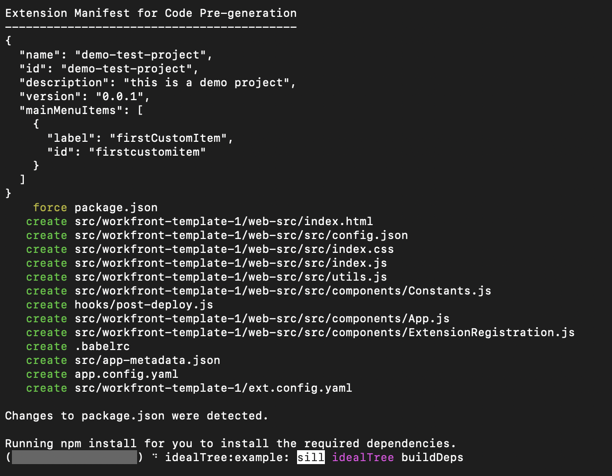

# Creare applicazioni personalizzate per Workfront con Adobe App Builder

Le estensioni dell’interfaccia utente di Workfront, basate su Adobe App Builder, consentono a clienti e partner di creare esperienze utente personalizzate. Questi strumenti migliorano l’efficienza, forniscono esperienze integrate e connesse, migliorano in modo significativo la soddisfazione degli utenti e aiutano le aziende a realizzare la loro visione unica.

Ad esempio, senza le estensioni dell’interfaccia utente di Workfront, un project manager potrebbe dover passare da Workfront a un sistema di tracciamento del tempo separato per registrare le ore. Con le estensioni dell’interfaccia utente, il tracciamento del tempo può essere integrato direttamente nell’esperienza Workfront, semplificando il flusso di lavoro e risparmiando tempo. Inoltre, puoi aggiungere componenti personalizzati per migliorare l’usabilità, automatizzare attività ripetitive e migliorare la gestione dei contenuti con funzioni quali l’assegnazione di tag dei metadati e le anteprime dei contenuti. Adobe App Builder offre anche scalabilità e gestione affidabile delle identità (IMS), garantendo una personalizzazione sicura ed efficiente su qualsiasi scala.

Le estensioni dell’interfaccia utente di Workfront offrono diversi vantaggi chiave:

* Personalizzazione precisa: le interfacce software standard spesso non soddisfano tutti i requisiti aziendali. Le estensioni dell’interfaccia utente consentono agli sviluppatori di modificare ed estendere l’interfaccia utente predefinita per soddisfare esigenze aziendali specifiche.
* Integrazione del sistema: le estensioni dell’interfaccia utente facilitano l’integrazione di altri sistemi garantendo flussi di lavoro fluidi e la coerenza dei dati.
* Scalabilità: con la crescita delle aziende, è possibile sviluppare estensioni dell’interfaccia utente per aggiungere nuove funzionalità senza la necessità di una revisione completa del sistema.
* Riduzione dei tempi di sviluppo: i punti di estensione e gli strumenti predefiniti riducono notevolmente il tempo e l’impegno necessari per implementare funzioni personalizzate.
* Migliore adozione da parte dell&#39;utente: un&#39;esperienza utente ottimizzata può favorire in modo significativo l&#39;adozione di software. Gli elementi personalizzati dell’interfaccia utente progettati per corrispondere alle preferenze dell’utente possono migliorare i tassi di adozione e la soddisfazione complessiva.
* Sfruttando le estensioni dell’interfaccia utente di Workfront, le aziende possono creare esperienze utente personalizzate che aumentano l’efficienza, l’integrazione e la soddisfazione degli utenti.

Dopo aver creato un’applicazione in Adobe App Builder, un amministratore di Workfront può aggiungerla al menu principale e al pannello di navigazione a sinistra di Workfront utilizzando i modelli di layout. Un utente con il modello di layout che fa clic sull’applicazione vedrà l’applicazione incorporata in Workfront, invece di doverla aprire separatamente.

Questo articolo descrive come accedere ad App Builder e utilizzare un modello per creare un’applicazione.

Per informazioni sull&#39;aggiunta di un&#39;applicazione personalizzata ai modelli di layout, vedere [Personalizzare il menu principale utilizzando un modello di layout](/help/quicksilver/administration-and-setup/customize-workfront/use-layout-templates/customize-main-menu.md) e [Personalizzare il pannello sinistro utilizzando un modello di layout](/help/quicksilver/administration-and-setup/customize-workfront/use-layout-templates/customize-left-panel.md).

## Prerequisiti

Devi avere i seguenti:

* Un account Workfront abilitato per IMS
* Una macchina di sviluppo con nodi v18 e npm
* Licenza App Builder

## Accedere ad Adobe App Builder

Per creare estensioni dell&#39;interfaccia utente, devi avere accesso ad Adobe App Builder in Adobe Developer Console.

Ulteriori istruzioni sono disponibili nel [sito Adobe Developer](https://developer.adobe.com/uix/docs/guides/get-access/).

### Aggiungere sviluppatori a Adobe Admin Console

>[!IMPORTANT]
>
>Accertati di aver selezionato l’organizzazione IMS corretta per tutti i passaggi seguenti. Se appartieni a più organizzazioni, puoi selezionare quella sbagliata. Assicurati di agire nell’organizzazione corretta, che in genere è elencata nell’angolo in alto a destra.

1. Passa a Produzione: https://adminconsole.adobe.com/

1. Nella sezione **Utenti**, fai clic su **Sviluppatori** > **Aggiungi sviluppatori**.

   

   >[!NOTE]
   >
   >Se non trovi un’opzione per la gestione degli sviluppatori, non disponi di un prodotto che consenta l’accesso agli sviluppatori.

1. Aggiungi l’e-mail dell’utente. Deve cercare gli utenti esistenti che sono già stati aggiunti dall’Admin Console.

1. Aggiungi i prodotti necessari al profilo sviluppatore e fai clic su **Salva**.\
   

### Accedere ad App Builder

Per acquistare App Builder, le organizzazioni devono collaborare con i rispettivi account manager.

Se AppBuilder è configurato correttamente, come parte della creazione di un nuovo progetto dovresti vedere Crea progetto da modello.

## Creare un nuovo progetto in Adobe Developer Console

Per creare l’estensione dell’interfaccia utente, devi utilizzare Adobe Developer Console.

Ulteriori istruzioni sono disponibili nel [sito Adobe Developer](https://developer.adobe.com/uix/docs/guides/creating-project-in-dev-console/).

1. Accedi a Adobe Developer Console con il tuo Adobe ID.

1. Scegli il tuo account e il tuo profilo o organizzazione.

1. Fare clic su **Crea progetto da modello** nell&#39;area Guida rapida oppure fare clic su **Crea nuovo progetto > Progetto da modello**.

   >[!IMPORTANT]
   >
   >Se non trovi l’opzione per creare un progetto da un modello, significa che in Admin Console non sei configurato correttamente e non hai accesso al catalogo di App Builder. Questa opzione è visibile solo quando si ha accesso ad AppBuilder.

   

1. Seleziona **App Builder**.

1. Immetti un **Titolo progetto** e un **Nome app**. Entrambi dispongono di valori predefiniti, ma se personalizzi il valore in un secondo momento sarà più semplice identificare il progetto desiderato.

1. Lascia selezionata **Includi runtime**.

1. Fai clic su **Salva**.

## Utilizza Adobe IO (aio) CLI

Adobe fornisce una CLI open source che puoi utilizzare per creare l’applicazione App Builder.

Ulteriori istruzioni sono disponibili su GitHub e sul sito Adobe Developer:

* https://github.com/adobe/aio-cli
* https://developer.adobe.com/app-builder/docs/getting_started/first_app/

1. Per installare lo strumento (verificare di essere al primo posto sul nodo v18) eseguire: `npm install -g @adobe/aio-cli`.
1. Avviare il terminale e accedere all&#39;AIO con il comando: `aio login`. In caso di problemi di accesso all’organizzazione IMS corretta, prova `aio login -f` per forzare un prompt di accesso. Utilizza `aio where` per vedere quale organizzazione hai effettuato l’accesso all’organizzazione IMS corretta. per ulteriori dettagli, utilizzare `aio config`.
1. Inizia a configurare l&#39;app eseguendo: `aio app init example-app` assicurati di sostituire &quot;example-app&quot; con il nome della tua app. Se non si è sicuri dei nomi di app, è possibile visualizzare un elenco di nomi di app con il comando `aio console project list`.
1. Seleziona l’organizzazione e il progetto dalle opzioni fornite.
   
   

1. Sfoglia tutti i modelli disponibili e scegli **@adobe/workfront-ui-ext-tpl** per il tuo progetto.
   
1. Seleziona e immetti il nome del progetto creato in Adobe Developer Console.
   

1. Rispondere alle richieste dell&#39;applicazione:

   * Denomina l&#39;estensione.
   * Fornisci un riepilogo descrittivo delle funzionalità dell&#39;estensione.
   * Seleziona un numero di versione iniziale con cui iniziare.
   * Il modello creerà il codice per un pulsante di navigazione principale se viene selezionato &quot;Aggiungi un pulsante personalizzato alla voce del menu principale&quot; quando viene richiesto &quot;Come procedere?&quot;.

   

1. Conferma il completamento selezionando Ho finito. È in corso la generazione del codice dal modello.
   
1. Attendi che venga visualizzato un messaggio indicante che l’inizializzazione dell’app è terminata. È quindi possibile aprire il progetto in un IDE (si consiglia Visual Studio Code) e accedere alla cartella src.

   Per ulteriori informazioni sulle cartelle e i file del progetto, visitare il [sito per sviluppatori Adobe](https://developer.adobe.com/app-builder/docs/getting_started/first_app/#5-anatomy-of-an-appbuilder-application).

## Creare le estensioni in VSCode

La configurazione del file App.js è necessaria per abilitare la navigazione tramite il menu principale di Workfront o la navigazione secondaria (pannello a sinistra).

Per visualizzare le estensioni nei modelli di layout di Workfront è necessaria la configurazione del file ExtensionRegistration.js.

Gli esempi seguenti mostrano come aggiungere applicazioni personalizzate al menu principale di Workfront e al pannello sinistro di un oggetto, utilizzando le estensioni dell’interfaccia utente.

### Configurare ExtensionRegistration.js

Per consentire applicazioni personalizzate nel menu principale di Workfront:

1. Vai a ExtensionRegistration.js.

Nella funzione ExtensionRegistration dovrebbe essere visualizzato il seguente codice. Questo codice è stato creato automaticamente dal modello. Questo codice può essere aggiunto per creare altre voci di menu. Assicurati di sostituire ID e URL.

    &quot;
    mainMenu: &lbrace;
    
    getItems() &lbrace;
    
    return &lbrack;
    
    &lbrace;
    
    id: &#39;main-menu-label&#39;,
    
    url: &#39;/index.html#/main-menu-label&#39;,
    
    label: &#39;Main-menu-label&#39;,
    
    icon: icon1,
    
    &rbrace;,
    
    &rbrack;;
    
    &rbrace;,
    
    &rbrace;
    &quot;

1. Aggiungi il seguente frammento di codice:
   
Questo esempio mostra una voce del menu principale. È necessario aggiornare ID, etichetta, icona e URL ai nomi corretti per l&#39;applicazione. Quando aggiungi più elementi, accertati che l’ID sia univoco.

1. Salvare i dati.

### Consenti applicazioni personalizzate nel pannello di navigazione a sinistra di Workfront

Per consentire l’utilizzo di applicazioni personalizzate nel pannello di navigazione a sinistra di Workfront:

1. Vai a ExtensionRegistration.js.
1. Nella funzione ExtensionRegistration, aggiungi il seguente snippet di codice:

   ```
   secondaryNav: {  
   
   TASK: {  
   
       getItems() {       return [         {           id: "TASK", 
   
   label: "My TASK",           icon: metricsIcon,           url: "/myTask",  
   
           },  
   
       ];  
   
       },  
   
   },  
   
   },  
   ```

   

   * Questo esempio mostra un elemento del pannello di navigazione sinistro denominato My Task. È necessario aggiornare ID, etichetta, icona e URL ai nomi corretti per l&#39;applicazione.

   * In questo esempio viene visualizzato un elemento del pannello di navigazione sinistro per il tipo di oggetto Project. È necessario creare questi elementi separatamente per ogni oggetto in cui sono supportati in Workfront. Sono disponibili i seguenti oggetti: progetto, attività, problema, portfolio e programma.

1. Salvare i dati.

### Configurare App.js

1. Passa a App.js.

1. Nel modello viene visualizzata un&#39;opzione del menu principale. Una route definisce la mappatura tra i percorsi URL e i componenti sottoposti a rendering per tali percorsi. Per aggiungere una route, utilizza il seguente frammento di codice, assicurati di sostituire il percorso e l&#39;elemento esatti con il tuo.

   ```
       <Route 
   
               exact path="custom-application" 
   
               element={<Customapplication />} 
   
           /> 
   ```

   
1. Salvare i dati.

Per ulteriori informazioni sullo sviluppo e l&#39;esecuzione dell&#39;applicazione, visitare il [sito per sviluppatori Adobe](https://developer.adobe.com/app-builder/docs/getting_started/first_app/#6developing-the-application).

## Contesto condiviso

Il contesto condiviso viene utilizzato per condividere i dati da Workfront a un’estensione dell’interfaccia utente. I dati disponibili nel contesto condiviso includono i dati utente e il contesto dell&#39;applicazione.


### Utente

Le estensioni dell’interfaccia utente di Workfront condividono i dati degli utenti. L’oggetto utente disponibile tramite il contesto condiviso include un ID utente Workfront e l’indirizzo e-mail dell’utente.

`user = (conn?.sharedContext?.get("user")); // {ID: '1', email: 'test@aaa.com'} userID = user.ID userEmail = user.email `

### Contesto dell’applicazione

Quando si aggiunge un’applicazione personalizzata utilizzando un punto di estensione Navigazione secondaria, in genere l’applicazione personalizzata utilizza dati contestuali come un ID progetto o un ID documento. Per questi dati, il contesto condiviso include un codice oggetto e un ID oggetto.

Esempio per ottenere il contesto dell&#39;applicazione per i documenti:

`context = conn?.sharedContext; // Using the connection created above, grab the document details from the host tunnel. // conn?.host?.document?.getDocumentDetails().then(setDocDetails); `

## Testare l’app in Workfront

Durante lo sviluppo dell’applicazione App Builder per Workfront, potrebbe essere necessario testare l’app all’interno di Workfront senza pubblicarla.

Nell&#39;app App Builder puoi avviare `aio app run` per lo sviluppo locale. Questo ti fornirà un URL, in genere qualcosa come `https://localhost:9080`. In alternativa, è possibile eseguire `aio app deploy` per ottenere un dominio Adobe statico. Assicurati di prendere nota di questi URL per utilizzi futuri.

Quindi, passa alla pagina specifica su cui desideri sviluppare nel browser. Apri gli strumenti per sviluppatori e accedi all’archiviazione locale per workfront.com o workfront.adobe.com. In questo caso, devi aggiungere una voce. Utilizza `extensionOverride` come chiave e l&#39;URL del generatore di app indicato in precedenza come valore.

Se la configurazione è stata completata correttamente, quando ricarichi la pagina del modello di layout in Workfront, verranno visualizzati i pulsanti dell’applicazione App Builder. Aggiungi i pulsanti dell’app al menu principale e al pannello sinistro per un oggetto e verifica che vengano visualizzati correttamente in tali aree.

Ulteriori istruzioni sono disponibili sul sito per sviluppatori di Adobe, utilizzando un esempio da AEM: https://developer.adobe.com/uix/docs/guides/preview-extension-locally/

## Pubblicare le applicazioni e approvare l’invio

Per pubblicare l&#39;applicazione e approvarla, seguire le istruzioni del [sito per sviluppatori Adobe](https://developer.adobe.com/uix/docs/guides/publication/).
