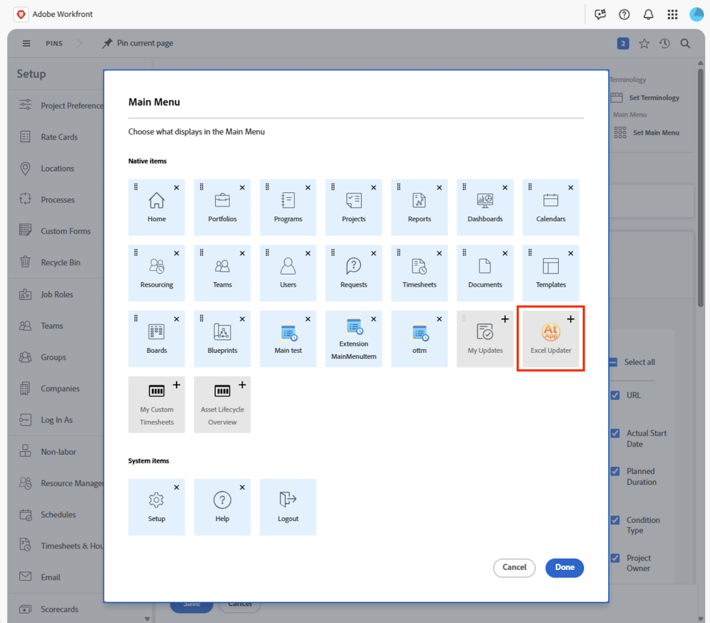

# Acquisire e installare app da Adobe Exchange

Ora puoi installare app create dai partner per Workfront direttamente da Adobe Exchange. Questa funzionalità collega i clienti a un ecosistema in crescita di partner Adobe che forniscono strumenti appositamente progettati per migliorare la produttività, semplificare le operazioni ed estendere le funzionalità di Workfront. Tramite Adobe Exchange, i clienti possono scoprire e installare app che si integrano perfettamente in Workfront tramite le estensioni dell’interfaccia utente.

Adobe Exchange è il marketplace centrale per applicazioni, estensioni e integrazioni di terze parti in Adobe Experience Cloud, incluso Adobe Workfront. Per i clienti Workfront, è la destinazione ideale per scoprire e installare app che migliorano le funzionalità, semplificano i flussi di lavoro e si integrano con sistemi esterni.

## App partner di Adobe

Workfront Partner Network è un ecosistema in crescita di partner tecnologici, fornitori di software indipendenti (ISV, Independent Software Vendor) che creano app scalabili, sicure ed estensibili utilizzando le estensioni dell’interfaccia utente di Adobe App Builder e Workfront.

I partner Workfront sfruttano le estensioni dell’interfaccia utente di Workfront, un potente framework che consente di incorporare le app direttamente nell’interfaccia di Workfront. Una volta installate da Adobe Exchange, gli amministratori di Workfront possono aggiungere queste app ai modelli di layout, rendendole visibili e accessibili agli utenti all’interno dei loro flussi di lavoro giornalieri. Questa integrazione perfetta garantisce che gli utenti possano interagire con gli strumenti creati dai partner, come dashboard, flussi di approvazione o tracciatori di campagne, senza uscire dall’ambiente Workfront.

### AtApp

#### Risultati in tempo reale, direttamente in Adobe Workfront

Collaboriamo con i clienti Adobe Workfront per trasformare i colli di bottiglia quotidiani in soluzioni ripetibili con risultati prevedibili. La nostra libreria di soluzioni in continua crescita consente di aumentare l&#39;accuratezza, la velocità e la responsabilità utilizzando i dati live direttamente da dove lavorano le persone. Potete aiutare i leader a vedere cosa sta succedendo ora e a pianificare cosa accadrà dopo. Esplora le app Adobe Exchange di atAppStore attualmente disponibili e pronte per l’installazione, quindi scegli quelle che corrispondono alle tue priorità correnti, per poi adattarle in base alle tue esigenze.

* [Excel Updater](https://exchange.adobe.com/apps/ec/abtt1rq7o9/atapp-excel-updater): la soluzione Excel Updater offre un percorso conveniente per integrare i dati in Workfront senza dover imparare l&#39;API, scrivere il codice o configurare un server ed è ideale sia per il caricamento di dati occasionali che ricorrenti.

* [Helper per ricalcolo](https://exchange.adobe.com/apps/ec/abv755903t/atapp-recalc-helper): la soluzione Helper per ricalcolo consente di ricalcolare facilmente le espressioni calcolate del modulo personalizzato, le tempistiche del progetto o i dati finanziari del progetto per tutti gli elementi che corrispondono a un filtro selezionato, direttamente da Workfront.

* UberTimesheet: la soluzione UberTimesheet può migliorare ed espandere l&#39;adozione da parte degli utenti di Workfront rendendo semplice e conveniente per tutti tenere traccia del tempo dal proprio browser, tablet, o smartphone, dopo il fatto.

### Workfocus

Workfocus offre soluzioni avanzate di automazione e integrazione per Workfront. Le loro app si concentrano su:

* Semplificazione delle timeline

* Automazione dei flussi di lavoro di Fusion

* Abilitazione della collaborazione tra istanze

Le app Workfocus sono progettate per funzionare in modalità nativa all’interno di Workfront, sfruttando le estensioni dell’interfaccia utente per fornire agli utenti strumenti potenti che migliorano la produttività e riducono lo sforzo manuale.

## Prerequisiti e autorizzazioni

**Provisioning di App Builder**

* I clienti devono aver effettuato il provisioning di App Builder nel proprio Adobe Admin Console. Questo è un prerequisito per l’installazione di app da Adobe Exchange.

**Amministratori o sviluppatori organizzazione Enterprise**

* È possibile cercare le app, fare clic su **Ottieni** e procedere con l&#39;installazione.

* Se l&#39;app è già stata acquisita da un utente dell&#39;organizzazione, potrebbe visualizzare **Inizia installazione** o **Gestisci**.

**Utenti non amministratori**

* Può avviare l’acquisizione, ma verrà richiesto di effettuare l’accesso e potrebbe incontrare restrizioni se l’app richiede il consenso dell’amministratore o licenze speciali.

## Acquisire e installare app da Adobe Exchange

I clienti di Adobe possono sfogliare, cercare e installare app direttamente dal Marketplace Adobe Exchange per utilizzarle all’interno di Workfront.

Le app create con Adobe App Builder sono elencate come _applicazioni App Builder_ in Adobe Exchange. Ogni inserzione di app include documentazione, schermate e istruzioni di utilizzo per aiutare i clienti a comprendere il valore dell’app.

Per visualizzare le app per Workfront, passa ad Adobe Exchange e cerca quelle compatibili con Workfront. Puoi anche filtrare le inserzioni per le app Workfront App Builder:

1. Fai clic su **Experience Cloud** nel pannello a sinistra.
1. Nel pannello a sinistra, individua **Prodotto**, quindi seleziona **Workfront**.
1. Espandi **Tipo app**, quindi scegli **App Builder**.

### Acquisire app

Le app possono richiedere l’acquisto da Adobe Exchange o consentire l’installazione, ma richiedono una licenza da parte dello sviluppatore dell’app.

Per acquisire un’app

1. Fai clic sul nome dell’app.
1. Fai clic sul pulsante che si trova nell’angolo in alto a destra dell’inserzione di app.
1. Fare clic su **Sì, continuare** e quindi accettare il contratto di licenza con l&#39;utente finale.
   

### Azioni per gli amministratori di sistema

Quando un utente acquisisce un&#39;app da Adobe Exchange, potrebbe visualizzare il seguente messaggio: _L&#39;amministratore di sistema deve approvare l&#39;acquisizione prima di installare e utilizzare l&#39;applicazione._

Questo significa che l’app richiede l’approvazione a livello di amministratore prima di poter procedere con l’installazione. Gli amministratori di sistema possono trovare la richiesta dalle seguenti aree:

**Notifiche**

In genere, gli amministratori di sistema ricevono una notifica tramite e-mail quando un utente dell’organizzazione acquisisce un’app.

**Admin Console**

Gli amministratori di sistema possono accedere ad Admin Console all&#39;indirizzo [https://adminconsole.adobe.com/](https://adminconsole.adobe.com/) e passare a Prodotti > Integrazioni app per visualizzare tutte le app acquisite o richieste.

Quando un amministratore di sistema ha accesso alle richieste, può rivedere e approvare l’applicazione. Alcune app possono richiedere all’amministratore di consentire l’accesso ai dati e di assegnarle a profili di prodotto o a utenti specifici.

Una volta approvata, l’app diventa disponibile per l’installazione.

## Installare le app

Una volta acquisita, un’app può essere installata direttamente in Workfront. Gli amministratori possono gestire le app installate tramite l’interfaccia di Workfront, garantendo che siano configurate correttamente e accessibili agli utenti.

1. Trova l’app da installare e apri il menu Azioni sul lato destro dello schermo.
1. Fai clic su Visualizza dettagli app.
1. Seleziona un ambiente sul lato sinistro della schermata o aggiungine uno nuovo.
1. Fare clic su **Distribuisci**.
   
1. Assegna i diritti di installazione o utilizzo (se necessario).

   Se l’organizzazione controlla l’accesso all’app tramite profili di prodotto o gruppi di utenti, assegna l’app al profilo o al gruppo appropriato in modo che gli utenti possano procedere con l’installazione e l’utilizzo.

## Aggiungi al modello di layout

Una volta implementata, l’app partner sarà disponibile nel modello di layout di Workfront. Puoi aggiungere l’app alla navigazione primaria o secondaria da utilizzare in Workfront.

Per aggiungere l’app al modello di layout, apri il modello e passa all’area Menu principale o Menu secondario. Aggiungi l’app utilizzando l’icona Aggiungi.

## Contatta il supporto dell’app

Le estensioni installate da Adobe Exchange sono supportate dai proprietari dell’app. Da Gestione app, puoi fare clic su **Richiedi assistenza** per ottenere assistenza su eventuali problemi.