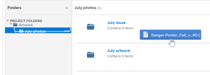

# Collegamento di documenti da applicazioni esterne

Puoi collegare documenti e cartelle ad Adobe Workfront dalle seguenti sorgenti:

<table style="table-layout:auto"> 
 <col> 
 <col> 
 <tbody> 
  <tr> 
   <td role="rowheader">Provider di documenti cloud di terze parti esistenti</td> 
   <td>Questi includono: 
    <ul> 
     <li>Box</li> 
     <li>Dropbox</li> 
     <li>Dropbox</li> 
     <li>WebDAM</li> 
     <li>Microsoft OneDrive</li> 
     <li>Microsoft SharePoint</li> 
     <li>Google Drive</li> 
    </ul></td> 
  </tr> 
  <tr> 
   <td role="rowheader">Bozza Workfront </td> 
   <td>Puoi rendere disponibili in Workfront le bozze originariamente create all’interno di Workfront Proof. Per utilizzare questa funzione è necessario un piano Workfront Pro o superiore. Per ulteriori informazioni sui vari piani disponibili, vedi <a href="https://www.workfront.com/plans">Piani Workfront</a>.</td> 
  </tr> 
  <tr data-mc-conditions="QuicksilverOrClassic.Quicksilver"> 
   <td role="rowheader">Nozioni di base su Experience Manager Assets </td> 
   <td>È possibile collegare i documenti a Workfront da Experience Manager Assets Essentials. Per ulteriori informazioni, consulta <a href="../../documents/adobe-workfront-for-experience-manager-assets-essentials/workfront-for-aem-asset-essentials.md" class="MCXref xref"> Adobe Workfront per Experience Manager Assets Essentials</a>.</td> 
  </tr> 
  <tr> 
   <td role="rowheader">Workfront DAM </td> 
   <td>Questo richiede un acquisto aggiuntivo. </td> 
  </tr> 
  <tr> 
   <td role="rowheader">Altri provider di documenti (tramite integrazioni personalizzate di documenti)</td> 
   <td> 
Per utilizzare questa funzione è necessario un piano Workfront Pro o superiore. Per ulteriori informazioni sui vari piani disponibili, vedi <a href="https://www.workfront.com/plans">Piani Workfront</a>.
 </td> 
  </tr> 
 </tbody> 
</table>

Prima di collegare documenti o cartelle, l&#39;amministratore Workfront deve abilitare questa funzionalità per ogni provider di documenti o per un&#39;integrazione di documenti personalizzata, come descritto in [Configurare le integrazioni di documenti](../../administration-and-setup/configure-integrations/configure-document-integrations.md).

Puoi verificare e approvare i documenti collegati a un provider cloud esterno nello stesso modo in cui lo fai con i documenti caricati direttamente in Workfront. 

## Requisiti di accesso

Devi disporre dei seguenti elementi:

<table style="table-layout:auto"> 
 <col> 
 <col> 
 <tbody> 
  <tr> 
   <td role="rowheader">piano Adobe Workfront*</td> 
   <td> 
 Qualsiasi
 </td> 
  </tr> 
  <tr> 
   <td role="rowheader">Licenze Adobe Workfront*</td> 
   <td> 
Richiesta o superiore
 </td> 
  </tr> 
  <tr> 
   <td role="rowheader">Configurazioni a livello di accesso*</td> 
   <td> 
Modifica accesso ai documenti
 
Nota: Se non disponi ancora dell’accesso, chiedi all’amministratore Workfront se ha impostato ulteriori restrizioni nel livello di accesso. Per informazioni su come un amministratore Workfront può modificare il livello di accesso, consulta <a href="../../administration-and-setup/add-users/configure-and-grant-access/create-modify-access-levels.md" class="MCXref xref">Creare o modificare livelli di accesso personalizzati</a>.
 </td> 
  </tr> 
 </tbody> 
</table>

&#42;Per informazioni sul piano, il tipo di licenza o l&#39;accesso, contattare l&#39;amministratore Workfront.

## Archiviazione dei documenti

I documenti collegati a Workfront da un&#39;applicazione esterna vengono memorizzati con il provider cloud esterno, non all&#39;interno di Workfront.

Si applicano le seguenti eccezioni:

* Se fornito dal servizio documenti, le miniature e le immagini di anteprima possono essere memorizzate sui server Workfront.
* Quando si utilizza la correzione in Workfront, il documento viene copiato e aggiunto ai server di correzione. 

## Collegamento di un documento da un’applicazione esterna a Workfront

Puoi collegare documenti esistenti a un provider cloud esterno. Ciò include tutti i documenti condivisi.

* [Prerequisiti](#prerequisites)
* [Collegamento di un documento esterno a Workfront](#link-an-external-document-to-workfront)
* [Aggiungere una nuova versione di un documento collegato](#add-a-new-version-of-a-linked-document)
* [Collegamento di documenti di prova Workfront](#link-workfront-proof-documents)
* [Creare un documento Google da Workfront](#create-a-google-document-from-within-workfront)

### Prerequisiti {#prerequisites}

Prima di collegare documenti o cartelle, l&#39;amministratore Workfront deve abilitare questa funzionalità per ogni provider di documenti o per un&#39;integrazione di documenti personalizzata, come descritto in [Configurare le integrazioni di documenti](../../administration-and-setup/configure-integrations/configure-document-integrations.md).

### Collegamento di un documento esterno a Workfront {#link-an-external-document-to-workfront}

È possibile collegare documenti a Workfront da un&#39;applicazione esterna come Google e Microsoft OneDrive.

>[!IMPORTANT]
>
>Dropbox memorizza i documenti in base al percorso del file. Per questo motivo, se un file collegato a un Dropbox viene spostato, rinominato o eliminato, diventa inaccessibile in Workfront.

1. Vai a **Documenti** in Workfront in cui si desidera inserire il documento.
1. Fai clic su **Aggiungi nuovo**, quindi fare clic sul provider di documenti esterno in cui si desidera collegare i documenti a Workfront.

   Ad esempio, per collegare documenti dal Dropbox, fai clic su **Da Dropbox**.

   I provider esterni già autorizzati vengono visualizzati in cima all’elenco.

1. (Condizionale) Se viene richiesto di accedere al servizio esterno, digitare le credenziali di accesso per il servizio nella casella visualizzata, quindi fare clic su **Accedere**.
1. (Condizionale) Se viene richiesto di autorizzare l’applicazione esterna, fai clic sul pulsante **Autorizzare** pulsante .

   Devi fare questo solo una volta.

1. Nella casella di ricerca del **Collega file e cartelle esterni** digitare il nome dell&#39;elemento che si desidera cercare, quindi premere **Invio** per visualizzare tutti i risultati dell’applicazione esterna, indipendentemente dalla cartella in cui sono memorizzati.

   Oppure

   Individua e seleziona i documenti da collegare.

   Sebbene sia possibile selezionare più documenti, solo i documenti selezionati nella visualizzazione corrente sono collegati. Ad esempio, se si seleziona un documento e quindi si passa a una cartella, il documento selezionato originariamente non è collegato.

1. (Condizionale) Se sei un cliente Workfront DAM, fai clic sul pulsante **Miniatura** per visualizzare i file come immagini in miniatura.

   >[!NOTE]
   I clienti Workfront DAM possono visualizzare le miniature quando si collegano documenti da Workfront DAM. Le miniature possono essere visualizzate anche per i clienti Workfront DAM per altri servizi come Dropbox e Box. Tuttavia, la visualizzazione delle miniature per servizi diversi da Workfront DAM in Workfront non è supportata e le miniature non vengono mai visualizzate quando si collegano documenti da SharePoint o Google Drive.

1. Fai clic su **Collegamento**.

   In Workfront, accanto ai documenti viene visualizzata l’icona del provider cloud .

   >[!NOTE]
   Per i documenti collegati a Box, il collegamento al documento in Box non viene visualizzato finché non si aggiorna la pagina.

### Aggiungere una nuova versione di un documento collegato {#add-a-new-version-of-a-linked-document}

È possibile aggiungere una nuova versione di un documento collegato a Workfront da un’applicazione esterna.

1. Vai a **Documenti** area in cui il documento è collegato, quindi selezionare il documento collegato.

   >[!IMPORTANT]
   Per creare una nuova versione, il documento deve trovarsi all’esterno di una cartella collegata.

1. Fai clic su **Aggiungi nuovo** > **Versione**, quindi fare clic sul provider di documenti esterno.

   Ad esempio, per collegare dal Dropbox una nuova versione di un documento, fare clic su **Da Dropbox**.

   I provider esterni già autorizzati vengono visualizzati in cima all’elenco.

1. (Condizionale) Se viene richiesto di accedere al servizio esterno, digitare le credenziali di accesso per il servizio nella casella visualizzata, quindi fare clic su **Accedere**.
1. (Condizionale) Se viene richiesto di autorizzare l’applicazione esterna, fai clic su **Autorizzare**.

   Devi fare questo solo una volta.

1. Nella casella di ricerca del **Collega file e cartelle esterni** digitare il nome dell&#39;elemento che si desidera cercare, quindi premere **Invio** per visualizzare tutti i risultati dell’applicazione esterna, indipendentemente dalla cartella in cui sono memorizzati.

   Oppure

   Individua e seleziona i documenti da collegare.

   È possibile selezionare più documenti; tuttavia, solo i documenti selezionati nella visualizzazione corrente sono collegati. Ad esempio, se si seleziona un documento e quindi si passa a una cartella, il documento selezionato originariamente non è collegato.

1. (Condizionale) Se sei un cliente Workfront DAM, fai clic sul pulsante **Miniatura** per visualizzare i file come immagini in miniatura.

   >[!NOTE]
   I clienti Workfront DAM possono visualizzare le miniature quando si collegano documenti da Workfront DAM. Le miniature possono essere visualizzate anche per i clienti Workfront DAM per altri servizi come Dropbox e Box. Tuttavia, la visualizzazione delle miniature per servizi diversi da Workfront DAM in Workfront non è supportata e le miniature non vengono mai visualizzate quando si collegano documenti da SharePoint o Google Drive.

1. Fai clic su **Collegamento**.

   In Workfront, accanto ai documenti viene visualizzata l’icona del provider cloud, che indica che sono collegati al provider cloud esterno.

   >[!NOTE]
   Per i documenti collegati a Box, il collegamento al documento in Box non viene visualizzato finché non si aggiorna la pagina.

Per informazioni sull&#39;aggiunta di una nuova versione di un documento caricato in Workfront dal file system, vedere [Aggiungere documenti ad Adobe Workfront dal file system](../../documents/adding-documents-to-workfront/add-documents-from-file-system.md#adding-new-versions-of-documents) in [Aggiungere documenti ad Adobe Workfront dal file system](../../documents/adding-documents-to-workfront/add-documents-from-file-system.md).

### Collegamento di documenti di prova Workfront {#link-workfront-proof-documents}

Puoi collegare le bozze a Workfront che esistevano originariamente in Workfront Proof. Quando colleghi una bozza da Workfront Proof, tutti i commenti e gli altri metadati associati alla bozza sono disponibili in Workfront. 

Puoi collegare solo le bozze per le quali hai accesso a Visualizza in Workfront Proof.

1. Vai a **Documenti** in Workfront in cui si desidera inserire il documento.
1. Fai clic su **Aggiungi nuovo**, quindi fai clic su **Da prova Workfront**.

   >[!NOTE]
   Le opzioni di questo menu possono variare a seconda dei provider di terze parti configurati nel tuo ambiente.

1. In **Collegamento** bozze **da** Casella di prova Workfront visualizzata, inizia a digitare il nome della bozza che desideri rendere disponibile in Workfront.

   L’elenco viene filtrato durante la digitazione.

1. Seleziona fino a 10 bozze da collegare.

   Qualsiasi nome di bozza oscurato non è disponibile per il collegamento, perché la bozza è già associata a un documento in Workfront.

1. Fai clic su **Collegamento**.

   La versione più recente della bozza è collegata ad Workfront. Quando apri la bozza, nel visualizzatore di correzione sono disponibili tutte le versioni.

### Creare un documento Google da Workfront {#create-a-google-document-from-within-workfront}

È possibile creare un nuovo documento Google da Workfront. Non è possibile creare nuovi documenti da Workfront per altri provider cloud.

1. Vai a **Documenti** in Workfront in cui si desidera inserire il documento.
1. Fai clic su **Aggiungi nuovo** > **File Google**, quindi selezionare il tipo di documento Google che si desidera creare.

1. Selezionare il tipo di documento Google che si desidera creare.
1. Se la **Aggiungi account drive Google** viene visualizzata la casella, fai clic su **Autorizza unità Googe**.

   Un documento Google viene aggiunto al **Documenti** scheda .

   >[!NOTE]
    La mia unità e condivisa con me mostrano due risultati diversi. Se non riesci a individuare un file nella mia unità, archivialo nella cartella Condiviso con me.

## Aggiornare e collegare un documento da Workfront a un provider cloud esterno

Puoi caricare e collegare un documento da Workfront a un provider cloud esterno. In questo modo l’archiviazione del documento viene spostata da Workfront al provider cloud esterno. Quando il documento viene modificato nell&#39;applicazione esterna, viene aggiornato automaticamente in Workfront.

Gli utenti senza accesso Workfront possono visualizzare il documento nell’applicazione esterna se hanno accesso all’applicazione.

1. Seleziona un documento caricato in Workfront.
1. Fai clic su **Altro** >**Invia a**, quindi selezionare il provider cloud che si desidera memorizzare il documento collegato.

   È inoltre possibile utilizzare il menu Altro  nella pagina Dettagli documento per eseguire questa operazione.

1. Selezionare la cartella nell&#39;applicazione del provider in cui si desidera memorizzare il documento.

   Può essere una qualsiasi cartella nell&#39;applicazione del provider, inclusa una cartella condivisa.

1. Fai clic su **Salva**.

   Il logo del provider esterno viene visualizzato accanto al nome del documento per indicare che il documento è ora collegato a Workfront e archiviato dal provider cloud esterno.

   

## Collega cartelle

Quando colleghi una cartella tra Workfront e un provider cloud esterno, la cartella e tutto il relativo contenuto sono collegati. Se gli utenti senza accesso Workfront aggiungono, rimuovono e modificano file dall’applicazione documento esterna, le loro modifiche vengono sincronizzate con Workfront. Le sezioni seguenti descrivono come collegare cartelle e sottocartelle:

* [Diritti di accesso alle cartelle](#folder-access-rights)
* [Collegamento di una o più cartelle esterne](#link-one-or-more-external-folders)
* [Aggiungere sottocartelle a una cartella collegata](#add-subfolders-to-a-linked-folder)

### Diritti di accesso alle cartelle {#folder-access-rights}

Quando si sincronizza il contenuto della cartella da un’applicazione documento esterna, Workfront utilizza le credenziali dell’utente che ha originariamente collegato la cartella. Questo determina la seguente esperienza utente:

* Se gli utenti non hanno accesso alla visualizzazione di file e cartelle nell’applicazione esterna, ma hanno accesso alla visualizzazione della cartella collegata tramite Workfront, possono visualizzare solo i nomi dei file e delle cartelle in Workfront, non il loro contenuto.
* Quando un utente accede al contenuto all’interno di una cartella collegata in Workfront (ad esempio una sottocartella in una cartella collegata) collegata ad Workfront da un altro utente, il contenuto si sincronizza con Workfront utilizzando le credenziali di accesso Workfront dell’utente che ha collegato originariamente la cartella, non le credenziali dell’utente che accede al contenuto.

>[!IMPORTANT]
* Se l’utente che ha originariamente collegato la cartella viene rimosso dal sistema Workfront, gli utenti non possono più accedere al contenuto della cartella collegata tramite Workfront. In questo caso, la cartella deve essere ricollegata da un utente Workfront attivo che dispone dei diritti per la cartella nell’applicazione esterna.
* Se l’utente che ha collegato una cartella non ha più accesso all’applicazione esterna, Workfront non può più accedere al contenuto della cartella. Questo può accadere, ad esempio, se l’utente che ha collegato originariamente la cartella lascia l’azienda. Per garantire un accesso continuo, un utente con accesso alla cartella deve ricollegare la cartella.

### Collegamento di una o più cartelle esterne {#link-one-or-more-external-folders}

1. Passa all’area in Workfront in cui desideri creare la cartella, quindi fai clic su  **Documenti**  nel pannello a sinistra .

1. Fai clic su **Aggiungi nuovo**, quindi fare clic sul provider di documenti esterno da cui si desidera collegare una cartella a Workfront.
1. (Condizionale) Se non hai ancora autorizzato il servizio esterno, specifica le credenziali di accesso per il provider esterno, quindi fai clic su **Accedere**.

   I provider esterni già autorizzati vengono visualizzati in cima all’elenco.

1. In **Collega file e cartelle esterni** nella casella visualizzata, individuare e selezionare le cartelle da collegare.

   Oppure

   Digitare il nome della cartella che si desidera cercare, quindi premere **Invio**.

   È possibile selezionare più cartelle; tuttavia, solo le cartelle selezionate nella visualizzazione corrente sono collegate. Ad esempio, se selezioni una cartella e poi vai in una cartella, la cartella selezionata originariamente non è collegata.

   >[!NOTE]
   Quando si collegano cartelle da Google Drive, è possibile collegare solo le cartelle che si trovano all&#39;interno dell&#39;unità personale (My Drive) e di Team Drive. Non è possibile collegare cartelle dall&#39;area Condiviso con me.

1. Fai clic su **Collegamento**.

   In Workfront, il logo del provider cloud viene visualizzato accanto alla cartella e indica che è collegato al provider cloud esterno.

1. (Facoltativo) Per rinominare la cartella in modo che il nome della cartella in Workfront sia diverso dal nome della cartella nell’applicazione documento esterna, selezionare la cartella nella cartella **Cartelle** fare clic sul menu Altro   visualizzato accanto al nome della cartella, quindi fare clic su **Rinomina**.

   

La cartella non viene rinominata nell&#39;applicazione esterna.

### Aggiungere sottocartelle a una cartella collegata  {#add-subfolders-to-a-linked-folder}

È possibile creare una nuova cartella all’interno di una cartella collegata esistente. Puoi anche trascinare un’altra cartella in una cartella collegata esistente.

1. Per creare una nuova cartella all’interno di una cartella collegata esistente, passa alla cartella esistente, quindi crea la nuova cartella come descritto in [Creare cartelle documenti](../../documents/organizing-documents/create-documents-folder.md).

   Oppure

   Per trascinare una cartella esistente in una cartella collegata esistente, passare all’area Documenti in cui si desidera inserire la sottocartella, quindi trascinarla nella cartella collegata.

   

   >[!NOTE]
   Quando si trascina una cartella Workfront esistente in una cartella collegata, si applicano le seguenti limitazioni:
   * La cartella da trascinare non può essere già collegata e non può contenere alcun contenuto già collegato.
   * La cartella (compreso il contenuto) che si sta trascinando non può superare i 50 MB.

## Aggiungere un documento a una cartella collegata

Quando si aggiunge un documento a una cartella collegata tramite Workfront, questo viene aggiunto automaticamente come documento collegato.

1. In **Documenti** area in cui si desidera posizionare il documento, trascinare il documento in una cartella collegata.

   <!--
   
 Selection box is wonky on the left 

   -->

   Oppure

   Selezionare la cartella collegata in cui si desidera inserire il documento, fare clic su **Aggiungi nuovo > Documento**, quindi individuare il documento e aggiungerlo alla cartella.

   Una nuova versione del documento viene creata automaticamente nell’applicazione esterna e collegata a Workfront.

## Eliminare un documento o una cartella collegati

Quando si elimina un documento o una cartella collegata dall&#39;applicazione esterna, il documento o la cartella rimane nel sistema Workfront fino a quando non viene eliminata anche da Workfront.

1. Selezionare il documento o la cartella collegati, quindi fare clic su **Elimina**.
1. Nella casella di conferma visualizzata, fai clic su **Sì, scollegalo**.

   Il documento viene scollegato dal sito Workfront. Non è interessato nell’applicazione esterna.

## Informazioni sulla ridenominazione di documenti e cartelle collegati

Quando si rinomina un documento o una cartella collegata, la modifica è visibile solo nell&#39;applicazione in cui è stata apportata. Ad esempio, se rinomini un documento collegato in Workfront, il nuovo nome è visibile solo in Workfront.

Se desideri che il nome corrisponda in Workfront e nell’applicazione esterna, devi rinominarlo in entrambe le posizioni.

>[!IMPORTANT]
Non rinominare un documento in Workfront collegato al Dropbox; in questo modo il file in Workfront diventa inaccessibile. Rinomina invece il file nel Dropbox, quindi sincronizza nuovamente il file, come descritto in [Collegamento di documenti da applicazioni esterne](#synchronizing-changes-made-on-a-linked-document).
