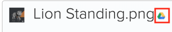

# Collegare documenti da applicazioni esterne

<!-- Audited: 01/2024 -->

Puoi collegare documenti e cartelle ad Adobe Workfront dalle seguenti origini:

<table style="table-layout:auto"> 
 <col> 
 <col> 
 <tbody> 
  <tr> 
   <td role="rowheader">Provider di documenti cloud di terze parti esistenti</td> 
   <td>Tra questi: 
    <ul> 
     <li>Box</li> 
     <li>Dropbox</li> 
     <li>Attività Dropbox</li> 
     <li>WebDAM</li> 
     <li>Microsoft OneDrive</li> 
     <li>Microsoft SharePoint</li> 
     <li>Google Drive</li> 
    </ul></td> 
  </tr> 
  <tr> 
   <td role="rowheader">Workfront Proof </td> 
   <td>In Workfront è possibile rendere disponibili le bozze create originariamente in Workfront Proof. Per utilizzare questa funzione, è necessario un piano Pro Workfront o superiore per le licenze correnti. Per le nuove licenze, tutti i piani includono questa funzione. Per ulteriori informazioni sui vari piani disponibili, vedere <a href="https://www.workfront.com/plans">Piani Workfront</a>.</td> 
  </tr> 
  <tr data-mc-conditions="QuicksilverOrClassic.Quicksilver"> 
   <td role="rowheader">Experience Manager Assets Essentials </td> 
   <td>Puoi collegare documenti a Workfront da Experience Manager Assets Essentials. Per ulteriori informazioni, vedere <a href="../../documents/adobe-workfront-for-experience-manager-assets-essentials/workfront-for-aem-asset-essentials.md" class="MCXref xref"> Adobe Workfront per Experience Manager Assets Essentials</a>.</td> 
  </tr> 
  <tr> 
   <td role="rowheader">Workfront DAM </td> 
   <td>Questo richiede un acquisto aggiuntivo. </td> 
  </tr> 
  <tr> 
   <td role="rowheader">Altri provider di documenti (tramite integrazioni di documenti personalizzate)</td> 
   <td> 
Per utilizzare questa funzione, è necessario un piano Pro Workfront o superiore per le licenze correnti. Per le nuove licenze, tutti i piani includono questa funzione. Per ulteriori informazioni sui vari piani disponibili, vedere <a href="https://www.workfront.com/plans">Piani Workfront</a>.
 </td>
  </tr> 
 </tbody> 
</table>

Prima di collegare documenti o cartelle, l&#39;amministratore di Workfront deve abilitare questa funzionalità per ogni provider di documenti o per un&#39;integrazione di documenti personalizzata, come descritto in [Configurare le integrazioni di documenti](../../administration-and-setup/configure-integrations/configure-document-integrations.md).

Puoi verificare e approvare i documenti collegati a un provider cloud esterno nello stesso modo in cui lo fai con i documenti caricati direttamente in Workfront.

## Requisiti di accesso

+++ Espandi per visualizzare i requisiti di accesso per la funzionalità in questo articolo.

Per eseguire i passaggi descritti in questo articolo, è necessario disporre dei seguenti diritti di accesso:

<table style="table-layout:auto"> 
 <col> 
 <col> 
 <tbody> 
  <tr> 
   <td role="rowheader">piano Adobe Workfront</td>
   <td> 
 Qualsiasi
 </td>
  </tr> 
  <tr> 
   <td role="rowheader">Licenza Adobe Workfront</td>
   <td>
Nuovo: Collaboratore o versione successiva

    
oppure

    
Corrente: richiesta o successiva
 </td>
  </tr> 
  <tr> 
   <td role="rowheader">Configurazioni del livello di accesso</td> 
   <td> 
Modifica accesso ai documenti
 </td> 
  </tr> 
 </tbody> 
</table>

Per ulteriori dettagli sulle informazioni contenute in questa tabella, vedere [Requisiti di accesso nella documentazione di Workfront](/help/quicksilver/administration-and-setup/add-users/access-levels-and-object-permissions/access-level-requirements-in-documentation.md).

+++

## Archiviazione documenti

I documenti collegati a Workfront da un’applicazione esterna vengono memorizzati con il provider cloud esterno, non all’interno di Workfront.

Si applicano le seguenti eccezioni:

* Se fornite dal servizio Document, le miniature e le immagini di anteprima potrebbero essere memorizzate sui server Workfront.
* Quando si utilizza la verifica in Workfront, il documento viene copiato e aggiunto ai server di verifica.

## Collegare un documento da un’applicazione esterna a Workfront

Puoi collegare documenti esistenti con un provider cloud esterno. Ciò include tutti i documenti condivisi.

### Prerequisiti {#prerequisites}

Prima di collegare documenti o cartelle, l&#39;amministratore di Workfront deve abilitare questa funzionalità per ogni provider di documenti o per un&#39;integrazione di documenti personalizzata, come descritto in [Configurare le integrazioni di documenti](../../administration-and-setup/configure-integrations/configure-document-integrations.md).

### Collegare un documento esterno a Workfront {#link-an-external-document-to-workfront}

È possibile collegare documenti a Workfront da un&#39;applicazione esterna come Google e Microsoft OneDrive.

>[!IMPORTANT]
>
>Il Dropbox memorizza i documenti in base al percorso del file. Per questo motivo, se un file collegato dal Dropbox viene spostato, rinominato o eliminato, diventa inaccessibile in Workfront.

1. Vai all&#39;area **Documenti** in Workfront in cui desideri inserire il documento.
1. Fare clic su **Aggiungi nuovo**, quindi sul provider di documenti esterno in cui si desidera collegare i documenti a Workfront.

   Per collegare documenti dal Dropbox, ad esempio, fare clic su **Dal Dropbox**.

   I provider esterni che hai già autorizzato vengono visualizzati nella parte superiore dell’elenco.

1. (Condizionale) Se viene richiesto di accedere al servizio esterno, digitare le credenziali di accesso per il servizio nella casella visualizzata, quindi fare clic su **Accedi**.
1. (Condizionale) Se viene richiesto di autorizzare l&#39;applicazione esterna, fare clic sul pulsante **Autorizza**.

   Devi fare questo solo una volta.

1. Nella casella di ricerca della casella **Collega file e cartelle esterni** visualizzata, digitare il nome dell&#39;elemento che si desidera cercare, quindi premere **Invio** per visualizzare tutti i risultati dell&#39;applicazione esterna, indipendentemente dalla cartella in cui sono archiviati.

   Oppure

   Individuare e selezionare i documenti da collegare.

   Sebbene sia possibile selezionare più documenti, vengono collegati solo i documenti selezionati nella visualizzazione corrente. Se ad esempio si seleziona un documento e quindi si accede a una cartella, il documento selezionato in origine non verrà collegato.

1. (Condizionale) Se sei un cliente Workfront DAM, fai clic sull&#39;icona **Miniatura** per visualizzare i file come immagini di miniatura.

   >[!NOTE]
   >
   >I clienti di Workfront DAM possono visualizzare le miniature quando collegano documenti da Workfront DAM. Le miniature potrebbero essere visualizzate anche per i clienti di Workfront DAM per altri servizi come Dropbox e Box. Tuttavia, la visualizzazione delle miniature per servizi diversi da Workfront DAM in Workfront non è supportata e le miniature non vengono mai visualizzate quando si collegano documenti da SharePoint o Google Drive.

1. Fai clic su **Collegamento**.

   In Workfront, accanto ai documenti viene visualizzata l’icona del provider di cloud.

   >[!NOTE]
   >
   >* Se l&#39;URL di download utilizzato per collegare il documento supera i 2048 caratteri, il file non può essere collegato.
   >* Per i documenti collegati a Box, il collegamento al documento in Box viene visualizzato solo dopo l&#39;aggiornamento della pagina.

### Aggiungere una nuova versione di un documento collegato {#add-a-new-version-of-a-linked-document}

È possibile aggiungere una nuova versione di un documento collegato a Workfront da un&#39;applicazione esterna.

1. Vai all&#39;area **Documenti** in cui è collegato il documento, quindi seleziona il documento collegato.

   >[!IMPORTANT]
   >
   >Per creare una nuova versione, il documento deve trovarsi all&#39;esterno di una cartella collegata.

1. Fai clic su **Aggiungi nuovo** > **Versione**, quindi fai clic sul provider di documenti esterno.

   Per collegare ad esempio una nuova versione di un documento dal Dropbox, fare clic su **Dal Dropbox**.

   I provider esterni che hai già autorizzato vengono visualizzati nella parte superiore dell’elenco.

1. (Condizionale) Se viene richiesto di accedere al servizio esterno, digitare le credenziali di accesso per il servizio nella casella visualizzata, quindi fare clic su **Accedi**.
1. (Condizionale) Se viene richiesto di autorizzare l&#39;applicazione esterna, fare clic su **Autorizza**.

   Devi fare questo solo una volta.

1. Nella casella di ricerca della casella **Collega file e cartelle esterni** visualizzata, digitare il nome dell&#39;elemento che si desidera cercare, quindi premere **Invio** per visualizzare tutti i risultati dell&#39;applicazione esterna, indipendentemente dalla cartella in cui sono archiviati.

   Oppure

   Individuare e selezionare i documenti da collegare.

   È possibile selezionare più documenti, ma solo i documenti selezionati nella visualizzazione corrente sono collegati. Se ad esempio si seleziona un documento e quindi si accede a una cartella, il documento selezionato in origine non verrà collegato.

1. (Condizionale) Se sei un cliente Workfront DAM, fai clic sull&#39;icona **Miniatura** per visualizzare i file come immagini di miniatura.

   >[!NOTE]
   >
   >I clienti di Workfront DAM possono visualizzare le miniature quando collegano documenti da Workfront DAM. Le miniature potrebbero essere visualizzate anche per i clienti di Workfront DAM per altri servizi come Dropbox e Box. Tuttavia, la visualizzazione delle miniature per servizi diversi da Workfront DAM in Workfront non è supportata e le miniature non vengono mai visualizzate quando si collegano documenti da SharePoint o Google Drive.

1. Fai clic su **Collegamento**.

   In Workfront, accanto ai documenti viene visualizzata l’icona del provider di cloud, che indica che sono collegati al provider di cloud esterno.

   >[!NOTE]
   >
   >Per i documenti collegati a Box, il collegamento al documento in Box viene visualizzato solo dopo l&#39;aggiornamento della pagina.

Per informazioni sull&#39;aggiunta di una nuova versione di un documento caricato in Workfront dal file system, vedere [Aggiungere documenti ad Adobe Workfront](../../documents/adding-documents-to-workfront/add-documents-from-file-system.md#add-documents-to-workfront) in [Aggiungere documenti ad Adobe Workfront dal file system](../../documents/adding-documents-to-workfront/add-documents-from-file-system.md).

### Collega documenti Workfront Proof {#link-workfront-proof-documents}

Puoi collegare le bozze a Workfront che originariamente esistevano in Workfront Proof. Quando colleghi una bozza da Workfront Proof, tutti i commenti e gli altri metadati associati alla bozza sono disponibili in Workfront.

Puoi collegare solo le bozze per le quali disponi dell’accesso di visualizzazione in Workfront Proof.

1. Vai all&#39;area **Documenti** in Workfront in cui desideri inserire il documento.
1. Fai clic su **Aggiungi nuovo**, quindi su **Da Workfront Proof**.

   >[!NOTE]
   >
   >Le opzioni di questo menu possono variare a seconda dei provider di terze parti configurati nel tuo ambiente.

1. Nella casella **Collega bozze da Workfront Proof** visualizzata, inizia a digitare il nome della bozza che desideri rendere disponibile in Workfront.

   L&#39;elenco viene filtrato durante la digitazione.

1. Seleziona fino a 10 bozze da collegare.

   Qualsiasi nome di bozza oscurato non è disponibile per il collegamento, perché la bozza è già associata a un documento in Workfront.

1. Fai clic su **Collegamento**.

   La versione più recente della bozza è collegata a Workfront. Quando apri la bozza, nel visualizzatore di bozze sono disponibili tutte le versioni.

### Creazione di un documento Google da Workfront {#create-a-google-document-from-within-workfront}

È possibile creare un nuovo documento Google da Workfront. Non è possibile creare nuovi documenti da Workfront per altri provider cloud.

1. Vai all&#39;area **Documenti** in Workfront in cui desideri inserire il documento.
1. Fai clic su **Aggiungi nuovo** > **File Google**, quindi seleziona il tipo di documento Google che desideri creare.
1. Se viene visualizzata la casella **Aggiungi account Google Drive**, fare clic su **Autorizza Google Drive**.

   Un documento Google è stato aggiunto alla scheda **Documenti**.

   >[!NOTE]
   >
   > Le opzioni Unità e Condiviso con me visualizzano due risultati diversi. Se non si riesce a individuare un file nella cartella Unità, archiviare la cartella Condiviso con me.

## Caricare e collegare un documento da Workfront a un provider cloud esterno

Puoi caricare e collegare un documento da Workfront a un provider cloud esterno. In questo modo l’archiviazione del documento viene spostata da Workfront al provider cloud esterno. Quando il documento viene modificato nell&#39;applicazione esterna, viene aggiornato automaticamente in Workfront.

>[!NOTE]
>
>Quando si invia una risorsa a un provider di documenti esterno, viene creata una nuova versione della risorsa.

Gli utenti senza accesso a Workfront possono visualizzare il documento nell’applicazione esterna se hanno accesso all’applicazione.

1. Seleziona un documento caricato in Workfront.
1. Fai clic su **Altro** >**Invia a**, quindi seleziona il provider cloud in cui desideri archiviare il documento collegato.

   A tale scopo è inoltre possibile utilizzare il menu Altro  nella pagina Dettagli documento.

1. Selezionare la cartella nell&#39;applicazione del provider in cui si desidera archiviare il documento.

   Può trattarsi di qualsiasi cartella nell’applicazione del provider, inclusa una cartella condivisa.

1. Fai clic su **Salva**.

   Accanto al nome del documento viene visualizzato il logo del provider esterno per indicare che il documento è ora collegato a Workfront e archiviato dal provider di cloud esterno.

   

## Collega cartelle

Quando colleghi una cartella tra Workfront e un provider cloud esterno, la cartella e tutto il suo contenuto vengono collegati. Se gli utenti senza accesso a Workfront aggiungono, rimuovono e modificano file dall&#39;applicazione documento esterna, le modifiche apportate vengono sincronizzate con Workfront.

### Diritti di accesso alle cartelle {#folder-access-rights}

Quando si sincronizza il contenuto della cartella da un&#39;applicazione per documenti esterna, Workfront utilizza le credenziali dell&#39;utente che ha collegato la cartella. Questo determina la seguente esperienza utente:

* Se gli utenti non hanno accesso alla visualizzazione di file e cartelle nell’applicazione esterna, ma hanno accesso alla visualizzazione della cartella collegata tramite Workfront, possono visualizzare solo i nomi dei file e delle cartelle in Workfront, non il loro contenuto.
* Quando qualcuno accede al contenuto all’interno di una cartella collegata in Workfront (ad esempio una sottocartella in una cartella collegata) che è stata collegata a Workfront da un altro utente, il contenuto viene sincronizzato con Workfront utilizzando le credenziali di accesso di Workfront dell’utente che ha collegato originariamente la cartella, non le credenziali dell’utente che accede al contenuto.

>[!IMPORTANT]
>
>* Se l’utente che ha collegato la cartella in origine viene rimosso dal sistema di Workfront, non potrà più accedere al contenuto della cartella collegata tramite Workfront. In questo caso, la cartella deve essere ricollegata da un utente Workfront attivo che dispone dei diritti per la cartella nell’applicazione esterna.
>* Se l’utente che ha collegato una cartella non ha più accesso all’applicazione esterna, Workfront non può più accedere al contenuto della cartella. Ciò può verificarsi, ad esempio, se l’utente che ha collegato originariamente la cartella lascia l’azienda. Per garantire l’accesso continuo, un utente con accesso alla cartella deve ricollegare la cartella.

### Collega una o più cartelle esterne {#link-one-or-more-external-folders}

1. Vai all&#39;area di Workfront in cui desideri inserire la cartella, quindi fai clic su **Documenti**  nel pannello a sinistra.

1. Fare clic su **Aggiungi nuovo**, quindi sul provider di documenti esterno da cui si desidera collegare una cartella a Workfront.
1. (Condizionale) Se non hai ancora autorizzato il servizio esterno, specifica le credenziali di accesso per il provider esterno, quindi fai clic su **Accedi**.

   I provider esterni che hai già autorizzato vengono visualizzati nella parte superiore dell’elenco.

1. Nella casella **Collega file e cartelle esterni** visualizzata, individuare e selezionare le cartelle che si desidera collegare.

   Oppure

   Digitare il nome della cartella da cercare, quindi premere **Invio**.

   È possibile selezionare più cartelle; tuttavia, solo le cartelle selezionate nella visualizzazione corrente sono collegate. Ad esempio, se selezioni una cartella e successivamente la inserisci in una cartella, la cartella selezionata originariamente non viene collegata.

   >[!NOTE]
   >
   >Quando si collegano cartelle da Google Drive, è possibile collegare solo le cartelle che si trovano nell&#39;unità personale (My Drive) e in Team Drive. Non è possibile collegare cartelle dall&#39;area Condiviso con me.

1. Fai clic su **Collegamento**.

   In Workfront, accanto alla cartella viene visualizzato il logo del provider di cloud, che indica che è collegato al provider di cloud esterno.

1. (Facoltativo) Per rinominare la cartella in modo che il nome della cartella in Workfront sia diverso dal nome della cartella nell&#39;applicazione documento esterna, selezionare la cartella nella sezione **Cartelle**, fare clic sul menu Altro  accanto al nome della cartella, quindi fare clic su **Rinomina**.

   

La cartella non verrà rinominata nell&#39;applicazione esterna.

### Aggiungere sottocartelle a una cartella collegata  {#add-subfolders-to-a-linked-folder}

È possibile creare una nuova cartella all&#39;interno di una cartella collegata esistente. Puoi anche trascinare un’altra cartella in una cartella collegata esistente.

1. Per creare una nuova cartella all&#39;interno di una cartella collegata esistente, passare alla cartella esistente, quindi creare la nuova cartella come descritto in [Crea cartelle di documenti](../../documents/organizing-documents/create-documents-folder.md).

   Oppure

   Per trascinare una cartella esistente in una cartella collegata esistente, passare all&#39;area Documenti in cui si desidera inserire la sottocartella, quindi trascinarla nella cartella collegata.

   

   >[!NOTE]
   >
   >Quando si trascina una cartella Workfront esistente in una cartella collegata, si applicano le seguenti limitazioni:
   >
   >* La cartella che stai trascinando non può essere già collegata e non può contenere alcun contenuto già collegato.
   >* La cartella (compreso il suo contenuto) che stai trascinando non può superare i 50 MB.

## Aggiungere un documento a una cartella collegata

Quando si aggiunge un documento a una cartella collegata tramite Workfront, questo viene aggiunto automaticamente come documento collegato.

1. Selezionare la cartella collegata in cui si desidera inserire il documento, fare clic su **Aggiungi nuovo > Documento**, quindi individuare il documento e aggiungerlo alla cartella.

   Oppure

   Nell&#39;area **Documenti** in cui si desidera inserire il documento, trascinare il documento in una cartella collegata.

   Una nuova versione del documento viene creata automaticamente nell&#39;applicazione esterna e collegata a Workfront.

>[!NOTE]
>
> * Le opzioni del documento non sono disponibili mentre è in corso lo spostamento del documento.
>
> * Dopo lo spostamento di un documento in Experience Manager Assets, non sarà più visibile nell&#39;elenco dei documenti in Workfront.
>
> * Qualsiasi azione o modifica eseguita su un documento durante lo spostamento non verrà visualizzata sul documento in Experience Manager Assets e andrà quindi persa.

## Eliminare un documento o una cartella collegata

Quando si elimina un documento o una cartella collegata dall&#39;applicazione esterna, il documento o la cartella rimane nel sistema Workfront fino a quando non viene eliminato anche da Workfront.

1. Selezionare il documento o la cartella collegata, quindi fare clic su **Elimina**.
1. Nella casella di conferma visualizzata fare clic su **Sì, scollega**.

   Il documento è scollegato dal sito Workfront. Non viene influenzato nell’applicazione esterna.

## Informazioni sulla ridenominazione di documenti e cartelle collegati

Quando si rinomina un documento o una cartella collegata, la modifica è visibile solo nell&#39;applicazione in cui viene creata. Se ad esempio si rinomina un documento collegato in Workfront, il nuovo nome sarà visibile solo in Workfront.

Se si desidera che il nome corrisponda in Workfront e nell&#39;applicazione esterna, è necessario rinominarlo in entrambe le posizioni.

>[!IMPORTANT]
>
>Non rinominare un documento in Workfront collegato al Dropbox; in questo modo il file in Workfront non sarà più accessibile. Rinominare il file nel Dropbox, quindi risincronizzare il file.
