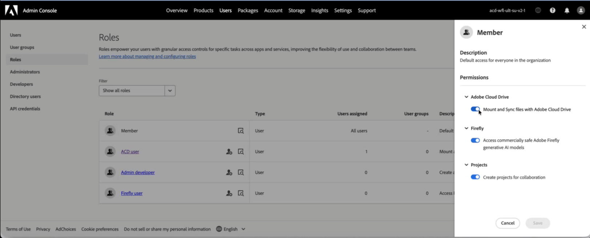
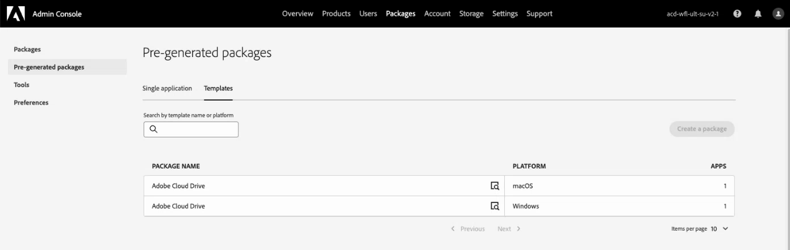
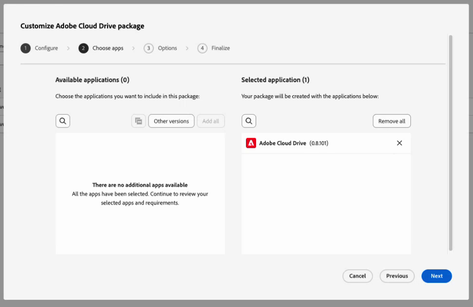

# Configurare e gestire Adobe Cloud Drive per la tua organizzazione

In qualità di amministratore, puoi configurare Adobe Cloud Drive per consentire agli utenti di accedere direttamente dal desktop ai propri file di progetto nell’archiviazione cloud di Adobe, tramite Finder su macOS ed Esplora file su Windows. Questo articolo illustra come abilitare l’accesso in Adobe Admin Console, distribuire l’applicazione ai dispositivi utente e gestire l’accesso su base continuativa.

Adobe Cloud Drive è un&#39;applicazione desktop aziendale che monta i documenti Workfront sull&#39;archiviazione cloud Adobe come unità virtuale nei computer Mac e Windows degli utenti. Dopo l&#39;installazione, gli utenti visualizzano le cartelle di progetto di Workfront nel Finder o in Esplora file e possono aprire, modificare e salvare i file di progetto utilizzando qualsiasi applicazione desktop, senza scaricare i file manualmente o utilizzare un browser.

Per utilizzare Adobe Cloud Drive, la tua organizzazione deve trovarsi nel pacchetto Workflow Ultimate, con l’archiviazione cloud Adobe abilitata.

Per ulteriori informazioni su Adobe Cloud Drive, consulta i seguenti articoli:

* [Panoramica di Adobe Cloud Drive](/help/quicksilver/documents/adobe-cloud-drive/adobe-cloud-drive-overview.md)
* [Installare Adobe Cloud Drive](/help/quicksilver/documents/adobe-cloud-drive/install-adobe-cloud-drive.md)
* [Usa Adobe Cloud Drive](/help/quicksilver/documents/adobe-cloud-drive/use-adobe-cloud-drive.md)

## Requisiti di accesso

+++ Espandi per visualizzare i requisiti di accesso per la funzionalità descritta in questo articolo.

<table style="table-layout:auto"> 
 <col> 
 <col> 
 <tbody> 
  <tr> 
   <td role="rowheader">Versione Adobe Workfront</td> 
   <td>Flusso di lavoro di Ultimate, con l'archiviazione cloud Adobe abilitata</td> 
  </tr> 
  <tr> 
   <td role="rowheader">Diritti di amministratore di Adobe</td> 
   <td>Devi essere un amministratore di sistema per Workfront in Adobe Admin Console</td> 
  </tr> 
 </tbody> 
</table>

Per informazioni, consulta [Requisiti di accesso nella documentazione di Workfront](/help/quicksilver/administration-and-setup/add-users/access-levels-and-object-permissions/access-level-requirements-in-documentation.md).

+++

## Assegnare l’accesso a Adobe Cloud Drive in Adobe Admin Console

Adobe Cloud Drive è incluso nel pacchetto Workflow Ultimate quando è abilitata l’archiviazione cloud Adobe. Non viene visualizzato come prodotto autonomo nella sezione **Products** di Admin Console. Viene invece gestito tramite la sezione **Ruoli** in **Utenti**.

Quando scegli **Utenti** > **Ruoli**, vengono visualizzati due ruoli associati al prodotto Workfront:

| Ruolo | Assegnato automaticamente a | Rilevanza per Adobe Cloud Drive |
| --- | --- | --- |
| **Membro** | Tutti gli utenti dell’organizzazione | Contiene lo switch di funzionalità Adobe Cloud Drive a livello di organizzazione. Attivato per impostazione predefinita. |
| **utente ACD** | Nessuno, per impostazione predefinita | Consente l’accesso individuale quando lo switch a livello di organizzazione è disattivato. |

### Controlli di accesso

**Controllo 1: controllo funzionalità a livello di organizzazione (nel ruolo Membro)**

Il ruolo **Membro** viene assegnato automaticamente a ogni utente dell&#39;organizzazione. In questo ruolo è presente un parametro di funzionalità **Adobe Cloud Drive**. Quando questo switch è attivo, ogni utente con una licenza Workflow Ultimate può accedere ad Adobe Cloud Drive. Quando è spento, nessun utente può accedere ad Adobe Cloud Drive, indipendentemente dalla licenza.

Lo switch è attivato per impostazione predefinita quando Adobe attiva Adobe Cloud Drive per la tua organizzazione.

**Controllo 2: ruolo utente ACD**

Il ruolo **utente ACD** è rilevante solo quando l&#39;opzione a livello di organizzazione è disattivata. Se disattivi l&#39;opzione a livello di organizzazione per eseguire un programma pilota controllato, puoi comunque concedere l&#39;accesso a utenti specifici aggiungendoli al ruolo **utente ACD**. Gli utenti con questo ruolo possono accedere ad Adobe Cloud Drive anche quando l’interruttore a livello di organizzazione è disattivato. Se l&#39;opzione a livello di organizzazione è attivata, il ruolo **utente ACD** non ha alcun effetto.

**Requisito sottostante: licenza Workflow Ultimate**

Adobe Cloud Drive è disponibile solo nel pacchetto Workflow Ultimate. Le opzioni per il ruolo non sono disponibili in nessun altro pacchetto.

La licenza all’interno del pacchetto Workflow Ultimate può essere di qualsiasi tipo: Standard, Light o Contributor. Per informazioni sulle licenze, vedere [Panoramica licenze](/help/quicksilver/administration-and-setup/add-users/how-access-levels-work/licenses-overview.md).

Nella tabella seguente viene illustrato l&#39;interazione di questi controlli:

| Switch a livello di organizzazione | Utente nel ruolo utente ACD | Licenza flusso di lavoro Ultimate | Risultato di accesso |
| --- | --- | --- | --- |
| Attivato | Non obbligatorio | Sì | Concesso |
| Disattivato | Sì | Sì | Concesso |
| Disattivato | No | Sì | Negato |
| o | o | No | Negato |

<!-- Sarah said to delete the second line. Commenting it out within the table messed up the display for the rest of the table, so keeping the line here until I can delete it. | On | Not required | No | Denied | -->

## Prerequisiti

Prima di iniziare, verifica quanto segue:

* Agli utenti di cui si prevede il provisioning vengono assegnate licenze di Workfront Workflow.
* Hai esaminato i [requisiti di rete](#network-requirements) con il tuo team IT.
* Hai preparato una comunicazione da inviare agli utenti spiegando cosa mostra Adobe Cloud Drive (solo risorse di progetto Workfront) e come installarlo.

  >[!NOTE]
  >
  >Un utente che ha l’accesso abilitato ma non ha accesso ad alcun progetto Workfront vede un’unità montata vuota dopo l’accesso. Questo è previsto. L’accesso ai progetti Workfront viene gestito separatamente in Workfront. Per informazioni, vedere [Condividi progetto](/help/quicksilver/workfront-basics/grant-and-request-access-to-objects/share-a-project.md).
  >
  >Inoltre, affinché i progetti vengano visualizzati nell’unità, l’adesione a Creative Cloud deve trovarsi nella stessa organizzazione IMS di Workfront.

## Configurare l’accesso in Adobe Admin Console

L&#39;accesso a Adobe Cloud Drive è configurato in Adobe Admin Console. Scegli l&#39;opzione che corrisponde alla tua strategia di rollout.

### Opzione A: abilitare l’accesso per l’intera organizzazione

Quando Adobe attiva Adobe Cloud Drive per la tua organizzazione, lo switch di funzionalità a livello di organizzazione è attivato per impostazione predefinita e tutti gli utenti possono accedervi immediatamente. Utilizzare questa procedura per verificare che lo switch sia attivato prima di distribuire l&#39;applicazione.

1. Accedi a [adminconsole.adobe.com](https://adminconsole.adobe.com/).
1. Fai clic su **Utenti** nella barra di navigazione superiore.
1. Fai clic su **Ruoli** nel pannello a sinistra.
1. Fare clic su **Membro** nell&#39;elenco dei ruoli.
1. Nel pannello **Membro** che si apre a destra, verificare che **Adobe Cloud Drive** sia visualizzato in **Autorizzazioni** e che sia attivato.

   

   >[!NOTE]
   >
   >Se Adobe Cloud Drive non viene visualizzato nelle **Autorizzazioni** del ruolo **Membro**, è possibile che Adobe Cloud Drive non sia ancora stato attivato per la tua organizzazione. Contatta il supporto Adobe per confermare.

1. Se hai apportato modifiche, fai clic su **Salva**.

### Opzione B: Abilitare l’accesso per un gruppo specifico di utenti

Utilizza questa opzione quando desideri limitare l’accesso a un set definito di utenti, ad esempio durante un progetto pilota prima di un rollout più ampio. Ciò comporta la disattivazione dell&#39;opzione a livello di organizzazione e l&#39;aggiunta degli utenti pilota al ruolo **utente ACD**.

>[!IMPORTANT]
>
>La disattivazione dello switch a livello di organizzazione rimuove immediatamente l’accesso a Adobe Cloud Drive per tutti gli utenti dell’organizzazione, inclusi gli utenti attualmente connessi. Devi disattivare la funzionalità a livello di organizzazione e aggiungere gli utenti pilota nella stessa sessione.

Per disattivare la funzionalità a livello di organizzazione:

1. Accedi a [adminconsole.adobe.com](https://adminconsole.adobe.com/).
1. Fai clic su **Utenti** nella barra di navigazione superiore, quindi fai clic su **Ruoli** nel pannello a sinistra.
1. Fare clic su **Membro** nell&#39;elenco dei ruoli.
1. Nel pannello **Membro**, individua **Adobe Cloud Drive** in **Autorizzazioni** e disattivala.
1. Fai clic su **Salva**.

Per aggiungere utenti pilota al ruolo utente ACD:

1. Nel pannello a sinistra, fai clic su **Ruoli** per tornare all&#39;elenco dei ruoli.
1. Fare clic su **utente ACD** nell&#39;elenco dei ruoli.

   

1. Fare clic su **Aggiungi utenti**.
1. Inserisci l’indirizzo e-mail di ciascun utente pilota.
1. Fai clic su **Salva**.

   Gli utenti aggiunti al ruolo **utente ACD** ottengono immediatamente l&#39;accesso. Gli utenti che non ricoprono questo ruolo rimarranno senza accesso finché non verranno aggiunti al ruolo o finché non verrà riattivato l’interruttore a livello di organizzazione.

   >[!TIP]
   >
   >Per espandere l&#39;accesso nel tempo, tornare al ruolo **utente ACD** e aggiungere gli utenti in base alle esigenze. Quando sei pronto per un rollout completo, riattiva l&#39;opzione a livello di organizzazione nel ruolo **Membro**. Una volta attivato il passaggio a livello di organizzazione, il ruolo **utente ACD** non ha alcun effetto e non deve essere mantenuto.

## Distribuire l’applicazione Adobe Cloud Drive

La configurazione dell’accesso in Adobe Admin Console determina il diritto. La distribuzione dell’applicazione la installa sul dispositivo dell’utente. Questi sono due passaggi separati e obbligatori.

Adobe Cloud Drive è un’applicazione autonoma. Non viene distribuito tramite l’applicazione desktop Creative Cloud e non viene visualizzato nel gestore di pacchetti Creative Cloud. Tuttavia, il profilo utente per Adobe Cloud Drive è associato all’adesione all’app Creative Cloud. Ciò significa che per consentire a un utente di accedere ai progetti Workfront nell’unità, le app Creative Cloud devono essere autorizzate nella stessa organizzazione IMS di Workfront.

Scegli il metodo di distribuzione che corrisponde alle procedure di gestione dei dispositivi della tua organizzazione.

### Metodo A: distribuzione gestita dall’IT tramite pacchetti Admin Console

Utilizzare questo metodo quando l&#39;organizzazione utilizza strumenti di distribuzione centralizzati quali Microsoft Intune, SCCM, Jamf Pro o Apple Remote Desktop. Si tratta del flusso di lavoro di distribuzione aziendale standard di Adobe e segue lo stesso processo di creazione di pacchetti utilizzato per altre applicazioni Adobe.

Per creare il pacchetto in Adobe Admin Console:

1. Accedi a [adminconsole.adobe.com](https://adminconsole.adobe.com/).
1. Fai clic su **Pacchetti** nella barra di navigazione superiore.
1. Fai clic su **Pacchetti pregenerati** nel pannello a sinistra.
1. Fare clic sulla scheda **Modelli**.

   Adobe Cloud Drive viene visualizzato due volte nell’elenco dei modelli: una volta per macOS e una volta per Windows.

   

1. Individua la riga **Adobe Cloud Drive** corrispondente alla piattaforma di destinazione, quindi fai clic sull&#39;icona dei dettagli in tale riga.

   Un pannello laterale visualizza i metadati del pacchetto.

   

1. Fai clic su **Personalizza**.

   Viene avviata la procedura guidata di personalizzazione del pacchetto, con quattro passaggi: **Configura**, **Scegli app**, **Opzioni** e **Finalizza**.

1. Nel passaggio **Configura**, seleziona l&#39;architettura dei computer di destinazione, quindi conferma l&#39;impostazione della lingua e fai clic su **Avanti**.

   * **macOS:** Scegli **macOS (Intel)** o **macOS (Apple Silicon)**.
   * **Windows:** Scegliere **Windows (64 bit)** o **Windows (ARM)**.

   

1. Nel passaggio **Scegli app**, verifica che Adobe Cloud Drive sia selezionato con la versione desiderata.

   Adobe Cloud Drive è preselezionato con l’ultima versione disponibile. Per utilizzare una versione precedente, fare clic su **Altre versioni** e selezionare **Versioni precedenti**.

   

1. Fai clic su **Next** (Avanti).
1. Nel passaggio **Opzioni**, fai clic su **Avanti** senza selezionare alcuna opzione.

   Queste impostazioni si applicano alle applicazioni desktop Creative Cloud e non a Adobe Cloud Drive.

   

1. Nel passaggio **Finalize**, digitare un nome per il pacchetto e selezionare **Package flat**.
1. Rivedi il riepilogo e fai clic su **Crea pacchetto**.

   

   La procedura guidata si chiude. Il nuovo pacchetto viene visualizzato nella parte superiore dell&#39;elenco dei pacchetti con lo stato **Preparazione** durante la generazione. Quando è pronto, lo stato diventa **Aggiornato** e viene visualizzato un collegamento per il download.

   

1. Fai clic su **Scarica** e salva il file del pacchetto nel percorso scelto.

### Metodo B: Download diretto self-service da Software Distribution

Utilizzare questo metodo per le organizzazioni più piccole, per i dispositivi autogestiti o quando si indirizzano i singoli utenti all&#39;installazione dell&#39;applicazione.

Prima di iniziare, verifica quanto segue:

* L’accesso è abilitato per gli utenti di Adobe Admin Console.
* Gli utenti ricevono una notifica con l’URL di distribuzione del software e le istruzioni di accesso.
* È stata verificata la connettività di rete agli endpoint richiesti. Per ulteriori informazioni, vedere [Requisiti di rete](#network-requirements) in questo articolo.

Per installare autonomamente Adobe Cloud Drive:

1. Conferma che l’accesso sia abilitato per l’utente in Adobe Admin Console.
1. Indirizza l&#39;utente a [experience.adobe.com/#/downloads](https://experience.adobe.com/#/downloads).

   >[!NOTE]
   >
   >Per visualizzare il programma di installazione di Adobe Cloud Drive, gli utenti devono avere l’accesso ad Adobe Cloud Drive abilitato in Adobe Admin Console. Gli utenti senza accesso non visualizzeranno il programma di installazione elencato.

1. L’utente effettua l’accesso con il proprio Enterprise ID o Federated ID. Il programma di installazione di Adobe Cloud Drive viene visualizzato nella scheda **Workfront** di Software Distribution.
1. L&#39;utente scarica il programma di installazione per la propria piattaforma e segue i passaggi di installazione descritti in [Installare Adobe Cloud Drive](/help/quicksilver/documents/adobe-cloud-drive/install-adobe-cloud-drive.md).

   

Dopo la distribuzione, completa questa verifica su un dispositivo di test:

1. Avvia Adobe Cloud Drive dalla cartella **Applicazioni** (macOS) o dal menu **Avvia** (Windows).
1. Accedi con un account utente per il quale è abilitato l&#39;accesso ad Adobe Cloud Drive in Adobe Admin Console.
1. Verificare che le cartelle di progetto di Workfront vengano visualizzate nell&#39;unità montata nel Finder o in Esplora file.

   >[!NOTE]
   >
   >Un utente che effettua l’accesso correttamente ma non vede alcuna cartella non ha accesso ad alcun progetto Workfront. Aggiungi l&#39;utente a un progetto in Workfront per popolare l&#39;unità.

1. Passare a una cartella di progetto e creare un piccolo file di test.
1. Apri Workfront in un browser e verifica che il file di test sia presente nel progetto corrispondente.
1. Elimina il file di test dopo la verifica.

## Gestire l’accesso continuo degli utenti a Adobe Cloud Drive

Una volta che la tua organizzazione utilizza Adobe Cloud Drive, segui questi passaggi per aggiungere nuovi utenti o rimuovere gli utenti che non hanno più bisogno di accedervi.

### Aggiungi un nuovo utente

Se l&#39;opzione a livello di organizzazione è attivata, non è richiesta alcuna azione Adobe Admin Console. Chiedere all&#39;utente di scaricare e installare Adobe Cloud Drive. Se un utente con licenza non riesce ancora ad accedere ad Adobe Cloud Drive, contatta il supporto Adobe per verificare che la migrazione del proprio account sia avvenuta correttamente.

Se l&#39;interruttore a livello di organizzazione è disattivato:

1. Accedi a [adminconsole.adobe.com](https://adminconsole.adobe.com/).
1. Fai clic su **Utenti** nella barra di navigazione superiore, quindi fai clic su **Ruoli** nel pannello a sinistra.
1. Fare clic su **utente ACD** nell&#39;elenco dei ruoli.
1. Fai clic su **Aggiungi utenti**, immetti l&#39;indirizzo e-mail dell&#39;utente e fai clic su **Salva**.

### Rimuovere un utente

Se lo switch a livello di organizzazione è attivato, qualsiasi utente con licenza ha accesso ad Adobe Cloud Drive. Per rimuovere l&#39;accesso per un utente specifico senza rimuovere la licenza Workfront, disattivare l&#39;opzione a livello di organizzazione e aggiungere tutti gli altri utenti al ruolo **utente ACD**, escluso l&#39;utente che si desidera bloccare.

Se l&#39;opzione a livello di organizzazione è disattivata e l&#39;utente è nel ruolo **utente ACD**:

1. Accedi a [adminconsole.adobe.com](https://adminconsole.adobe.com/).
1. Fai clic su **Utenti** nella barra di navigazione superiore, quindi fai clic su **Ruoli** nel pannello a sinistra.
1. Fare clic su **utente ACD** nell&#39;elenco dei ruoli.
1. Selezionare l&#39;utente e fare clic su **Rimuovi**.

L&#39;utente perde immediatamente l&#39;accesso all&#39;unità montata. I file memorizzati in Workfront non vengono eliminati. La cache locale dell’utente rimane sul dispositivo fino a quando l’applicazione non viene disinstallata.

>[!IMPORTANT]
>
>La rimozione di un utente dal ruolo **utente ACD** non ne comporta la rimozione da Workfront o da alcun progetto Workfront. Gestisci l&#39;accesso ai progetti Workfront separatamente.

## Gestire l’accesso ai progetti Workfront

Adobe Cloud Drive mostra agli utenti i progetti Workfront a cui hanno accesso. L&#39;accesso al progetto è gestito in Workfront, non in Adobe Admin Console. Un utente con accesso a Adobe Cloud Drive ma che non appartiene a nessun progetto Workfront vede un’unità montata vuota dopo l’accesso. Questo è il comportamento previsto.

Per informazioni sulla gestione dell&#39;accesso al progetto, vedere [Gestione progetti](/help/quicksilver/manage-work/projects/manage-projects/manage-projects-overview.md) e [Condivisione di un progetto](/help/quicksilver/workfront-basics/grant-and-request-access-to-objects/share-a-project.md).

## Requisiti di rete

Adobe Cloud Drive richiede l’accesso HTTPS in uscita (porta 443) a un set di endpoint Adobe. Non sono richieste regole firewall in entrata. Per l&#39;elenco degli endpoint, vedere [Endpoint di rete Adobe](https://helpx.adobe.com/in/enterprise/kb/network-endpoints.html).

Adobe Cloud Drive legge la configurazione proxy a livello di sistema sia su macOS che su Windows. Sono supportati i proxy autenticati.

## Considerazioni sulla sicurezza

### Autenticazione

Adobe Cloud Drive autentica gli utenti tramite Adobe IMS (Identity Management System). Gli utenti accedono con il proprio Enterprise ID o Federated ID. Se l’organizzazione utilizza l’SSO configurato in Adobe Admin Console, gli utenti si autenticano tramite il provider di identità e non richiedono credenziali Adobe separate.

>[!NOTE]
>
>Adobe Cloud Drive non supporta gli Adobe ID personali (account creati singolarmente e non gestiti) nelle distribuzioni aziendali. Gli utenti devono accedere con un Enterprise ID o un Federated ID nella directory dell’organizzazione.

### Dati in transito e a riposo

* Tutte le comunicazioni tra Adobe Cloud Drive e i servizi Adobe utilizzano TLS 1.2 o versione successiva.
* I file memorizzati nell’archiviazione cloud di Adobe vengono crittografati quando sono inattivi.
* I file memorizzati nella cache locale utilizzano la crittografia del disco a livello di sistema operativo quando sul dispositivo è abilitato FileVault (macOS) o BitLocker (Windows).

### Controllo dell’accesso ai file

L&#39;accesso ai file segue le autorizzazioni del progetto Workfront. Gli utenti possono vedere e interagire solo con i progetti per i quali dispongono delle autorizzazioni, come consentito dal loro livello di accesso a Workfront.

La cartella principale di ciascun progetto Workfront è di sola lettura nella vista desktop. Gli utenti non possono rinominare, spostare o eliminare una cartella principale del progetto dal Finder o da Esplora file. Possono creare cartelle, sottocartelle e file in qualsiasi profondità all’interno di una cartella di progetto, in base alle loro autorizzazioni Workfront.

## Risolvere i problemi comuni

Per i passaggi di risoluzione dei problemi per l&#39;utente finale, vedere [Risoluzione dei problemi relativi a Adobe Cloud Drive](/help/quicksilver/documents/adobe-cloud-drive/troubleshoot-adobe-cloud-drive.md). I problemi elencati di seguito sono specifici per gli amministratori.

### L’utente non riesce a trovare il programma di installazione di Adobe Cloud Drive in Distribuzione software

**Causa:** l&#39;accesso a Adobe Cloud Drive non è abilitato per l&#39;utente in Adobe Admin Console.

**Risoluzione:**

1. Accedi a [adminconsole.adobe.com](https://adminconsole.adobe.com/) e fai clic su **Utenti**.
1. Cerca l’utente e fai clic sul suo nome.
1. Fai clic sulla scheda **Ruoli** e verifica se Adobe Cloud Drive è abilitato.

**Causa:** il provisioning di Creative Cloud All Apps è stato eseguito in un&#39;organizzazione IMS diversa da Workfront.

**Risoluzione:** Nessuna risoluzione attualmente disponibile.

### L&#39;utente ha installato l&#39;applicazione e ha effettuato l&#39;accesso, ma non vede cartelle nell&#39;unità

**Causa:** l&#39;utente non dispone di autorizzazioni per alcun progetto Workfront.

**Risoluzione:**

1. In Workfront, conferma che l’utente disponga delle autorizzazioni necessarie per almeno un progetto.
1. In caso contrario, condividi un progetto con l’utente.
1. Chiedi all’utente di attendere fino a cinque minuti prima che venga visualizzata la cartella del progetto.
1. Se dopo cinque minuti la cartella non viene più visualizzata, chiedi all’utente di uscire da Adobe Cloud Drive e di riavviarlo.

### L&#39;utente non può accedere ad Adobe Cloud Drive

**Causa:** l&#39;account Adobe Admin Console dell&#39;utente non è attivo o l&#39;identità non è configurata correttamente.

**Risoluzione:**

1. In Adobe Admin Console, fai clic su **Utenti** e cerca l&#39;utente.
1. Verificare che lo stato dell&#39;account dell&#39;utente sia **Attivo**.
1. Conferma che il dominio e-mail dell’utente sia un dominio registrato nella directory di Admin Console.
1. Se l&#39;organizzazione utilizza l&#39;SSO, verificare che l&#39;account dell&#39;utente sia attivo nel provider di identità.
1. Chiedere all&#39;utente di riprovare ad accedere.

### I file non vengono sincronizzati dopo il salvataggio dell&#39;utente

**Causa:** il file non è stato salvato in modo esplicito oppure si è verificato un problema di connettività di rete.

**Risoluzione:**

1. Conferma con l&#39;utente di aver salvato il file utilizzando **File** > **Salva** nell&#39;applicazione. La chiusura di un&#39;applicazione o il salvataggio automatico non attiva la sincronizzazione.
1. Verificare che l&#39;utente disponga dell&#39;accesso a Internet e possa raggiungere `*.adobe.com` e `*.workfront.com`.
1. Chiedere all&#39;utente di controllare l&#39;icona di Adobe Cloud Drive nella barra dei menu (macOS) o nell&#39;area di notifica (Windows) per un indicatore di errore.
1. Se è presente un errore, chiedere all&#39;utente di uscire da Adobe Cloud Drive, riavviarlo e salvare di nuovo il file.
1. Se il problema persiste, raccogliere il registro dell’applicazione:

   * **macOS:** `~/Library/Logs/Adobe/AdobeCloudDrive/`
   * **Windows:** `C:\Users\<username>\AppData\Local\Temp\Adobe\AdobeCloudDrive\`

### Copia in conflitto di un file visualizzata nella cartella del progetto

**Causa:** due utenti hanno salvato le modifiche allo stesso file prima che una delle due versioni fosse sincronizzata nel cloud. Adobe Cloud Drive ha mantenuto entrambe le versioni in automatico.

La copia in conflitto utilizza questo formato di denominazione: `filename (Conflicted copy from device_name on date_time).extension`
Esempio: `project_brief (Conflicted copy from jsmith's MacBook Pro on 2026-06-15-10-45-19).docx`

**Risoluzione:**

1. Chiedi a entrambi gli utenti quale versione è autorevole.
1. Copiare il contenuto necessario dalla copia in conflitto nel file principale.
1. Elimina la copia in conflitto dopo aver riconciliato le due versioni.

   >[!NOTE]
   >
   >Adobe Cloud Drive non utilizza il blocco dei file. Per evitare conflitti quando più utenti modificano lo stesso file, coordinare la modifica tramite le assegnazioni delle attività di Workfront o i flussi di lavoro di approvazione prima che più utenti accedano allo stesso file dal desktop.

### L’utente non può creare una cartella o un file nel progetto

**Causa A:** L&#39;utente sta tentando di creare una cartella o un file a livello di directory principale del progetto. Le cartelle principali del progetto sono attualmente di sola lettura in Adobe Cloud Drive. Le cartelle principali rappresentano i progetti Workfront creati e gestiti in Workfront.

**Risoluzione:**

1. Chiedi all’utente di spostarsi in una sottocartella esistente all’interno del progetto e di crearvi il file o la cartella.
1. Se l’utente ha bisogno di una nuova cartella di livello principale all’interno del progetto, chiedi loro di crearla prima in Workfront. Viene quindi visualizzato in Adobe Cloud Drive.

**Causa B:** l&#39;utente non dispone delle autorizzazioni di modifica per il progetto Workfront.

**Risoluzione:**

1. In Workfront, controlla le autorizzazioni dell&#39;utente sul progetto (**Visualizza**, **Contribuisci** o **Gestisci**).
1. Aggiornare le autorizzazioni dell&#39;utente a **Contribute** o **Manage** per creare o modificare file.
