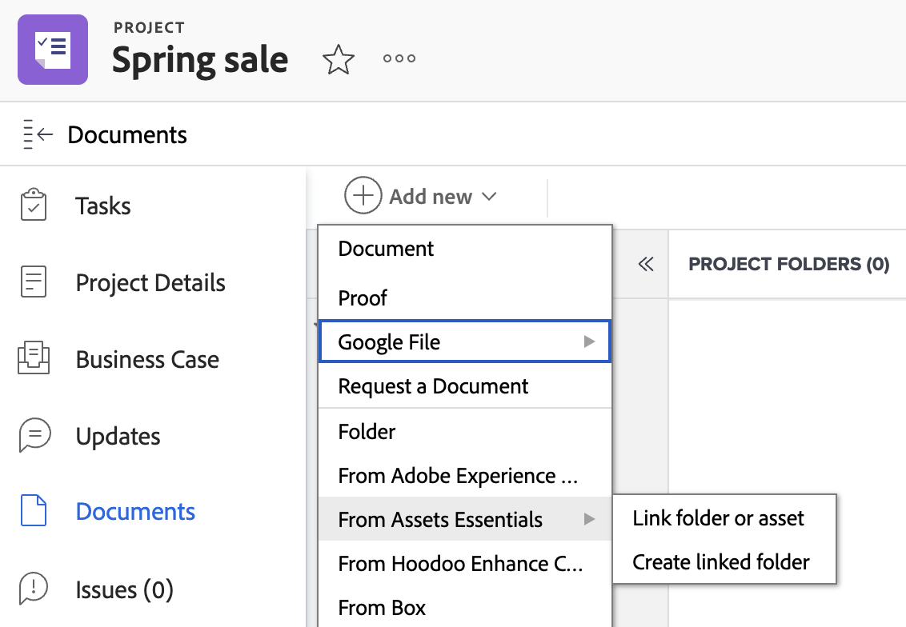

# Creare una cartella collegata con Experience Manager Assets o Assets Essentials

È possibile creare una cartella collegata con Experience Manager Assets o Assets Essentials in Workfront. Poiché la cartella è collegata, tutte le risorse aggiunte alla cartella verranno visualizzate automaticamente in Workfront ed Experience Manager. Non è necessario inviare manualmente la risorsa se si trova in una cartella collegata.

## Requisiti di accesso

Devi disporre dei seguenti elementi:

<table>
  <tr>
   <td><strong>piano Adobe Workfront*</strong>
   </td>
   <td>Qualsiasi
   </td>
  </tr>
  <tr>
   <td><strong>Licenze Adobe Workfront*</strong>
   </td>
   <td>Piano
   </td>
  </tr>
  <tr>
   <td><strong>Prodotto</strong>
   </td>
   <td>Devi disporre di Experience Manager Assets as a Cloud Service o Assets Essentials e devi essere aggiunto al prodotto come utente.
   </td>
  </tr>
  <tr>
   <td><strong>Autorizzazioni di Experience Manager</strong>
   </td>
   <td>È necessario disporre dell’accesso in scrittura alla cartella di destinazione nell’integrazione Experience Manager.
   </td>
  </tr>
  <tr>
   <td><strong>Configurazioni a livello di accesso</strong>
   </td>
   <td>Devi essere un amministratore Workfront. Per informazioni sugli amministratori di Workfront, consulta <strong>Concedere a un utente pieno accesso amministrativo</strong>.
   </td>
  </tr>
</table>

*Per sapere quale piano, tipo di licenza o accesso si dispone, contattare l&#39;amministratore Workfront.

## Prerequisiti

Prima di iniziare,

* L’amministratore di Workfront deve configurare un’integrazione Experience Manager. Per ulteriori informazioni, consulta [Configurare l’integrazione as a Cloud Service di Experience Manager Assets](/help/quicksilver/administration-and-setup/configure-integrations/configure-aacs-integration.md) o [Configurare l’integrazione Experience Manager Assets Essentials](/help/quicksilver/documents/adobe-workfront-for-experience-manager-assets-essentials/setup-asset-essentials.md).

## Creare una cartella collegata

La cartella collegata viene creata nel percorso specificato dall’amministratore Workfront al momento della configurazione dell’integrazione. Ciascuna integrazione può avere una sola posizione di cartella per le cartelle collegate.

Il nome della cartella collegata viene creato automaticamente in base al Portfolio, al programma, al progetto a cui è associato e non può essere modificato. Se il progetto non è associato a un Portfolio o a un programma, nella cartella collegata vengono visualizzati il nome del progetto e la data di creazione.

Per creare una cartella collegata:

1. Passa al progetto in cui desideri inserire la cartella.
1. Seleziona **Aggiungi nuovo**, quindi passa all’integrazione Experience Manager configurata dall’amministratore.
   >[!NOTE]
   >
   >L’amministratore di Workfront può scegliere qualsiasi nome per questa integrazione, pertanto potrebbe non menzionare specificamente Experience Manager Assets o Assets Essentials.

1. Seleziona **Crea cartella collegata**. Il sistema crea automaticamente una cartella in Experience Manager in base al percorso specificato al momento della configurazione dell&#39;integrazione.
   
