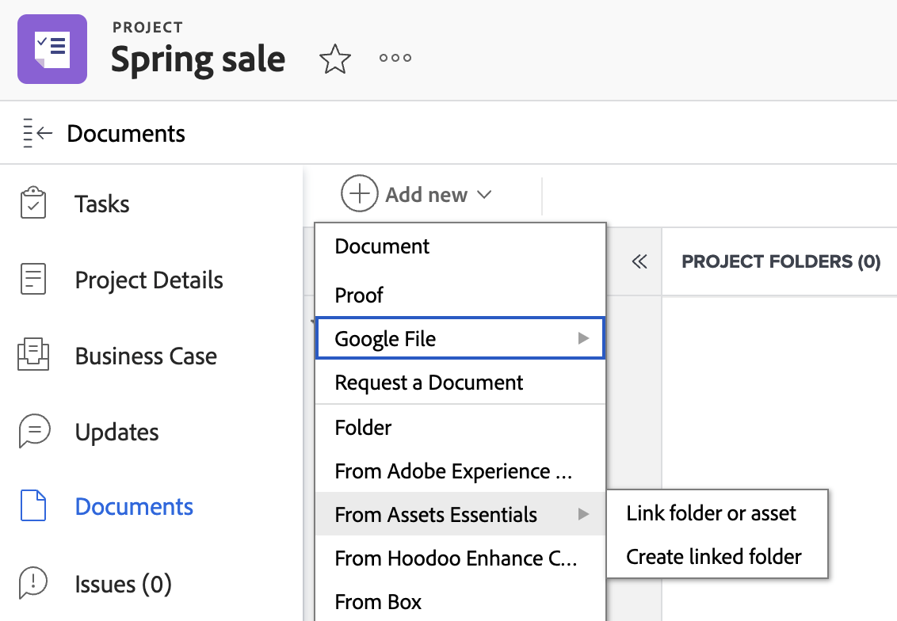

# Creare una cartella collegata a Experience Manager Assets o Assets Essentials

You can create a folder linked with Experience Manager Assets or Assets Essentials while in Workfront. Because the folder is linked, any asset added to the folder will automatically show up in both Workfront and Experience Manger. You don&#39;t have to manually send the asset if it&#39;s in a linked folder.

If an asset is deleted or moved from a linked folder inside of Experience Manager Assets or Assets Essentials, Workfront retains a copy of the asset in the Project > Documents area.

>[!NOTE]
>
>Questa funzionalità non è disponibile nell&#39;area nuovi documenti. 
>Se l&#39;organizzazione utilizza l&#39;archiviazione aziendale, quando si accede ai documenti in Workfront verrà visualizzata la nuova area documenti. From there, you can add assets from Experience Manager Assets or Assets Essentials, but you won&#39;t be able to create a linked folder.

## Requisiti di accesso

+++ Espandi per visualizzare i requisiti di accesso per la funzionalità descritta in questo articolo.

<table>
  <tr>
   <td><strong>Adobe Workfront package</strong>
   </td>
   <td>Qualsiasi
   </td>
  </tr>
  <tr>
   <td><strong>Adobe Workfront licenses</strong>
   </td>
   <td>
   
Standard

   
Piano

   </td>
  </tr>
  <tr>
   <td><strong>Additional products</strong>
   </td>
   <td>You must have Experience Manager Assets as a Cloud Service or Assets Essentials, and you must be added to the product as a user.
   </td>
  </tr>
  <tr>
   <td><strong>Experience Manager permissions</strong>
   </td>
   <td>You must have write access to the destination folder in the Experience Manger integration.
   </td>
  </tr>
  <tr>
   <td><strong>Access level configurations</strong>
   </td>
   <td>You must be a Workfront administrator to configure an Experience Manager integration. After it is configured, users with a Plan license can set up linked folders on individual projects.
   </td>
  </tr>
</table>

Per ulteriori dettagli sulle informazioni contenute in questa tabella, consulta [Requisiti di accesso nella documentazione Workfront](/help/quicksilver/administration-and-setup/add-users/access-levels-and-object-permissions/access-level-requirements-in-documentation.md).

+++

## Prerequisiti

Prima di iniziare,

* L’amministratore di Workfront deve configurare un’integrazione Experience Manager. Per ulteriori informazioni, consulta [Configurare l&#39;integrazione Experience Manager Assets as a Cloud Service](/help/quicksilver/administration-and-setup/configure-integrations/configure-aacs-integration.md) o [Configurare l&#39;integrazione Experience Manager Assets Essentials](/help/quicksilver/documents/adobe-workfront-for-experience-manager-assets-essentials/setup-asset-essentials.md).

## Create a linked folder

The linked folder is created in the location specified by the Workfront administrator when they set up the integration. Each integration can have only one folder location for linked folders.

The name for the linked folder is automatically created based on the Portfolio, Program, Project its associated with and can&#39;t be changed. If project is not associated with a Portfolio or Program, the linked folder will display the project name and creation date.

>[!NOTE]
>
>Impossibile creare un nuovo documento o una nuova versione di una bozza all&#39;interno di una cartella collegata.

Per creare una cartella collegata:

1. Passa al progetto in cui desideri inserire la cartella.
1. Seleziona **Aggiungi nuovo**, quindi vai all&#39;integrazione di Experience Manager configurata dall&#39;amministratore.

   >[!NOTE]
   >
   >L’amministratore di Workfront può scegliere qualsiasi nome per questa integrazione, pertanto potrebbe non menzionare specificamente Experience Manager Assets o Assets Essentials.

1. Selezionare **Crea cartella collegata**. Il sistema crea automaticamente una cartella in Experience Manager in base alla posizione specificata al momento della configurazione dell’integrazione.
   
