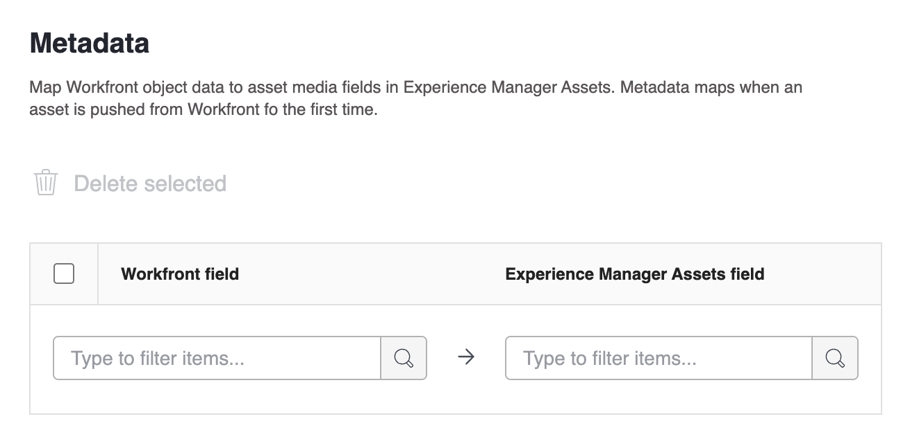

# Configurare l’integrazione di Experience Manager Assets Essentials

Connect your work with your content in Experience Manager Assets Essentials&#x200B;:

* Push assets and metadata from Adobe Workfront to Experience Manager Assets Essentials&#x200B;
* Link assets from Experience Manager Assets Essentials to your projects and tasks in Workfront&#x200B;
* Facilitate versioning workflows for assets pushed to Experience Manager Assets Essentials

>[!NOTE]
>
>You can also connect several Experience Manager Assets repositories to one Workfront environment, or several Workfront environments to one Experience Manager Assets repository across Organization IDs. Follow the configuration instructions in this article for each integration you&#39;d like to set up. 
>Questa funzionalità non è disponibile nell&#39;area nuovi documenti.

## Requisiti di accesso

+++ Espandi per visualizzare i requisiti di accesso per la funzionalità descritta in questo articolo.

<table>
  <tr>
   <td><strong>Adobe Workfront package</strong>
   </td>
   <td>Qualsiasi
   </td>
  </tr>
  <tr>
   <td><strong>Adobe Workfront licenses</strong>
   </td>
   <td>
   
Standard

   
Piano

   </td>
  </tr>
  <tr>
   <td><strong>Additional products</strong>
   </td>
   <td>You must have Experience Manager Assets as a Cloud Service or Assets Essentials, and you must be added to the product as a user.
   </td>
  </tr>
  <tr>
   <td><strong>Experience Manager permissions</strong>
   </td>
   <td>You must have write access to the destination folder in the Experience Manger integration.
   </td>
  </tr>
  <tr>
   <td><strong>Configurazioni del livello di accesso</strong>
   </td>
   <td>You must be a Workfront administrator to configure an Experience Manager integration. After it is configured, users with a Plan license can set up linked folders on individual projects.
   </td>
  </tr>
</table>

Per ulteriori dettagli sulle informazioni contenute in questa tabella, consulta [Requisiti di accesso nella documentazione Workfront](/help/quicksilver/administration-and-setup/add-users/access-levels-and-object-permissions/access-level-requirements-in-documentation.md).

+++

## Set up the integration

{{step-1-to-setup}}

1. Select  **Documents**  in the left panel, then select **Experience Manager Integration**.
1. Select **Add Experience Manager Integration**.
1. Specify the following:

   <table>
   <tr>
      <td><strong>Nome</strong>
      </td>
      <td>Enter the name you want users to see in the Add new button in the Documents area.
      </td>
   </tr>
   <tr>
      <td><strong>Navigation URL</strong>
      </td>
      <td>Il sistema compila automaticamente l’URL di navigazione. Questo URL viene utilizzato per collegare all’istanza Assets Essentials della tua organizzazione dal menu principale per un accesso rapido.
      </td>
   </tr>
   <tr>
      <td>
      <strong>Archivio Experience Manager Assets</strong>
      </td>
      <td>
      Il sistema popola automaticamente l’archivio Experience Manager associato al tuo ID organizzazione.
      </td>
   </tr>
   </table>

1. Fai clic su **Salva** o passa alla sezione [Configura metadati (facoltativo)](#set-up-metadata-optional) in questo articolo.

## Configurazione metadati (facoltativo)

Mappa i dati oggetto Workfront ai campi degli elementi multimediali delle risorse in Experience Manager Assets. I metadati vengono mappati quando una risorsa viene inviata da Workfront per la prima volta.

### Prerequisiti

Prima di iniziare, è necessario

* Configura uno schema metadati in Experience Manager Assets Essentials come descritto in [Configura la mappatura dei metadati delle risorse tra Adobe Workfront e Experience Manager Assets](https://experienceleague.adobe.com/it/docs/experience-manager-cloud-service/content/assets/integrations/configure-asset-metadata-mapping).
* (Facoltativo) Configura i campi modulo personalizzati in Workfront. Workfront dispone di molti campi personalizzati incorporati che è possibile utilizzare. Tuttavia, puoi anche creare campi personalizzati. Per ulteriori informazioni, vedere [Creare un modulo personalizzato](/help/quicksilver/administration-and-setup/customize-workfront/create-manage-custom-forms/form-designer/design-a-form/design-a-form.md).

## Campi Workfront e Experience Manager Assets supportati

### Parola chiave AEM

È possibile mappare qualsiasi campo supportato da Workfront a una parola chiave in Experience Manager Assets Essentials.

Per collegare un campo a una parola chiave, selezionare `xcm:keywords` nel menu a discesa del campo Experience Manager Assets nell&#39;area di mappatura dei metadati.

Per mappare più campi di testo a riga singola alle parole chiave, immettere un elenco separato da virgole dei valori delle parole chiave nel lato Workfront della mappatura metadati e `xcm:keywords` nel lato Experience Manager Assets. Ogni valore di campo viene mappato su una parola chiave separata. È possibile utilizzare un campo calcolato per combinare più campi Workfront in un unico campo di testo separato da virgole.

<!--
Look for essentials article
For more information on keywords in Experience Manager Assets, including how to create and manage keywords, see [Administering Tags]( https://experienceleague.adobe.com/docs/experience-manager-64/administering/contentmanagement/tags.html?lang=it).
-->

### Risorse

I metadati vengono mappati quando una risorsa viene inviata da Workfront per la prima volta. La prima volta che una risorsa viene inviata a Experience Manager Assets Essentials, i documenti con i campi incorporati o personalizzati vengono mappati automaticamente sui campi specificati.

1. Nella colonna **Campo Workfront** scegliere un campo Workfront predefinito o personalizzato.

   >[!NOTE]
   >
   >È possibile mappare un singolo campo Workfront a più campi Experience Manager Assets. Non puoi mappare più campi Workfront a un singolo campo Experience Manager Assets.

1. Nel campo **Experience Manager**, scegli un campo Experience Manager Assets.

   Per associare un campo Workfront a un tag Experience Manager Assets, selezionare `xcm:keywords`.

1. Ripetere i passaggi 1 e 2 in base alle esigenze.
   
1. Fai clic su **Salva** o passa alla sezione [Configura cartelle collegate (facoltativo)](#set-up-linked-folders-optional) in questo articolo.

## Configurare le cartelle collegate (facoltativo)

{{setup-linked-folder}}
